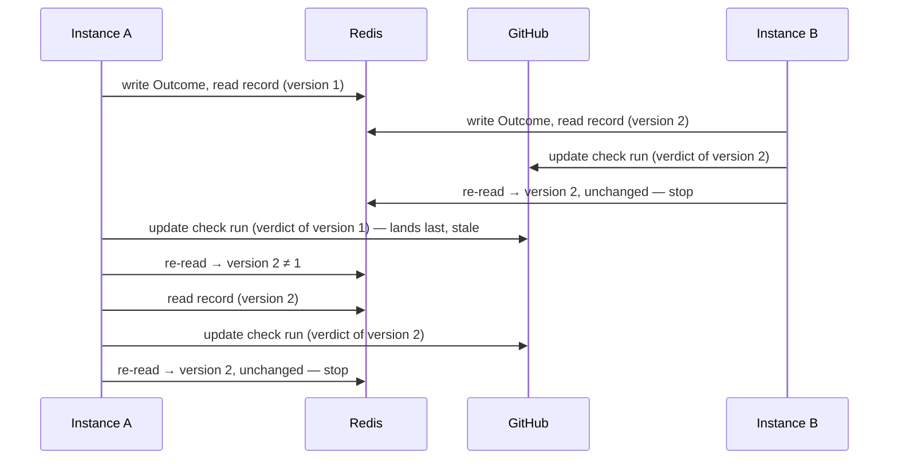
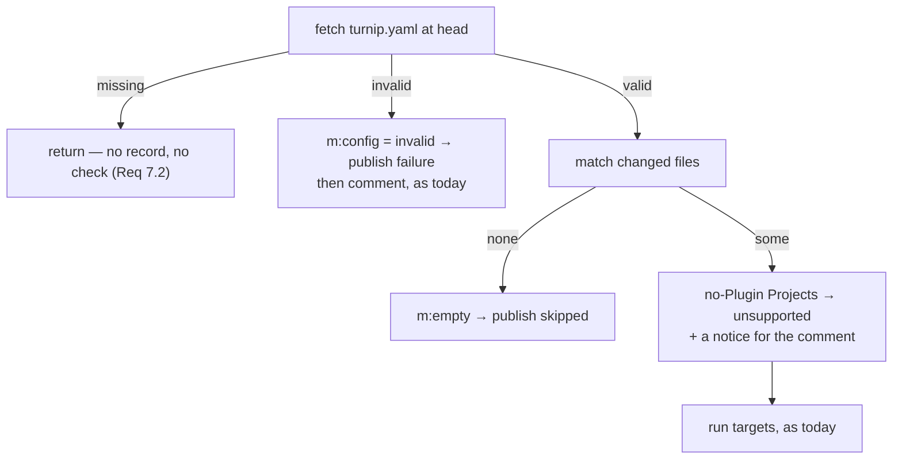

# Design: One Check Branch Protection Can Require (Slice 37)

## Confirmed GitHub behavior

Checked 2026-09-23 (task 1), since the design leans on all three:

- **`skipped` is settable by an app**, on create and update; of the
  documented conclusions only `stale` is reserved to GitHub
  ([check runs API](https://docs.github.com/en/rest/checks/runs)).
- **`success`, `skipped` and `neutral` satisfy a required check**, and a
  required check that never reports blocks the pull request with "Waiting
  for status to be reported"
  ([troubleshooting required status checks](https://docs.github.com/en/pull-requests/collaborating-with-pull-requests/collaborating-on-repositories-with-code-quality-features/troubleshooting-required-status-checks)).
- **Several check runs of one name on one commit**: the most recently
  updated one is used ([Ken Muse, "Shared Commits and GitHub
  Checks"](https://www.kenmuse.com/blog/shared-commits-and-github-checks/);
  not stated in GitHub's own reference). Decision 3 relies on it only for
  the rare duplicate, and there the run being kept current is by
  construction the most recently updated.

## Overview

Three pieces, each small:

1. A **Pull_Request_Record** in Redis — one hash per pull request and head
   commit, one field per Project holding its latest Outcome.
2. A pure **verdict** function from a record to the Aggregate_Check's
   status, conclusion, title and summary.
3. A **publisher** that any Server instance runs after writing an Outcome:
   it reads the record, and creates or updates the one `turnip` check run
   for that commit.

Nothing reads the Lock to decide the verdict. The Outcome is derived from
the `lock.Event` each finished Operation already produces, which is the one
place turnip decides, per tool, whether a plan left something to apply.

The per-Project rename (Requirement 2) is a one-line change to
`checkRunName` (`execute.go:365`); every site already calls it.

## Where Outcomes come from

Every write happens at a point that already exists. No new event is
invented; the Outcome is a function of the `lock.Event` computed there.

| Site | Today computes | Outcome written |
|---|---|---|
| `HandleResult` (`result.go`) | `lockEventFor` → `EventPlanApplicable` | awaiting apply |
| | `EventPlanNothingToApply` | nothing to apply |
| | `EventPlanFailed` | not planned |
| | `EventMutatingSucceeded` | applied |
| | `EventMutatingFailed` | apply failed |
| `reportTimeout` (`sweep.go`) | `EventPlanTimedOut` | not planned |
| | `EventMutatingTimedOut` | apply failed |
| `executeOne` refusals (`execute.go`) | — (returns via `reject`) | not planned, **for a Plan_Operation only** |
| automatic path, `planTargetsFor` (`target.go:50`) | — (skips the Project) | unsupported |

The Outcome follows the **event**, not the Lock transition the event
produced. `HandleResult` records it even when `locks.Apply` fails or finds
no Lock (a pull request closed mid-run): what happened to the Operation is
known regardless of what the Lock did with it.

**Refusals, narrowly.** Requirement 4.4 records a refused plan; 4.7 leaves a
refused Mutating_Operation alone. Two families of refusal exist, and only
one is about the Project:

- `executeOne`'s refusals (Lock held elsewhere, refused ServiceAccount or
  submodule override, a Lock or Redis error) concern this Project's plan.
  Recorded as not planned when `t.Operation` is the Plugin's plan; ignored
  otherwise.
- `selection.resolve`'s refusals (`target.go:139`, `:152`) concern the
  *command* — an operation name the tool does not have, or a commenter
  without write permission for a mutating one. They are not recorded. A
  typo in a comment must not be able to put a Project into the record and
  block the merge.

**A Project with no Plugin** (Requirement 7.3) — `turnip.yaml` validates
`terraform` and `pulumi`, but only Helmfile is registered — is today
dropped silently from the automatic plan: `planTargetsFor` skips it
(`target.go:54`). It now returns the Projects it skipped alongside the
Targets, and the automatic path records each as **unsupported** and says
so in the comment as a notice — the mechanism the comment path already
uses for command-level caveats, which rides at the top of the plan comment.
When every affected Project is unsupported there are no results for the
notice to ride on, so it is posted on its own, by the same rule
`HandleIssueComment` applies to an orphaned notice.

*Alternative considered*: stop skipping, and let `executeOne`'s existing
"tool is not supported" refusal (`execute.go:78`) produce a result row.

*Rejected because*: with no Plugin there is no plan Operation to put on
the Target, and `partitionByKind` files any result it cannot identify as a
plan into the **apply** comment — so an automatic plan would post an apply
comment reporting that nothing could be applied.

Only affected Projects reach `planTargetsFor`, so an unsupported Project
the pull request does not touch never enters the record (Requirement 7.4).

## The record

**Key**: `pr-status:<owner>/<repo>#<number>@<head-sha>` — a Redis hash.

| Field | Value | Written by |
|---|---|---|
| `p:<project>` | JSON `{outcome, operation, tool}` — the Outcome (`awaiting`, `nothing`, `not_planned`, `applied`, `apply_failed`, `unsupported`), plus the Operation that produced it and the tool, so the summary can name the Project_Check and an unsupported tool | every Outcome write |
| `m:version` | integer, incremented on every write that changes the verdict | Outcome writes, `m:config`, `m:empty` — atomically with them |
| `m:mutated` | `1` once any Mutating_Operation's Outcome is recorded | Outcome writes of `applied`/`apply_failed` |
| `m:config` | `invalid` when the automatic plan found an invalid `turnip.yaml` | the automatic path |
| `m:empty` | `1` when the automatic plan matched no Project | the automatic path |
| `m:check_run` | the ID of the check run currently carrying the verdict; its presence is what "published" means | the publisher |
| `m:check_done` | whether that run was last published completed — a hint, see Publishing | the publisher |

Project fields and metadata fields use disjoint prefixes, so no Project
name can collide with a metadata field. The publisher's own fields
(`m:check_run`, `m:check_done`) do **not** bump `m:version`: they are not
inputs to the verdict, and bumping it would make every publish look like a
change and publish again.

**TTL**: 90 days, refreshed on every write — `planCommentTTL`'s reasoning,
since a pull request may stay open for months. No explicit delete on close:
a record is a few hundred bytes, there is one per pushed commit, and
deleting them would need an index of a pull request's commits.

**A write** is `HSET p:<project> <entry>` (plus `m:mutated` when it
applies), `HINCRBY m:version 1` and `EXPIRE`, in one `MULTI`. Two
Operations of the same pull request finishing on different instances write
different fields, so neither can overwrite the other (Requirement 3.6), and
no read-modify-write is involved.

### Decision 1: Key by head commit rather than resetting on a new one

*Alternative considered*: one record per pull request, cleared when a
result arrives for a head it has not seen — the shape Requirement 3.4
describes.

*Rejected because*: an Operation dispatched against the old head can
finish after the push. With one record, its Outcome either lands in the new
commit's record, where it does not belong, or needs a head comparison on
every write to discard it. Keyed by commit, it lands in the old commit's
record, updates the old commit's check run — where it is true — and the new
record is untouched. Requirement 3.4 then holds with no code at all.

### Decision 2: A hash, not a JSON value under a Lua script

*Alternative considered*: the repository's established pattern — a JSON
value mutated by a Lua script (`record.go`, `internal/lock/redis.go`).

*Rejected because*: that pattern exists for compare-and-mutate, where the
new value depends on the old. An Outcome write does not: the latest Outcome
for a Project replaces the previous one unconditionally. A hash makes each
Project's write independent, and nothing is left to coordinate but
publishing, handled below.

## The verdict

A pure function of the record, evaluated in this order:

| Record | Status | Conclusion |
|---|---|---|
| `m:config = invalid` | completed | `failure` |
| `m:empty` and no `p:` field | completed | `skipped` |
| any `p:` = `unsupported` | completed | `failure` |
| any `p:` = `apply_failed` | completed | `failure` |
| at least one `p:`, and every `p:` ∈ {`applied`, `nothing`} | completed | `success` |
| otherwise | `in_progress` | — |

Whether to publish at all (Requirement 6.1) is a separate test: publish
when `m:check_run` or `m:mutated` is set, or the row above is `success`,
`skipped` or `failure`. So plans awaiting review publish nothing, and the
pull request shows GitHub's "Expected" rather than a check.

`m:empty` does not stop later Projects counting: a `/turnip plan *` on a
commit that matched nothing adds `p:` fields, the `skipped` row stops
applying, and — because `m:check_run` is set — the check moves to
`in_progress` (Requirement 3.3).

**Title**: `<done>/<total> projects applied`, where done counts `applied`
and `nothing`. `no projects affected` for `skipped`, `invalid turnip.yaml`
for a configuration failure, and the Project and tool for `unsupported`.
Slice 35 owns the final wording.

**Summary**: one line per Project, sorted by name, giving its Outcome and
its Project_Check's name, so a reader can find the detail row.

## Publishing

The Aggregate_Check is **one check run per commit, updated in place while
it is open**. The publisher runs after every Outcome write, on whichever
instance wrote it.

No instance ever learns that the check "is complete". Each one writes its
own Outcome, reads the **whole** record back, and publishes the verdict of
what it read. The instance that writes last therefore sees every Outcome,
including ones written by instances it knows nothing about. Two Projects,
both awaiting apply, applied on different instances:

| Step | Instance A (`web`) | Instance B (`api`) | Record | `turnip` |
|---|---|---|---|---|
| 1 | writes `web=applied` | | web applied, api awaiting (v1) | absent |
| 2 | reads v1 → 1/2 → `in_progress` | | | created, "1/2" |
| 3 | | writes `api=applied` | both applied (v2) | |
| 4 | | reads v2 → 2/2 → `success` | | updated, ✅ "2/2" |

B needs nothing from A beyond what A already wrote to Redis. Had A's apply
failed, B's read in step 4 would find `apply_failed` and publish `failure`
just the same.

**The one rule: after publishing, re-read the record; if `m:version` or
`m:check_run` moved, publish again.** It handles the hazard a lock would
otherwise be needed for — two publishes reaching GitHub in the reverse of
the order their records were read:

Whichever instance's call lands last is also the last to re-read, so it
finds any version it missed. The loop ends once writes for the commit stop.

**A completed check run is never reopened.** GitHub documents no way to
move one back to in progress, and the verdict can need it — a re-plan after
a failed apply goes from `failure` back to in progress. So when
`m:check_done` says the current run is completed and the new verdict is
not, the publisher creates a new run instead of updating. GitHub evaluates
a required check by the most recently updated run of its name (see
"Confirmed GitHub behavior"), which is the new one. `m:check_done` is only
a hint: if it is stale and an update is refused, the publisher creates a
new run then.

**No creation claim.** Two instances publishing for the first time at
once both create a run. That is harmless for the same reason: whichever run
is updated last carries the latest verdict, by the rule above. The cost is
a rare duplicate `turnip` entry in the commit's check history.

**The round cap is a guard against a bug, not a tuning knob.** A round
repeats only when another write for the same commit landed while this
instance talked to GitHub, so the rounds needed grow with the number of
Outcomes arriving at once. The convergence property test found that a cap
of five lets a slow publisher give up while its own stale verdict is the
last one GitHub received. The cap is 100, and exhausting it returns an
error, which reaches the comment as a note (Requirement 8.2).

### Decision 3: Update one check run rather than create one per publish

*Alternative considered*: create a new `turnip` check run on every publish.
GitHub evaluates the most recent run of a name, so no ID needs storing.

*Rejected because*: every publish would add an entry to the commit's check
history, and a pull request applying five Projects would show a stack of
superseded `turnip` runs. New runs are created only when unavoidable —
the first publish, and leaving a completed state.

### Decision 4: Re-read the version rather than serialize publishers

*Alternative considered*: a short per-pull-request Redis lock around
publishing.

*Rejected because*: it needs its own expiry and its own answer for a
holder that dies mid-publish, which is the problem it was meant to avoid.
The version re-read reaches the same guarantee — the final state lands —
with no waiting and nothing to expire.

### Decision 5: No creation claim — revised during implementation

*Alternative considered*, and designed first: a `SET NX` claim so that
only one instance creates the check run, with a compare-and-delete to
release it.

*Rejected because*: once a completed run cannot be reopened, several runs
per commit are unavoidable anyway, so correctness already rests on GitHub
reading the most recently updated one. The claim then bought only fewer
duplicates in a rare race, at the price of a Lua script, a second key and
a crash window — a holder dying between creating the run and storing its
ID left nothing to republish until the next trigger. Without it, no
publisher ever stops because another holds something, so that window does
not exist.

## The automatic path

`handlePlanTrigger` gains two writes and changes one:

## Failure handling

A Redis or GitHub error in writing or publishing never blocks the
Operation (Requirement 8.2). Where a `ProjectResult` is in hand —
`HandleResult`, `reportTimeout`, `executeOne` — the note joins it, as
`appendCheckRunNote` does for a Project_Check, and so reaches the comment.
On the automatic path's `skipped` publish there is no comment to join, so
the failure is logged; the next push or trigger publishes again.

## Testing

- **The verdict** is table-driven: every row above, plus the ordering
  between them (`config` over everything, `unsupported` and `apply_failed`
  over `success`).
- **Outcomes from events**: one case per row of the Outcomes table,
  including a refused mutating Operation leaving the field unchanged and a
  `selection` refusal writing nothing.
- **Convergence** is a property test (`rapid`, against miniredis and a fake
  GitHub client that refuses to reopen a completed run): two or three
  instances write Outcomes concurrently, with GitHub calls taking
  rapid-drawn time, and the run GitHub would evaluate ends carrying the
  verdict of the final record. Deterministic tests cover the specific
  cases: a write landing mid-publish, leaving a completed state, and a
  stale completed hint.
- **Across real Redis**: `ha_test.go` finalizes two Projects' applies on
  two instances at once, repeatedly, and asserts one verdict covering both.
- **Rename**: the four existing check-run sites assert the new name.

## Correctness properties

1. The published verdict, once writes stop, equals the verdict of the
   record. *(Convergence test.)*
2. Of the `turnip` check runs on a commit, the most recently updated
   carries the latest verdict. Normally there is one; there are more after
   leaving a completed state, or after concurrent first publishes.
3. A Project with a recorded Outcome other than `applied` or `nothing`
   keeps the verdict from `success`.
4. No Lock transition, including unlock, changes the record.
