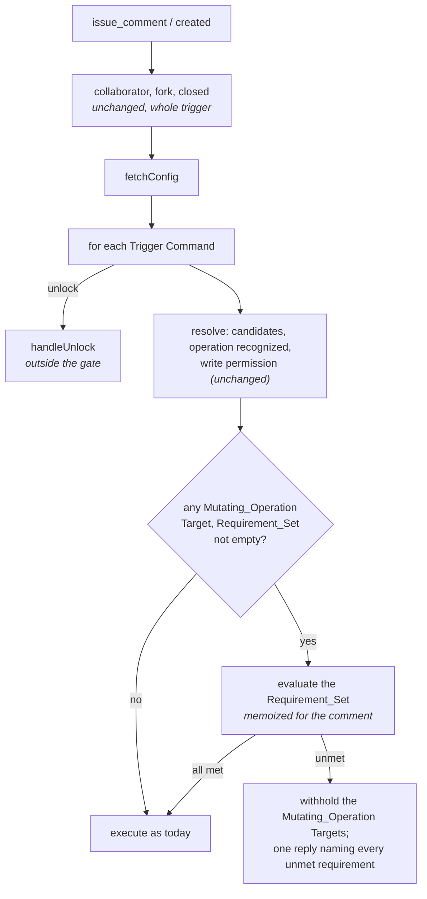

# Design: What a Pull Request Must Satisfy Before a Mutating Operation (Slice 34)

## Overview

One Server setting, one question asked once per comment, and one reply.

1. **`TURNIP_MUTATION_REQUIREMENTS`**, parsed at start beside
   `TURNIP_ALLOWED_OVERRIDES`, names the Requirement_Set.
2. **The gate** sits in Target resolution, beside the write-permission
   check that already applies to a Mutating_Operation. It asks GitHub
   about the pull request at most once per comment.
3. **An unmet requirement withholds** the command's Mutating_Operation
   Targets, and the command gets one reply naming every unmet
   requirement. No Project_Check, no Lock, no Job.

Nothing is stored. Every answer comes from GitHub at the moment of the
comment, so the Server's HA story is unchanged.

## Where the gate sits



**In `resolve`, after the write-permission check.** A commenter without
write permission is refused per Project today, before the gate would
ask anything, so the gate never spends an API call on a trigger that was
never going to run. And the gate sees only Targets that would otherwise
run: an operation a Plugin does not recognize is already a rejected row.

**Evaluated at most once per comment.** The answer cannot differ between
the Projects of a command, or between the commands of one comment, so it
is computed on first need and reused, as `memoModifiedFiles` does for the
changed files. Requirement 6.4 asks for no more than once per Trigger
Command; once per comment is stricter and free.

**Only Mutating_Operation Targets are withheld.** A command's operation
is tool-native, so under `/turnip <op>` one name could in principle be a
plan for one tool and mutating for another. The plan Targets run
(Requirement 6.2); the rest are withheld. For every real command this is
all or nothing, since each tool's plan and apply names differ.

**Before `executeOne`'s Lock and plan checks.** An explicit
`/helmfile apply web` with no plan on an unapproved pull request is
refused for the approval first, and for the missing plan once approved.
Both replies are accurate, and the order costs nothing: a bare
`/helmfile apply` with nothing planned still answers "no project has a
plan" from `bareDefaults`, which runs before any Target reaches the gate.

### Decision 1: In resolution, not in `executeOne`

*Alternative considered*: check in `executeOne`, where a
Mutating_Operation's other refusals (no plan, stale plan, extra
arguments) live.

*Rejected because*: `executeOne` runs per Target, concurrently.
Requirement 5.3 and 6.4 ask for one reply and one evaluation per command,
which per-Target placement would have to reassemble; and its refusals
become rows in the results comment, one per Project, where the answer is
the same for every row.

## The setting

| | |
|---|---|
| Variable | `TURNIP_MUTATION_REQUIREMENTS` |
| Form | comma-separated names, whitespace trimmed |
| Names | `approved`, `mergeable` |
| Default | empty: no requirement, today's behavior |
| Unknown name | the Server does not start; the error names it and lists the recognized names |
| `Config` field | `MutationRequirements []string`, passed to the Orchestrator |

It is not an override path, and `knownOverridePaths` is untouched
(Requirement 2). `turnip.yaml`'s strict decoding already rejects any key
it does not define, so there is no repository-side spelling to guard.

## Evaluating `approved`

A new client method lists the pull request's reviews, every page:

```go
ListReviews(ctx context.Context, owner, repo string, prNumber int) ([]Review, error)

type Review struct {
	Author string
	State  string // APPROVED, CHANGES_REQUESTED, COMMENTED, DISMISSED, PENDING
}
```

GitHub returns reviews oldest first. The rule, in GitHub's own terms:

| Step | Rule |
|---|---|
| Each account's standing | its latest review in state `APPROVED`, `CHANGES_REQUESTED` or `DISMISSED`. `COMMENTED` and `PENDING` do not change it, as they do not in GitHub's own review decision |
| Candidates | accounts whose standing is `APPROVED`, other than the pull request's author (compared case-insensitively, as GitHub logins are) |
| Met | when any candidate has write permission, asked through the comment's `Authorizer`, which already caches per account |

A stale approval dismissed by branch protection is `DISMISSED` and
drops out (Requirement 3.4, 3.5); a commit id on the review is never
read. Candidates are checked in order until one has write permission, so
the usual case is one permission call, often already cached for the
approver if they also commented.

The App's existing **Pull requests: Read** permission covers listing
reviews; no permission change.

## Evaluating `mergeable`

`github.PullRequest` gains `Mergeable *bool`, mapped from the same
`GET /pulls/{n}` `GetPullRequest` already makes: `nil` while GitHub has
not computed it. It is the conflict-only field, never `mergeable_state`
(Requirement 4.2).

`HandleIssueComment` already read the pull request once. When that read
says `nil`, the gate reads it again up to **3 times, 1 second apart**:
under 4 seconds added, inside GitHub's 10-second webhook delivery, with
room for the calls before it. Still `nil` after that is refused as not
yet known (Requirement 4.4).

| GitHub says | Result |
|---|---|
| `true` | met |
| `false` | unmet: a merge conflict |
| `nil` after the retries | unmet: not yet known, try again |

### Decision 2: Wait inside the webhook, not after it

*Alternative considered*: evaluate in the goroutine that executes the
Targets, where time is not bounded by GitHub's delivery.

*Rejected because*: the reply and the withheld Targets are decided in
the handler, with the other refusals, and moving only this one would
split the command's outcome across two places. Four seconds fits.

## When GitHub cannot be asked

A failed review listing, permission lookup or pull request read makes
the requirement **unmet**, with its own wording, and the error is logged.
The gate fails closed: a requirement turnip could not check has not been
shown to hold, and the author can retry the comment.

## The reply

One per command, posted with the command's other replies, naming every
unmet requirement (Requirement 5.1, 5.2):

```text
`/helmfile apply` was not run. This pull request must first:
- be approved by someone with write access other than its author
- have no merge conflicts (GitHub reports one)
```

| Condition | Line |
|---|---|
| `approved` unmet | be approved by someone with write access other than its author |
| `mergeable` false | have no merge conflicts (GitHub reports one) |
| `mergeable` unknown | have no merge conflicts (GitHub has not finished checking; try again in a moment) |
| could not ask GitHub | the requirement's line, then "(turnip could not check this; try again)" |

The refusal is logged at INFO, like the closed pull request's, with the
unmet names and the commenter. No Project_Check is created and the
Pull_Request_Record is untouched (Requirement 5.5): the `turnip` check is
already in progress while a plan awaits its apply.

## Documentation

| File | What |
|---|---|
| `docs/configuration.md` | the setting in the Server settings table; a section on mutation requirements: both names, off by default, not settable from `turnip.yaml` and why, `mergeable` is conflicts only, `approved` counts a write-access account other than the author and follows GitHub's review state, and branch protection's stale-approval dismissal is how a repository requires approval of the commit being applied |
| `docs/troubleshooting.md` | each reply line and what to do |
| `SECURITY.md` | without `approved`, one collaborator can plan and apply their own pull request; the setting that prevents it |

## Testing

- **The setting**: empty, each name, both, whitespace; an unknown name
  refuses start and lists the recognized names.
- **`approved`**, table-driven over review histories: none; the author's
  own approval; an approval then `CHANGES_REQUESTED`; an approval then
  `COMMENTED` (still approved); a `DISMISSED` approval; an approver
  without write permission; one without and one with; a login differing
  from the author only in case; a failed listing or permission call.
- **`mergeable`**: true; false; `nil` then true within the retries; `nil`
  throughout, refused as not yet known, with the retry count and waits
  asserted through an injected sleep; a failed read.
- **The gate in the comment path**: a plan with requirements unmet runs;
  `unlock` runs; an apply is withheld with one reply naming both unmet
  requirements, and no Job, Lock event or check run follows; two apply
  commands in one comment ask GitHub once; an empty Requirement_Set asks
  nothing.
