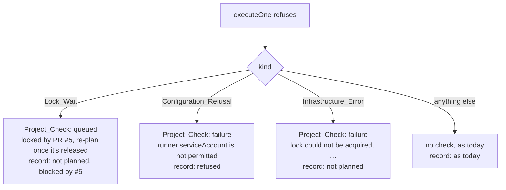

# Design: A Blocked Operation Blocks the Merge, Visibly (Slice 36)

## Overview

Every refusal in `executeOne` goes through one closure, `reject(reason)`,
which today only builds the comment's result — and, since Slice 37,
records a refused plan as not planned. This slice gives that closure the
one thing it lacks: **what kind** of refusal it is. From the kind follow
the Project_Check's status, its Title, and the Outcome recorded.



"Anything else" is every refusal this slice leaves alone: a refused
Mutating_Operation, and a tool with no Plugin. Neither gets a check
created for it, and neither changes the record in a new way (Requirement
7). The one thing that reaches every Operation is completing a check that
already exists — see "What `reject` does with a kind".

## The refusal kinds

`reject` takes a `refusal` rather than a string:

```go
type refusalKind int

const (
	refusalOther refusalKind = iota // no check; today's behavior
	refusalLockWait
	refusalConfiguration
	refusalInfrastructure
)

type refusal struct {
	kind      refusalKind
	reason    string // what the comment shows, as today
	blockedBy int    // Lock_Wait: the holder's PR number, 0 when unknown
	setting   string // Configuration_Refusal: "runner.serviceAccount", …
	title     string // Infrastructure_Error: its Title, from titles.go
}
```

Each call site states its kind; nothing reads the reason's text to decide
it (the same rule Slice 35 applied to failure categories):

| Site (`execute.go`) | Kind | Detail |
|---|---|---|
| `:97` tool not supported | other | — |
| `:104` ServiceAccount override | configuration | `setting` from `ServiceAccountNotPermittedError` |
| `:112` submodules override | configuration | `setting` from `SubmodulesNotPermittedError` |
| `:135` mutating with arguments | other | — |
| `:167` acquiring the Lock failed | infrastructure | `lock could not be acquired` |
| `:175` locked, holder unknown | Lock_Wait | `blockedBy` 0 |
| `:177` locked by PR #N | Lock_Wait | `blockedBy` N |
| `:191`–`:221` mutating, no or stale plan | other | — |
| `:278` saving the Operation Record | infrastructure | `operation could not be recorded` |
| `:313` building the Runner Job | infrastructure | `Runner Job could not be built` |
| `:327` creating the Runner Job | infrastructure | `Runner Job could not be created` — today's own update moves here |
| `:337` waiting for the result | other | the Job exists; `HandleResult` finishes the check for a Runner that reports, the sweep for one that never starts — see "A known gap" |

The two override resolvers return only their "not permitted" error type,
so `:104` and `:112` classify by `errors.As` with no remainder. The
setting's name is the override constant each already uses
(`overrideServiceAccount`, `overrideCloneSubmodules`), so the Title and
`TURNIP_ALLOWED_OVERRIDES` spell it the same way.

## What `reject` does with a kind

The closure already knows whether the Operation is a plan, and — with
the check run's ID declared before it — reads that ID through a variable
it closes over. Two questions are answered separately, because they have
different answers for a Mutating_Operation:

**The Project_Check**, for any Operation:

| Kind | No check exists yet | A check already exists |
|---|---|---|
| Lock_Wait (plans only) | **create**, `queued`, no conclusion | **update** it, completed `failure`, `operation could not be started` |
| Configuration | **create**, completed `failure` — for a plan | **update** it, completed `failure`, `… is not permitted` |
| Infrastructure | **create**, completed `failure` — for a plan (`:167`) | **update** it, completed `failure` — for **any** Operation (`:278`, `:313`, `:327`) |
| other | nothing | **update** it, completed `failure`, `operation could not be started` |

Only the Infrastructure row of the right-hand column is reached by a site
today. The others are there so the invariant does not depend on a later
site choosing its kind correctly: whatever the kind, a check that exists
and whose Job was never created is completed, and the kind only picks the
Title. A Lock_Wait there still completes rather than requeues, for
Decision 1's reason.

**The record**, for a plan only:

| Kind | Outcome |
|---|---|
| Lock_Wait | not planned, `blocked_by` N |
| Configuration | **refused**, with the setting |
| Infrastructure | not planned |
| other | as today |

A refused Mutating_Operation never *creates* a check and never changes the
record (Slice 37, Requirement 4.7) — it ran nothing and changed nothing.
But the Project_Check is created at `:234` for every Operation, applies
included, so an apply that fails at `:278` or `:313` would be left in
progress exactly like a plan. Completing a check that already exists is
therefore not limited to plans: it is what Requirement 4.4 asks of every
path, and `reject` holds it for every site rather than each remembering.

A queued or failed check is created with the same name, head commit and
`Summary` a running one gets, the summary carrying the comment's full
reason — for a refused override, that includes the instruction to add the
setting to `TURNIP_ALLOWED_OVERRIDES`. A GitHub error creating or
updating it is a soft failure noted on the result, exactly as
`appendCheckRunNote` handles a running check's today.

### A known gap: a Runner that dies after starting

`:337` is the one return after the check exists that completes nothing,
and the table's reason holds only in part. A Runner that reports a result
is finished by `HandleResult`, and one that never starts by the sweep. A
Runner that starts (its first log line marks the record started) and then
dies without a result, whether OOMKilled, evicted or cut off, is finished
by neither: the RPC handler returns the stream's error without a result,
and the sweep claims only records that never started. `executeOne` waits
out `operationTTL`, by which time the record has expired too, so nothing
is left to complete the check from.

This predates the slice and is not a refusal, so it is not fixed here.
`executeOne` cannot simply complete the check at `:337`: a result can
still arrive, and completing it without the record's atomic claim would
race `HandleResult`. The fix needs a claim for a started Operation that
went silent (a liveness signal from the Runner, or the sweep watching the
Job's own state) and belongs in a slice of its own.

### Decision 1: Create the check at the refusal, not before every plan

*Alternative considered*: create every plan's Project_Check at the top of
`executeOne`, in progress, and have each refusal update it.

*Rejected because*: a Lock_Wait would then move a check from in progress
back to queued, which GitHub does not document as permitted — the same
uncertainty that led Slice 37 never to reopen a completed check. It would
also create a check for refusals this slice deliberately leaves without
one. Creating at the refusal needs only the create call every refusal kind
would have made anyway, and no transition GitHub might reject.

### Decision 2: A typed refusal, not a classified string

*Alternative considered*: keep `reject(reason string)` and decide the kind
from the reason's text or from separate booleans.

*Rejected because*: the reasons are free text written for people, and a
kind inferred from them breaks the first time one is reworded — the
reasoning Slice 35 recorded for the Failure_Category. A struct also puts
the kind at the call site, where a reviewer sees it beside the condition
that caused it.

## The record

`ProjectEntry` (Slice 37) gains two optional fields and the Outcome set
gains one:

| Addition | Meaning |
|---|---|
| Outcome `refused` | a Configuration_Refusal. Fails the verdict, as `unsupported` does |
| `blocked_by` | on `not_planned`: the pull request holding the Lock, when known |
| `setting` | on `refused`: the override that was not permitted |

Both fields are `omitempty`, so every entry written before this slice
decodes unchanged.

## The verdict

`refused` joins the configuration failures. The precedence becomes:

| Record | Conclusion | Title |
|---|---|---|
| invalid `turnip.yaml` | `failure` | unchanged |
| nothing affected | `skipped` | unchanged |
| any `unsupported` | `failure` | unchanged |
| **any `refused`** | `failure` | `not permitted: web sets runner.serviceAccount, and 1 more` |
| any apply failed | `failure` | unchanged |
| all up to date | `success` | unchanged |
| otherwise | in progress | unchanged |

`refused` follows `unsupported` only so that one Title is chosen when both
occur; each is a configuration failure and either is true. The first
refused Project is the first by name, the rule Slice 35 set for the
unsupported Title.

The summary's per-Project line gains the detail:

- `not_planned` with `blocked_by`: `not planned, locked by PR #5`
- `refused`: `runner.serviceAccount is not permitted — change turnip.yaml,
  or permit it in TURNIP_ALLOWED_OVERRIDES`

## The Titles

`titles.go` gains, alongside Slice 35's:

| Function | Returns |
|---|---|
| `lockWaitTitle(blockedBy)` | `locked by PR #5, re-plan once it's released`; for 0, `locked by another pull request, re-plan once it's released` |
| `notPermittedTitle(setting)` | `runner.serviceAccount is not permitted` |
| `refusedTitle(project, setting, more)` | `not permitted: web sets runner.serviceAccount`, then `, and 2 more` |
| `lockNotAcquiredTitle()` | `lock could not be acquired` |
| `recordNotSavedTitle()` | `operation could not be recorded` |
| `jobNotBuiltTitle()` | `Runner Job could not be built` |
| `notStartedTitle()` | `operation could not be started` — the fallback for a check that exists, when the refusal names no step |

`jobNotCreatedTitle` (Slice 35) is unchanged; its call moves from the
inline update at `:327` into `reject`.

## Testing

- **Classification**: one `executeOne` test per row of the sites table,
  asserting the check created or updated (status, conclusion, Title) and
  the Outcome recorded — including that `:175` and `:177` differ only in
  the Title's blocking pull request.
- **The stuck-check invariant**: tests for `:278` and `:313`, for a plan
  and for an apply, fail today (the check is never completed) and pass
  after. The apply cases also assert the record is unchanged.
- **Unchanged paths**: a refused Mutating_Operation and a tool with no
  Plugin create no check.
- **The verdict**: `refused` fails; its precedence below `unsupported` and
  above a failed apply; the refused Title's first-and-count; the summary
  lines for `blocked_by` and `setting`.
- **Titles**: table rows for each new function, under Slice 35's checks
  (no `·`, no bare status word).
