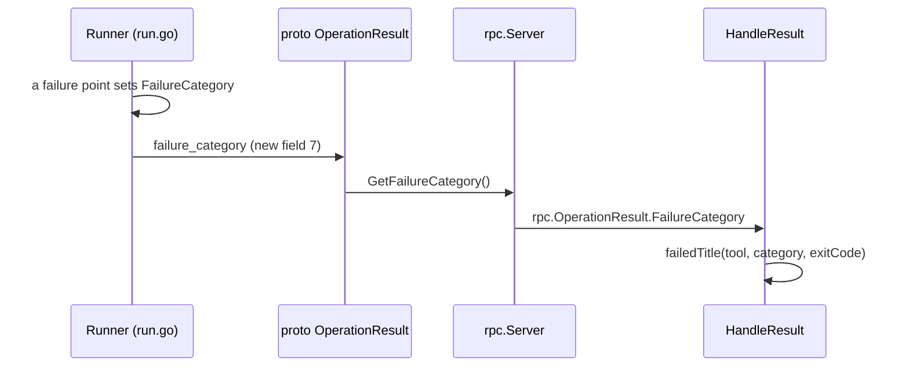

# Design: What the Checks List Says (Slice 35)

## Overview

Two changes, one small and one that crosses the wire:

1. **One title formatter** in the orchestrator, `titles.go`, which every
   site that sets a check run's title calls. It builds on two plain-text
   renderers exported from the comment code, so a Title and the comment
   render the same outcome from the same function.
2. **A Failure_Category on the Runner's result**, set where the Runner
   fails and carried through gRPC to the completion site, so a failed
   Operation's Title can name what failed without reading the error text.

Nothing else moves. The comment's output is unchanged (Requirement 7.1),
check run names are unchanged, and each site's summary and text keep what
they carry today.

## The sites

| Site | When | Title after this slice | Inputs it needs |
|---|---|---|---|
| `execute.go:233` | Project_Check created | `running`, `running, -l name=api` | the trigger's arguments |
| | … for a Mutating_Operation | `running the recorded plan, +1 ~4 -2` | the Lock's `PlanRecord` — `Summary` and `Args` |
| `execute.go:317` | Runner Job not created | `Runner Job could not be created` | — |
| `result.go:93` | Operation succeeded | `+1 ~4 -2`, `no changes`, plus scope | `result.Changes`, `rec.ExtraArgs` |
| | Operation failed | by Failure_Category (Requirement 4.1) | `result.FailureCategory`, `result.ExitCode`, `rec.Project.Tool` |
| `sweep.go:111` | timed out | `timeoutDiagnostic`'s text | the diagnostic, already built there |
| `verdictFor` | Aggregate_Check | `1/2 projects up to date, 1 failed`, … | counts from the record |

Everything a Title needs is already in hand at its site, with one
exception: the running Title for a Mutating_Operation needs the recorded
plan's counts, and `executeOne` today keeps only `plan.Data` and
`plan.Args` from the `PlanRecord` it fetches. It keeps `plan.Summary` as
well.

## Where the formatter lives

`internal/orchestrator/titles.go` holds every Title's wording. It is the
one file a reviewer reads to see what the checks list can say.

It does not re-implement the comment's renderings. `internal/github`
exports two plain-text functions, and both the comment and `titles.go`
call them:

```go
// ChangeText renders counts as the comment does: "+1 ~4 -2", or
// "no changes" when all are zero.
func ChangeText(c ChangeCounts) string

// ScopeText renders an Operation's arguments as the comment's scope
// marker does, truncated to the same width, as plain text.
func ScopeText(args []string) string
```

The comment's `summaryLine` and `scopeMarker` are rewritten on top of
them. `scopeMarker` keeps its `<code>` and HTML escaping, applied to
`ScopeText`'s result, so the comment renders byte-for-byte as before; the
Title uses the plain string (Requirement 1.3).

### Decision 1: The formatter in the orchestrator, the shared renderings in `internal/github`

*Alternative considered*: the whole formatter in `internal/github`, beside
the comment code it shares vocabulary with.

*Rejected because*: the failure Titles are keyed on the Failure_Category,
which is an `rpc` type, and the Aggregate_Check's inputs are the
orchestrator's record. Moving them into `internal/github` would make the
comment package import the gRPC translation layer for the sake of a
string. What must be shared is the rendering of counts and scope, and
exporting exactly those two keeps the dependency pointing the way it
already does.

## The Failure_Category



**On the wire**, in `proto/turnip/v1/operation.proto`:

```proto
enum FailureCategory {
  FAILURE_CATEGORY_UNSPECIFIED = 0;
  FAILURE_CATEGORY_TOOL_EXITED = 1;
  FAILURE_CATEGORY_CLONE_FAILED = 2;
  FAILURE_CATEGORY_WORKSPACE_FAILED = 3;
  FAILURE_CATEGORY_TOOL_NOT_STARTED = 4;
}

message OperationResult {
  // … fields 1–6 unchanged …
  FailureCategory failure_category = 7;
}
```

The naming follows buf's STANDARD lint (`proto/buf.yaml`): the zero value
ends in `_UNSPECIFIED`, and every value carries the enum's name as a
prefix. Adding a field is not a breaking change under the `FILE` rule
already configured.

**In Go**, one domain type, `rpc.FailureCategory`, used by both sides. The
Runner already imports `internal/rpc` (`reporter.go`, `credential.go`),
so its `OperationResult` gains a `FailureCategory` field of that type;
`reporter.go` translates it to the proto enum and `rpc.Server` translates
it back, beside the fields each already translates.

**Where the Runner sets it** (`internal/runner/run.go`):

| Failure point | Category |
|---|---|
| `runCloneWith`, no workspace directory configured (`:96`) | clone failed |
| `runCloneWith`, the clone itself failed (`:103`) | clone failed |
| `execute`, `resolveWorkspace` failed (`:192`) | workspace failed |
| `execute`, the Plugin's `Execute` returned an error (`:248`) | tool not started |
| `execute`, the tool ran and its exit code is not 0 (`:252`) | tool exited |

"Tool not started" covers every error `Execute` returns rather than
running the tool — including a missing binary and an Operation the Plugin
does not support. Those are the cases where no tool process produced an
exit code, which is what distinguishes them from "tool exited".

The exit code keeps its current values, including `-1` for turnip's own
failures; only the Title stops showing it (Requirement 4.5).

### Decision 2: A new enum field, not a reuse of `exit_code`

*Alternative considered*: encode the category in `exit_code` — `-1`,
`-2`, `-3` — since turnip already uses `-1` as a marker.

*Rejected because*: it would overload a field whose meaning is the tool's
exit code, and every reader would need to know which negative number
means what. A named enum is self-describing on the wire and in the
generated code, and `-1` goes on meaning what it means now.

## The Titles

`titles.go` exposes one function per situation. These are the contracts;
their wording is the requirements':

| Function | Returns |
|---|---|
| `completedTitle(changes, scope)` | `+1 ~4 -2` or `no changes`, then `, <scope>` when scoped |
| `runningTitle(scope)` | `running`, then `, <scope>` |
| `runningRecordedPlanTitle(changes, scope)` | `running the recorded plan, +1 ~4 -2`, then `, <scope>` |
| `failedTitle(tool, category, exitCode)` | the Requirement 4.1 table; `failed` for unspecified |
| `jobNotCreatedTitle()` | `Runner Job could not be created` |
| `timeoutTitle(diagnostic)` | the diagnostic, unchanged |
| `aggregateTitle(upToDate, total, failed)` | `1/2 projects up to date`, then `, 1 failed` |
| `unsupportedTitle(first, tool, rest)` | `unsupported tool: infra uses terraform`, then `, and 2 more` |

`verdictFor` keeps deciding *which* verdict applies and calls these for
its words. Its `no projects affected` and `invalid turnip.yaml` Titles move
into `titles.go` unchanged, so every Title's text is in one file.

For the unsupported-tool Title, "first" is the first by name — the same
order the summary lists Projects in — so the named example is also the top
line of the list beneath it.

The existing `checkRunResultTitle` is removed; its two strings were the
problem.

## Testing

- **`titles.go`**: table-driven, one row per Title in the requirements,
  asserting exact strings — including scope truncation, `-1` never
  appearing, and no `·` anywhere.
- **`ChangeText` / `ScopeText`**: the comment's existing tests pin that
  `summaryLine` and `scopeMarker` render exactly as before (Requirement
  7.1); new tests cover the plain forms, including that `ScopeText` is not
  HTML-escaped.
- **The Runner**: one test per failure point asserting the category it
  reports, extending `run_test.go`'s existing failure tests.
- **The wire**: `rpc`'s server tests gain a round trip for
  `failure_category`, so a category set by the Runner arrives at
  `HandleResult`.
- **The sites**: the existing tests asserting `fakeExecuteClient`'s
  created and updated check runs assert the new Titles.

## Generated code

`make proto-gen` regenerates `internal/grpc/turnip/v1/`. CI's
proto-freshness check fails until the regenerated files are committed,
which is the repository owner's step.
