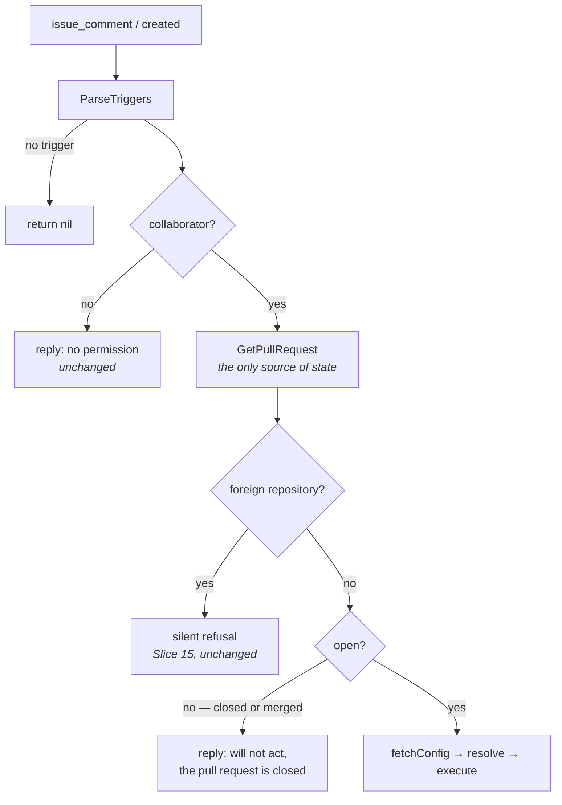

# Design: Refuse a Closed Pull Request, Plan a Reopened One (Slice 32)

## Overview

One field on `github.PullRequest`, mapped from the two payloads that carry
it, plus a guard on the comment path and one extra action on the automatic
one. Nothing else moves.

The two halves are the same idea read in opposite directions: a pull
request that is no longer open must not be acted on, and one that becomes
open again should be planned. Both are turnip reading a state it has never
recorded.

## Where the guard goes



Three placements, each load-bearing:

**After the collaborator check.** A non-collaborator commenting on a
closed pull request keeps today's permission message. This matches Slice
15's reasoning exactly — the authorization answer is the one the commenter
can act on, and it costs no API call to reach.

**After the fork check.** A closed *fork* pull request stays silent. Slice
15 withholds feedback from a requester who may be an attacker; replying
"this pull request is closed" would hand back precisely the signal that
decision withholds. The stronger refusal goes first.

**Before `fetchConfig` (`comment.go:84`).** Requirement 2.3 wants the
refusal ahead of the Lock, the Job and the configuration read, and this
one placement satisfies all three, because everything that acquires or
creates anything is downstream of the configuration.

## Decision 1: One boolean, and it fails closed

```go
// Open reports whether GitHub still considers this pull request open. A
// merged pull request and one closed without merging are both false:
// GitHub gives each the state "closed", and turnip draws no distinction
// between them, because the Lock argument applies to both.
//
// False is the safe default. A path that forgets to map it refuses
// everything, loudly, instead of silently restoring the bug this slice
// exists to fix.
//
// Like Draft, this is false on every issue_comment event, where the
// payload populates only Number — which is why the guard reads the pull
// request GetPullRequest returned and never event.PullRequest. Unlike
// Draft, reading the wrong one here does not merely skip an autoplan: it
// refuses every comment trigger in the repository. Say so on the field,
// because the compiler cannot.
Open bool
```

`Open = pr.GetState() == "open"` on both mapping sites. The merged case
needs no handling of its own: GitHub reports a merged pull request as
`closed`, so Requirement 1.4 falls out of its model rather than out of a
rule turnip has to remember. `GetMerged()` is deliberately not read.

**Alternative considered**: a tri-state `State string`, so the reply could
say "merged" where it differs from "closed".

**Rejected because** Requirement 1.4 forbids the distinction, and a field
that can express it is an invitation to act on it — most likely by
deciding a merged pull request is harmless, which is true of the second
consequence and false of the first.

**Alternative considered**: `Closed bool`, whose zero value is "open".

**Rejected because** the failure directions are not symmetric. An unmapped
`Open` refuses every Operation, which is obvious within one pull request.
An unmapped `Closed` accepts every Operation, which is this slice's bug
returning with no signal at all.

**A cost worth predicting rather than discovering.** Every test fixture
building a `PullRequest` literal must now set `Open: true`. Slice 15's
identical change to `HeadRepo` broke eleven tests for exactly this reason,
and that was the mechanism working: a fixture that does not say the pull
request is open is a fixture describing one that is not.

## Decision 2: The refusal replies, then returns `ErrRefused`

The reply is posted, and the handler returns `github.ErrRefused` — the
sentinel Slice 15 added, which makes `ServeHTTP` answer **200** and count
the delivery once as `rejected`.

Returning nil instead would count it as `dispatched`, which is false:
nothing was dispatched. Returning a plain error would answer 500 and make
GitHub redeliver a comment turnip declined on purpose — and redelivery
would post the reply again.

**On a failed post**: log it and return `ErrRefused` anyway. The
alternative, returning the post error, answers 500 and invites the
redelivery loop above. The permission refusal at `comment.go:51` returns
its post error today; this path deliberately does not, and the difference
is that this one has already decided the delivery is finished.

**The log entry is `INFO`, not `WARN`.** Slice 15 logs its fork refusals
at `WARN` because repeated ones are a detection signal — someone outside
the repository trying to have turnip run their code. A closed-pull-request
refusal is a colleague commenting on the wrong tab. Logging it at `WARN`
would put routine mistakes in the same channel as attempted misuse, which
is how a `WARN` channel stops being read. Requirement 3.3 asks for a
record, not an alarm.

**One reply per comment, not per command or per Project** (Requirement
3.2) follows from the placement: the guard sits above the per-command
loop, so there is one exit and one message.

## Decision 3: `reopened` joins the existing arm

`HandlePullRequest`'s first arm becomes
`case "opened", "synchronize", "ready_for_review", "reopened":`.

Everything wanted follows from the arm it joins rather than from new code:

| Wanted | Where it comes from |
|---|---|
| plan only the matched Projects | `handlePlanTrigger` matches `whenModified` against the pull request's changed files |
| a reopened draft does not autoplan | the draft guard already at the top of the arm |
| a reopened fork pull request is refused | the fork refusal already in the arm |

**Alternative considered**: a `case "reopened":` of its own.

**Rejected because** it would have to repeat the draft guard and the fork
refusal, and two copies of a security check drift. The one thing a
separate arm could express — treating a reopen differently from an open —
is the thing Requirement 5.1 says not to do.

## Decision 4: Nothing guards the automatic path

`closed` routes to `handlePRClosed`, and every action but the four
planning ones returns nil. So the automatic path cannot reach a closed
pull request, and a state check there would add a branch no event can
take — while risking Requirement 4's hazard, where a guard written one
level too high stops the Lock release as well.

This is the same shape as Slice 15's Requirement 2.3, and the test that
pins it already exists.

## What changes where

| File | Change |
|---|---|
| `internal/github/types.go` | `Open bool` on `PullRequest` |
| `internal/github/webhook.go` | map it in `pullRequestWebhookEvent` |
| `internal/github/client.go` | map it in `GetPullRequest` — the only source on the comment path |
| `internal/orchestrator/comment.go` | the guard, after the fork refusal and before `fetchConfig` |
| `internal/orchestrator/pullrequest.go` | `reopened` joins the first arm |
| `docs/usage.md` | closed and merged pull requests are not acted on; reopening plans again |

## Interaction with the slices around it

**Slice 15** supplies `ErrRefused` and the placement pattern this follows,
and its silence for forks is preserved by ordering rather than by a
special case.

**Slice 18** narrowed the consequence that motivates this slice without
closing it. A plan on a closed pull request that *fails* now releases its
Lock, and one that finds nothing releases for a tool inert without
changes. A successful plan still holds, and Helmfile is never inert
because `sync` acts regardless of the diff — so the stranded Lock this
slice prevents is still the ordinary case on the tool in use.

**Slice 19** is unchanged and is the reason the draft guard stays where it
is: being a draft decides when turnip acts on its own, and a reopen is
turnip acting on its own.

## Testing strategy

**The refusal matrix on the comment path.** Open runs; closed refuses;
merged refuses. The merged row matters most, because it is the one a
reader is most likely to think is harmless.

**Ordering is a test, not a comment.** A pull request that is both foreign
and closed must produce *silence*, not the closed reply. Nothing else in
the suite would notice if the two guards were swapped, and swapping them
undoes Slice 15's decision rather than this slice's.

**Absence, positively.** A refused comment must fetch no configuration,
acquire no Lock and create no Job. `getFileCallLog` is the strongest
witness available, exactly as in Slice 15: `fetchConfig` is the first
thing past the guard, so an empty log proves the refusal ran before it.

**Requirement 4 is a regression test that already exists.**
`TestHandlePullRequest_ClosedDraftStillReleasesLocks` and the
`TestHandlePRClosed_*` family must stay green untouched. If they go red,
the guard was placed where it can reach the cleanup path.

**The reopen half needs three.** A reopened pull request plans the matched
set; a reopened draft plans nothing; a reopened fork pull request is
refused. The second and third prove the arm was joined rather than
duplicated — a separate arm would pass the first and fail these.

**Fail-closed is worth one explicit test.** A `PullRequest` with `Open`
left at its zero value must be refused. That pins Decision 1's direction
against a future reader who "fixes" the fixture churn by flipping the
field's sense.
