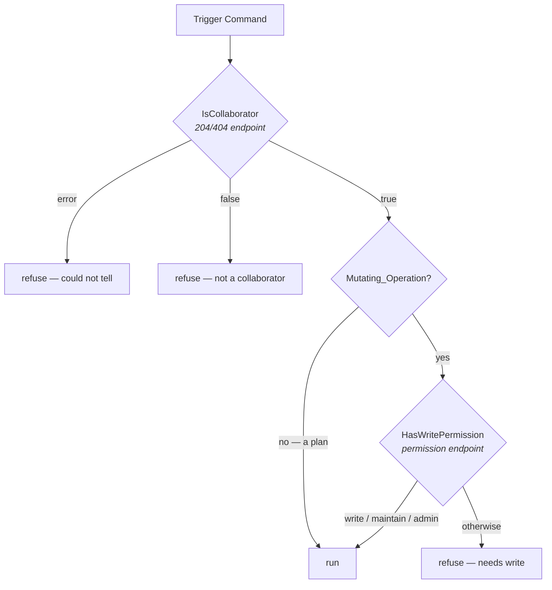

# Design: Authorize on Permission Level, Not Call Success (Slice 23)

## Overview

One method changes behaviour. `Authorizer.IsCollaborator` stops inferring
collaborator status from the success of a permission lookup and asks the
endpoint that answers the question.

Two facts make this smaller than it looks, and both were verified rather
than assumed:

- **`GitHubClient` already declares `IsCollaborator`** (`client.go:24`),
  and `Client` already implements it against
  `Repositories.IsCollaborator`. No interface changes, no new client
  method — the correct implementation has been sitting unused.
- **go-github maps the 404 to a clean false.** `parseBoolResponse`
  converts an `ErrorResponse` with status 404 into `(false, nil)` —
  *"Simply false. In this one case, we do not pass the error through."*

That second fact is what makes the endpoint the right answer rather than
merely a different one. It yields three distinguishable outcomes:

| GitHub says | `Client.IsCollaborator` returns | turnip concludes |
|---|---|---|
| 204 No Content | `(true, nil)` | is a collaborator |
| 404 Not Found | `(false, nil)` | is not a collaborator |
| anything else | `(false, err)` | could not tell — refuse |

The permission endpoint cannot produce that table. Every answer it gives
arrives as a 200 carrying a string, so "is not a collaborator" and "is a
collaborator with read" are the same shape, and the code has to interpret
rather than observe. The present code does not even interpret — it treats
the 200 itself as the answer, which admits every account GitHub will
answer about. That is the defect stated without reference to any
particular value, and it is the statement to rely on: the roadmap's two
claims about what the endpoint returns were both checked and neither was
confirmed.

## What the gate looks like after



The right-hand branch is unchanged. `permissionRank` already maps `none`
to 1 and an unknown string to 0, and the comparison is `>= write`, so
apply, sync and unlock were never exposed by this defect.

## Decision 1: Two questions, two endpoints, one cache

`Authorizer` keeps one map keyed by `(owner, repo, username)`. The entry
grows to carry both answers, each filled the first time it is asked:

```go
// cacheEntry holds whichever authorization answers have been fetched for
// one account on one repository. The two are independent: collaborator
// status comes from the 204/404 endpoint, the permission level from the
// endpoint that reports access. Neither implies the other, which is the
// defect this slice corrects.
type cacheEntry struct {
	collaborator    bool
	haveCollaborator bool

	permission     string
	havePermission bool

	expiresAt time.Time
}
```

**Alternative considered**: two maps, one per question.

**Rejected because** it doubles the things holding a lock and the things
holding a TTL, to separate two values that share a key and a lifetime.

**Alternative considered**: keep deriving collaborator status from the
permission string, but compare it against a threshold.

**Rejected because** it is the defect, one layer down. Requirement 1.2
states the reason: that endpoint answers *what access an account has*, and
read access is not evidence of trust. It would also leave the code one
convenience refactor away from the original bug.

**Cost.** A comment triggering a plan makes one call. One triggering a
mutating Operation makes two — collaborator, then permission — where it
previously made one. Both are bounded per Trigger Command and cached for
the existing TTL, which is what Requirement 4 asks.

**Alternative considered**: for a mutating Operation, ask the permission
endpoint first and skip the collaborator call when it reports write or
better, since write implies collaboration.

**Rejected because** it makes the number of calls depend on the answer,
and the saving is one request on the path that is about to start a
Kubernetes Job. It also reintroduces "infer one question from another",
which is the habit this slice exists to break.

## Decision 2: An error refuses, and that is load-bearing

`Client.IsCollaborator` returns `(false, err)` for anything that is not a
clean 204 or 404. The Authorizer propagates the error and the caller
refuses — today's behaviour, preserved deliberately.

This is the failure mode most likely to be met in practice. GitHub's
documentation notes that reading collaborator information requires write,
maintain or admin privileges, so an App installation with narrower
permissions makes this call fail. Refusing is the only safe direction, and
the refusal must not be silently converted into "not a collaborator" — the
operator needs to see an error, not a permission decision.

## Decision 3: The premise is corrected where it was written

`github-integration/design.md:387` claims *"GitHub's API returns 404 for a
non-collaborator on that endpoint"*, and uses it to justify one cached
call serving both questions. The sentence is corrected in place, with a
note recording that the 404 behaviour belongs to
`/collaborators/{username}` and that reading it otherwise produced a gate
which admitted every account GitHub would answer about.

**Alternative considered**: delete the sentence and move on.

**Rejected because** the next person to optimise an API call reads the
same paragraph. What has to survive is not the correction but the fact
that turnip once believed it — the roadmap entry carries the same note for
the same reason.

## Decision 4: The regression test must fail against the current code

The existing non-collaborator fixtures return an **error** from
`GetCollaboratorPermission`, which the broken code already handles
correctly. A test built the same way passes before the fix and proves
nothing.

The fixture that distinguishes them answers both questions independently:

| Fake answers | Current code | Fixed code |
|---|---|---|
| `GetCollaboratorPermission → ("none", nil)`, `IsCollaborator → (false, nil)` | **authorizes** | refuses |

That is the shape GitHub actually sends for a non-collaborator asked about
by permission, and it is the only fixture that demonstrates the defect
rather than the surrounding machinery.

**Expected churn, named in advance.** Comment-path fakes embed
`github.GitHubClient` and implement only the methods their tests reach.
The gate now calls `IsCollaborator`, which those fakes do not implement,
so they will panic on a nil embedded interface rather than fail quietly.
That is the right failure — loud, immediate, and at the fixture rather
than in a decision — but it means every comment-path fixture gains an
`IsCollaborator` answer, the way Slice 32's fixtures gained `Open: true`.

## What changes where

| File | Change |
|---|---|
| `internal/github/authorize.go` | `IsCollaborator` calls the client method; `cacheEntry` carries both answers |
| `internal/github/authorize_test.go` | the 200-with-no-access regression; error-refuses; cache still bounds calls |
| `internal/orchestrator/comment_test.go` | fixtures answer `IsCollaborator` |
| `github-integration/design.md` | the premise corrected in place, with what was wrong |
| `roadmap.md` | Slice 23 entry records the correction; status |
| `docs/` | triggering requires collaborator status, not read access |

## Interaction with other slices

**Slice 22** is where this compounds: a plan carries Project selection and
trailing arguments to the tool's argv, and the collaborator check is the
only gate in front of it. Restoring the gate shrinks that slice's blast
radius without touching argument handling.

**Slice 34** is where a *stricter* rule would belong if one is ever wanted
— requiring more than collaborator status to trigger a plan is a
requirement on the trigger, not a correction to how collaboration is
determined.

**The dead-code sweep** must not remove `Client.IsCollaborator` before
this lands. It is flagged as test-only and is, today; it is also the
correct implementation, and deleting it would leave only the broken one.
Requirement 7 exists because the finding and the fix live in different
documents.

## Testing strategy

**The defect, pinned by a fixture that fails against the current code.**
Decision 4's table is the test: permission `none` with collaborator false
must refuse, and that combination authorizes today.

**Error refuses, and is distinguishable from refusal.** A client error
must produce an error from the Authorizer, not a quiet false — otherwise
an under-permissioned installation looks like a repository where nobody is
a collaborator, and the operator has no way to tell those apart.

**The write gate is a bystander that must not move.** The existing
`HasWritePermission` tests stay green untouched; `none`, an unknown
string, and `read` all remain insufficient.

**Caching is asserted on call count, not on timing.** Two questions about
one account within the TTL make at most one call each, and a second
Trigger Command from the same author makes none. Counting calls on a
recording fake is what makes Requirement 4 testable at all.

**At the Trigger Command level, not only the Authorizer.** Requirement 6.3
asks for both: a helper that returns false proves nothing if the caller
ignores it, and the comment path is where the refusal has to appear.
