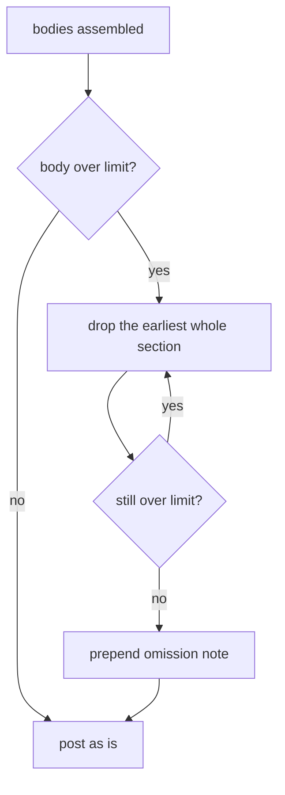

# Design: Pull Request Comment Output (Slice 17)

## Overview

One constraint shapes every decision here: **`internal/github` is a leaf
package.** It has no lock manager, no plugin registry, and no Redis. Its
comment builder is a pure function over a slice of results:

```go
func BuildConsolidatedComment(results []ProjectResult) []string
```

Everything the new comment says — change counts, which Projects this pull
request locked, the exact command that applies one Project — is knowledge
that lives elsewhere. So the work divides in two: decide what
`ProjectResult` must carry (Decisions 1–3), and decide how it renders
(Decisions 4–6). Nothing here gives the renderer a new dependency.

## The shape being built

```markdown
**4 changes across 3 projects** — 1 with no changes, 1 failed.

<details>
<summary>✅ <code>infra</code>: diff, +0 ~4 -0</summary>

```diff
<Output verbatim>
```

- Apply just this project: `/turnip apply infra`
- Re-plan it: `/turnip diff infra`

</details>

<details>
<summary>✅ <code>apps</code>: diff, no changes</summary>
...
</details>

<details>
<summary>❌ <code>edge</code>: diff, failed</summary>
...
</details>

This pull request holds locks on `infra` until applied or released.
`/turnip apply` or `/turnip unlock`
```

Labels use plain punctuation and `<code>` inside `<summary>`, as revised
by Slice 33's Decision 10; the operation name on the summary line was
added there too.

No summary table — global Requirements 10.2 and 17.3 were amended for
this slice. The scanning a table provided comes from the `<summary>`
line, which GitHub renders **while the section is collapsed**, so each
Project costs one line until someone opens it.

## Decision 1: the renderer stays pure; the orchestrator resolves

`ProjectResult` gains fields rather than `BuildConsolidatedComment`
gaining parameters or dependencies. This mirrors how
`runner.serviceAccount` already works: resolve where the knowledge lives,
hand the renderer an answer.

| New field | Filled by | Absent means |
|---|---|---|
| `Changes` | the Operation's reported counts | the summary line omits counts rather than printing zeros |
| `PlanOperation` | the Project's Plugin | no re-plan command is printed |
| `ApplyOperation` | the Project's Plugin | no apply command is printed |
| `Locked` | the orchestrator, reflecting whether this pull request holds the Lock once the result has been handled | no lock line is printed |
| `BlockedBy` | the orchestrator, on the contention path only | the message says the Project is locked without naming a holder |

Every field degrades to "print less", never to a wrong statement. That
matters because `rejectedResult` builds a `ProjectResult` for a Project
that never ran: its zero values must produce a comment that is merely
quieter, not one claiming zero changes were planned.

**Alternative considered**: passing a second argument carrying lock state
and operation names. *Rejected* — it splits one Project's facts across two
parallel structures the caller must keep aligned, which is exactly the
shape the existing `Tool` field's doc comment says was avoided once
already.

**Alternative considered**: letting `comment.go` import `internal/plugin`
for `ChangeSummary`. *Rejected* — it would put tool concepts into the
package that talks to GitHub, for one struct of three ints. The counts
type is declared locally and the orchestrator converts, keeping
`internal/github` free of the plugin system.

## Decision 2: operation names are resolved, not inferred

Per-project commands are per-tool. Helmfile plans with `diff` and applies
with `apply`; Pulumi previews with `preview` and applies with `up`. Those
names come from `Plugin.GetPlanOperation()` and `GetApplyOperation()`,
and the renderer has no registry to ask.

So the orchestrator — which already looks the Plugin up to decide whether
an Operation is a plan or an apply — puts both names on the result. A
comment reporting two Projects using different tools therefore prints
different commands for each, correctly, without the renderer knowing what
a tool is.

## Decision 3: commands print `/turnip`, never the tool's own name

Both `/turnip apply infra` and `/helmfile apply infra` work. The comment
prints the first.

`/turnip` considers every Project, so naming the Project already narrows
it to one; the tool-scoped form adds nothing. It would also mean a
multi-tool comment printing `/helmfile …` in one section and
`/terraform …` in the next, which reads as though the prefix carried
meaning the reader must work out.

## Decision 4: the verdict line, and what counts as changed

| Term | Definition |
|---|---|
| with changes | succeeded, and at least one of add/change/destroy is non-zero |
| no changes | succeeded, and all three are zero |
| failed | did not succeed, whatever the counts say |

**"No changes", not "unchanged".** The tools say it themselves — helm-diff
and Terraform both emit the literal phrase "No changes", and Atlantis
prints "with no changes" in its footer. A comment that echoes the tool's
own wording asks the reader to learn nothing; "unchanged" is turnip
coining a term for something already named.

The headline counts only what is worth counting. It states the total
change and then names the exceptions — Projects with no changes, and
failures — rather than reciting all three figures. With the per-Project
rows directly beneath it, a "with changes" count is the one number the
reader can already see, and the total implies it.

The headline total sums add/change/destroy across Projects *with changes*
only; a failed Project contributes nothing, because its counts describe
an Operation that did not complete.

**One Project reads as one Project.** "4 changes across 1 project — 0
with no changes, 0 failed" is arithmetic, not a sentence. A single result
renders as its own clause naming the Project. The pilot repository has
exactly one Project today, so this is the common case rather than an edge
case.

## Decision 5: the contention message gains a link, not a lookup

Requirement 5 is smaller than it first appeared. The failed-acquire path
in `execute.go` **already** calls `GetLockStatus` and already reports
`locked by PR #<n>`, falling back to a generic message only when the
status lookup fails or reports unlocked. What is missing is the link —
even though `LockStatus.PullRequestURL` is in the struct already being
read.

So there is no new lookup, no change to `AcquireLock`'s contract, and no
extra round trip on the happy path: the rejection message renders the URL
it already holds. The generic fallback stays exactly as it is, and
Requirement 5.3 is already satisfied by it.

## Decision 6: clamping drops whole sections before it cuts bytes

Requirement 6 inverts truncation: keep the end, drop the beginning.
Mirroring today's byte-level cut would be the obvious implementation and
is the wrong one.

Cutting bytes from the *front* leaves a fragment that can begin in the
middle of a code fence, inside a `<details>`, or between the two. The
prepended marker would have to *open* whichever elements the fragment
later closes — guessing at structure it cannot see, and producing stray
closing tags whenever it guesses wrong. Today's marker has the easy half
of this problem: closing an open block is unambiguous.

Instead, clamping drops **whole leading pieces**. Slice 4 already
guarantees each `<details>` piece is self-contained — "it opens and closes
its own code fence and `<details>` tag — so it never depends on a
neighboring piece to be valid markdown on its own". Dropping entire
pieces from the front therefore leaves valid markdown by construction,
with a short prepended note saying how many sections were omitted and
that the earliest were removed first.

This also keeps the verdict line honest about the truncation: it is
prepended after the drop, so it still describes the whole run, not the
surviving fragment.

**When one section alone is too large, clamping falls back to cutting
within it.** Dropping whole sections has a floor: it cannot drop the last
one. `splitDetailSection` normally prevents this by sizing every piece to
`budget - scaffold`, but it guards that arithmetic with a floor of one
byte — so a section whose *scaffold alone* (summary line, per-Project
commands, fences) exceeds the budget produces pieces that are over the
limit however they are split, and no amount of dropping helps.

In that case, and only then, bytes are cut from the front of that
section's output, keeping its end.

The objection that ruled byte-cutting out for tier 1 does not apply here.
There, a fragment could begin anywhere inside arbitrary packed content
whose structure the clamp cannot see. Here exactly one section remains,
turnip generated its scaffold, and the elements to reopen are therefore
known rather than guessed: the `<details>`, its summary, and the fence,
each reproduced verbatim from the same builder that emitted them, with a
note that the earliest output was removed.

Tier 2 is the last resort tier 1 used to be — reachable only through an
absurd Project or Operation name, and covered by a test rather than left
to argument.



**Alternative considered**: keep cutting bytes, but prepend a marker that
opens a `<details>` and a fence. *Rejected* — correctness depends on
where the cut lands, and the failure mode is malformed markdown in a
comment nobody can re-render.

## Edge cases

| Case | Behaviour |
|---|---|
| One Project | verdict reads as a clause about that Project, not a count of one |
| Every Project reports no changes | verdict says so; no apply command is offered |
| Every Project failed | verdict says so; no apply command anywhere |
| A Project failed | its section prints re-plan only, never apply |
| Counts unavailable | summary line omits them; no zeros are invented |
| Contention | the whole comment is the rejection; no sections, no apply invitation |
| Project name containing backticks or markup | rendered in `<code>` and HTML-escaped, so it cannot break out of `<summary>` (Slice 33, Decision 10) |
| A single section larger than the whole budget | tier 2 of Decision 6: bytes are cut from the front of that section's output and its `<details>` and fence are reopened verbatim. Reachable only when the section's scaffold alone exceeds the budget, since `splitDetailSection` otherwise pre-sizes every piece |
| Every section dropped, nothing left | cannot occur: tier 1 stops at the last section and hands it to tier 2 |

## Testing approach

`comment.go`'s tests are pure-function tests over `[]ProjectResult`, and
extend directly. Three assertions carry the design rather than the
implementation:

- **The collapsed summary line.** It is what a reviewer actually sees, so
  it is what tests assert on — name, status and counts present, and no
  zeros for a Project that reported none.
- **A failed Project is never invited to apply.** The one assertion whose
  absence would let turnip suggest applying a plan that did not complete.
- **Clamping leaves every surviving section intact.** Asserting that the
  result contains no partial `<details>` — the property Decision 6 buys by
  dropping whole pieces instead of cutting bytes.
- **A section too large to drop still renders.** Tier 2's case, forced
  with a scaffold larger than the budget: the result must remain valid
  markdown with its `<details>` and fence reopened, and must keep the end
  of the output rather than the beginning.

The verdict line's arithmetic is a table test over the with-changes /
no-changes / failed combinations, including the all-zero and
single-Project cases.

`internal/orchestrator` covers the field-population side: that a plan's
counts and resolved operation names reach the result, and that a
contention rejection carries the holder's URL.
