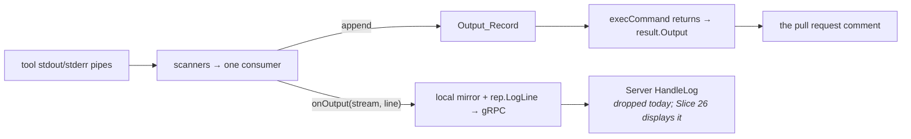
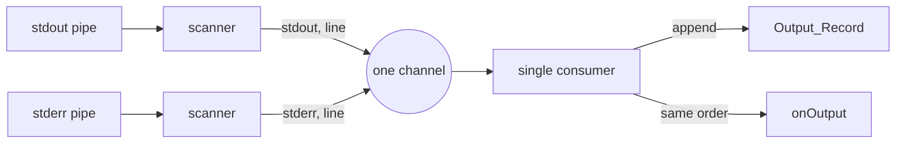

# Design: Show What Ran and With What Scope (Slice 33)

## Overview

Two things turnip knows and does not say: the scope a plan ran with, and
the command it actually executed. The first is a field on the comment; the
second is lines written into the Operation's own output.

Nothing about the wire format changes. `OperationResult` gains no field,
the proto is untouched, and the transcript arrives at the Server the way
every other line of tool output does.

## A correction to Requirement 4.2's mechanism

The requirement says the transcript reaches the comment "through the
Operation's existing output, requiring no new field on `OperationResult`",
and describes emitting it "through `OnOutput`". The intent holds; the
mechanism as written does not, and the difference matters.

`execCommand` has **two** destinations, not one:



`onOutput` feeds the **live** path. The comment is built from the
**captured record** (Decision 9). A transcript emitted only through `onOutput` would
appear in a future live view and be absent from every comment — the
opposite of what the requirement wants.

So the seam writes the transcript to the captured record *and* mirrors it
through `onOutput`: one emission, both destinations, still inside
`execCommand`, still no plugin involvement and no proto change.

## Decision 1: The seam emits, before the process starts

In `execCommand`, after `cmd.Start()` succeeds and before the scanners run,
each header line is appended to the command's Output_Record and passed to
`onOutput` with stream `"stdout"`. The trailer is appended once both
scanners have drained (Decision 9).

Ordering falls out of this: the header is in the record before any tool
output can be appended to it, and the trailer after all of it, so the
command's annotations enclose its output without anything having to sort
them.

**Alternative considered**: have each Plugin prepend the transcript to its
`ExecuteResult.Output`.

**Rejected because** a Plugin that forgets is indistinguishable from a
command that never ran, and Requirement 4.1 asks for the shared seam
precisely so a Plugin added later is covered by existing code. It would
also put the transcript *after* the fact rather than at execution, losing
the ordering above and the live-view property Slice 26 inherits.

**Alternative considered**: emit before `cmd.Start()`.

**Rejected because** a command that fails to start would report a
transcript for something that never ran. After `Start` returns nil, the
process exists.

## Decision 2: What the lines say

```
@@ turnip: <project-dir>, helmfile v0.169.0 @@
@@ turnip: helmfile --environment <env> diff -l name=<release> @@
<tool output, stdout and stderr interleaved>
@@ turnip: exit 0 in 4.2s @@
```

**`@@ turnip: … @@`, so turnip's voice is unlike the tool's.** In a
`diff` fence GitHub renders a line of that shape as a hunk header —
highlighted, not muted (verified against GitHub's markdown renderer:
`pl-mdr`). No tool turnip runs prints one: Helmfile, Helm, Terraform and
Pulumi mark their own annotations with `#`. The `turnip:` inside the
markers is what the change-count parser keys on, so a real hunk header
from some future tool could never be mistaken for turnip's.

`@@` also carries the meaning this decision once reserved it for: "a new
command starts". Each command's record opens with its `@@` lines, so when
a multi-command Plugin lands (Slice 7) every command is visibly its own
section without a second convention.

**Phrases, not fields.** The text between the markers reads as a phrase —
a comma between directory and tool, `in` before the duration — rather
than fields joined by a separator glyph (Decision 10).

**Alternative considered**: `#`, which this decision originally chose,
because GitHub renders it as a muted comment — an annotation subordinate
to the payload. **Rejected because** `#` is the tools' own annotation
syntax (Terraform's `# aws_instance.web will be created`, Helm's
`# Source:`): turnip's lines looked like the tool's, which is the one
confusion Requirement 6 exists to prevent, and muting them made the
record of what ran the easiest thing on the page to skip.

**Alternative considered**: `$`. **Rejected because** it implies a shell
line you could paste, which is false — `exec.CommandContext` takes argv,
so quoting does not round-trip.

**`+` and `-` are the payload's and are never used.** An annotation so
prefixed renders as an addition or deletion and is counted by eye as part
of the change.

**Two lines, not one.** The provenance line is turnip-authored text plus a
version string — nothing user-controlled. The command line is argv, which
is the only part needing redaction and fence-escaping. Splitting them
keeps the blast radius on one line instead of both.

## Decision 3: The version travels as an environment variable

`BuildJob` already resolves it (`build.go:101`) to build the tool image
tag. It passes the same string to the Runner as an environment variable,
and `internal/runner/config.go` reads it beside `Tool`.

**Alternative considered**: have the Runner ask the tool (`helmfile
version`).

**Rejected because** it is an extra subprocess per Operation and needs a
per-tool "how do I ask" concept on the `Plugin` interface, which Slice 7's
plugins would then have to implement. The Server already knows the answer.

**Its limit, stated**: this records the version turnip *requested*. Today
that is the version that runs, because `resolveVersion` rejects a floating
tag and returns either the requested version or the tool's default. If
floating tags are ever allowed — the Backlog's "Resolving a floating tool
version" — this line becomes the surface that entry fills in, and it must
then say what resolved rather than what was asked for.

## Decision 4: Redaction and path-stripping happen once, in the Runner

`run.go` already composes `Output: strip(result.Output)`. It gains
redaction in the same expression, using the secrets it already holds
(`cfg.GitHubToken`) and the `redact` helper that exists in
`internal/runner/clone.go`.

This places both rules where the secrets are, rather than plumbing a
redactor into `internal/plugin`, which has no business knowing them. The
transcript is inside `result.Output` by then, so it is covered by the same
pass as the tool's own output.

**It closes a gap wider than this slice.** Today `redact` is applied to
clone errors only; a tool that echoes a token in its output has never been
redacted at all. Adding the transcript is what makes that worth fixing
now, but the fix is not about the transcript.

**The environment is never recorded.** Credentials reach the tool through
the environment and mounted files — cloud credentials, kubeconfig, the
ServiceAccount token — not through argv. Recording argv is therefore safe
in a way that recording the environment would not be, and the seam is
given no access to the environment to record.

## Decision 5: The scope marker is a field, not a parse

```go
// ScopeArgs is the Trailing_Arguments this Project's Operation ran with,
// verbatim and in order. Empty means it ran with none.
//
// Carried as a field rather than recovered from the transcript: the
// renderer needs them on the summary line, which is built before the
// output is, and parsing turnip's own annotation back out of a blob the
// tool also writes into would be a guess.
ScopeArgs []string
```

Set from `rec.ExtraArgs` where `HandleResult` already builds the result,
beside `Locked` and `LockNote`.

**Rendered per Project, not per comment.** `ParseTriggers` stops
collecting Project names at the first `-`-prefixed token
(`parser.go:101`), so a trigger carrying arguments and no names applies
them to every selected Project. One marker per comment would attribute a
scope to Projects it may not be meaningful for.

**Verbatim, never classified.** Slice 20 put "teaching turnip which flags
affect scope" out of scope because such a list needs updating whenever a
tool gains a flag. The marker reports what was passed; the reader, who
knows their own tool, decides what it meant.

**Rendered as HTML, because it sits in `<summary>`.** See Decision 10.

## Decision 6: The trailer already has an occupant

Slice 18 renders `LockNote` in the trailer, ahead of `nextSteps`. The
order becomes:

| Position | Content | Owner |
|---|---|---|
| summary line | status, name, operation, counts, **scope marker** | this slice |
| fenced block | **transcript** + tool output | this slice |
| trailer | blocked note → **lock note** → next steps | Slice 18 |
| footer | "holds locks on …", **scope-aware** | this slice |

The lock note stays first in the trailer: it explains the state that
decides which commands `nextSteps` offers, so it has to be read before
them. The scope marker is on the summary line and never enters the
trailer, so the two slices do not contend for the same position.

## Decision 7: The footer describes a scoped apply in prose

Where any locked Project's recorded plan carries arguments, the footer
says applying replays the recorded scope rather than implying whole-Project
coverage.

**It does not render a copy-pasteable command carrying the arguments.**
`execute.go:99` refuses a mutating Operation that supplies its own
arguments, so a footer offering `/turnip apply -l name=web` would be
offering a command turnip rejects. Prose cannot be pasted and therefore
cannot be wrong.

## Decision 8: Fence hardening covers the tool's output too

`Output` is interpolated into a fence with no escaping (`comment.go:407`).
Content terminating that fence early makes everything after it render as
markdown inside a comment authored by turnip — which readers trust
differently from one authored by a contributor.

The transcript adds a line built from trigger-supplied tokens, which
widens an exposure that already exists, so the neutralisation covers both.
It belongs in the renderer, applied to whatever goes inside a fence, not
at the seam: the seam does not know it is writing markdown.

**Failure renders in the same fence as success.** `fenceFor`
(`comment.go:508`) uses `diff` only on success, so today a failed
Operation's annotation would lose its styling in exactly the case a reader
scrutinises hardest. Its stated reason — a column-0 `-` in a failure
renders red — applies equally to success, where the same YAML can appear;
the consistent answer is one fence for both.

## Decision 9: One ordered record per command (amendment, Requirement 8)

**What went wrong.** `execCommand` captured two buffers, the transcript
went into stdout's, and the Helmfile plugin returned `stdout + "\n" +
stderr`. Everything Helmfile writes to stderr — repository setup, which
happens *before* the diff — was therefore shown after the diff and after
the trailer. Decision 1 placed the header ahead of the tool's output
without sorting; the trailer had no equivalent guarantee against the
second buffer, and the code comment that accepted this as cosmetic was
wrong.

**Resolution.** The seam returns one Output_Record instead of two
buffers. This is the contract every Plugin and test fake builds on, so
it is spelled out:

```go
// OutputLine is one line of a command's output, tagged with the stream
// ("stdout" or "stderr") it arrived on. The Execution_Transcript's own
// lines are tagged "stdout", as they already are for onOutput.
type OutputLine struct {
	Stream string
	Text   string
}

type commandRunner func(ctx context.Context, dir, name string, args []string,
	version string, onOutput func(stream, line string),
) (lines []OutputLine, exitCode int, err error)
```

`ExecuteResult.Output` stays a string: the Plugin joins every line's
`Text` in record order. Nothing downstream of the Plugin — Runner
redaction and path stripping, the gRPC result, the comment — changes.

**How the two pipes become one order.**



Header lines are appended before the scanners start (Decision 1,
unchanged). The consumer drains the channel until both scanners are
done, and only then is the trailer appended — so it is last by
construction (8.2), not by a sort. Because one goroutine both appends
and calls `onOutput`, the live stream and the comment cannot disagree
about order (8.4).

*Alternative considered*: each scanner appends under a shared mutex and
calls `onOutput` inside it. *Rejected because* the Runner's `onOutput`
hands lines to the reporter, which "may block" (`run.go:222`); holding
the record's lock across that call would let a stalled report freeze
both pipes. With a single consumer a slow `onOutput` still applies
back-pressure — as it already does to one pipe today — but no lock is
held across it.

**What "as it happened" means with two pipes.** Within one stream the
order is exact. Across streams it is the order lines reached the Runner:
two lines written on different streams within the same few microseconds
can land either way round. Order is also only as faithful as the tool's
own writes — a tool that block-buffers stdout when it is not attached to
a terminal delivers it late, and no capture arrangement short of a
terminal changes that. Helmfile, Helm, Terraform and Pulumi are Go
programs that write unbuffered, so this is a note, not an observed
problem.

*Alternative considered*: give the child one shared pipe for both
streams (`2>&1`), which preserves the exact interleaving the kernel saw.
*Rejected because* it discards which stream each line came from, and the
change count needs that (8.5, 8.6): Helmfile's `Building dependency` and
`Adding repo` lines would become release bodies and inflate the count.
A microsecond-level swap between streams costs nothing a reader can act
on; a wrong change count is a wrong number in a check run.

*Alternative considered*: run the tool under a pseudo-terminal. *Rejected
because* it merges the streams the same way, and it changes what tools
print (colour, progress bars, interactive prompts) — the record would be
of a different run than an unattended one.

**The change count reads stdout only.** `parseChangedReleases` receives
the stdout lines of the record, in order, and still skips transcript
lines by prefix. Verified against helmfile 1.7.4: `Comparing release=`
is written to stdout, as are diff bodies (in the reported comment the
manifests sit in the stdout block, above the trailer); `Building
dependency`, `Adding repo` and a failing `helm diff`'s error go to
stderr.

## Decision 10: Display labels are plain text, and HTML where they sit in HTML

Every label turnip renders reads as ordinary punctuated text:

| Surface | Renders |
|---|---|
| summary line, changes | `✅ <code>web</code>: diff, +0 ~1 -0` |
| summary line, none | `✅ <code>web</code>: diff, no changes` |
| summary line, failed | `❌ <code>web</code>: diff, failed` |
| summary line, scoped | `✅ <code>web</code>: diff, +0 ~1 -0, <code>-l name=api</code>` |
| summary line, split output | `… (output part 1/2)` appended, unchanged |
| footer commands | `` `/turnip apply` or `/turnip unlock` `` |
| transcript | Decision 2 |
| check-run title (Slice 35) | `+0 ~1 -0, -l name=api` |

The project is in code because the headline above the sections already
names Projects that way (`` **No changes in `web`.** ``), so a name looks
the same wherever it appears.

**`<code>`, not backticks, inside `<summary>`.** `<summary>` is an HTML
element; GitHub does not parse markdown inside it, so backticks render
literally (verified against GitHub's markdown renderer). The
backtick-widening logic that protected the marker from an argument
containing a backtick goes with them — escaping does that job now.

**Escaping is required, not cosmetic.** The project name comes from
`turnip.yaml` and the arguments from the trigger comment. Interpolated
raw into HTML, an argument containing `</code></summary>` or `<a href=…>`
rewrites the structure of a comment turnip authored. Both are passed
through `html.EscapeString`. The marker's 40-character truncation happens
first, on the raw text, so the cut can never land inside `&amp;`.

**Check-run titles are plain text.** GitHub renders them without markup,
so Slice 35's title gets the same punctuation and no `<code>`.

**Alternative considered**: keep a separator, but a conventional one —
` | ` as CLI tools use. **Rejected because** plain punctuation needs no
separator at all, and a pipe in the Slice 35 title would be one more
character to reason about in a surface that is plain text today.

**Alternative considered**: `/`. **Rejected because** Project names are
often paths (`env/staging`), and a slash between fields would read as
part of the name.

## What changes where

| File | Change |
|---|---|
| `internal/plugin/command.go` | `execCommand` writes the transcript to the captured record and mirrors it to `onOutput` |
| `internal/plugin/plugin.go` | `ExecuteOptions` carries the tool name and version for the provenance line |
| `internal/jobs/build.go` | pass the resolved version to the Runner |
| `internal/runner/config.go` | read it |
| `internal/runner/run.go` | redact as well as strip when composing `Output` |
| `internal/github/types.go` | `ScopeArgs` on `ProjectResult` |
| `internal/github/comment.go` | scope marker on the summary line; scope-aware footer; fence neutralisation; one fence for both outcomes |
| `internal/orchestrator/result.go` | set `ScopeArgs` from the record |
| `docs/usage.md` | what the annotation lines mean; that arguments are recorded and replayed |

Amendment (Decisions 2, 9 and 10):

| File | Change |
|---|---|
| `internal/plugin/command.go` | `OutputLine`; `commandRunner` returns one record; scanners feed a single consumer; trailer appended after both drain; the "cosmetic" comment removed |
| `internal/plugin/helmfile.go` | `Output` joined from the record; change count from its stdout lines |
| `internal/plugin/helmfile_parse.go` | unchanged signature; now receives stdout only |
| `internal/plugin/*_test.go` | `fakeRunner` returns a record, so fixtures state their interleaving explicitly |
| `internal/plugin/command.go` | transcript lines as `@@ turnip: … @@` phrases; `transcriptPrefix` becomes `@@ turnip: ` |
| `internal/github/comment.go` | summary line and footer in plain punctuation; project and marker in `<code>`, HTML-escaped; backtick widening removed |
| `docs/usage.md` | the new transcript and summary-line formats |
| `roadmap.md` | Slice 35's "After" column in the new title format |

## Testing strategy

**The transcript reaches the comment, not just the live stream.** The test
that would have caught the Requirement 4.2 mistake: assert the transcript
appears in `ExecuteResult.Output`, not only that `onOutput` was called
with it. A fake `commandRunner` cannot prove this — it needs the real
`execCommand` against a real short-lived process, which
`internal/plugin/command_test.go` already does.

**Ordering is asserted, not assumed.** The command line precedes the first
line of tool output in the captured record. Emitting after the scanners
start would usually still look right, and would race.

**Redaction is tested with a token that appears in tool output**, not only
in argv — that is the gap Decision 4 closes, and a test that only checks
argv would pass while the real hazard remains.

**Fence neutralisation is tested from both sources**: a tool whose output
contains a fence terminator, and a trigger argument that does. Both must
render inside the block.

**The marker is per Project.** A trigger with arguments and no Project
names, resolving to two Projects, must mark both — the fan-out
`parser.go:101` produces.

**The footer is tested for what it does not say**: no locked Project with
arguments must ever produce a copy-pasteable apply carrying them, because
`execute.go:99` would refuse it.

**Mutation checks** on each new edge: removing the transcript write, the
redaction pass, or the fence neutralisation must each fail a specific
test, and absence assertions come from recording fakes rather than from
output that happens to look unchanged.

**Interleaving is asserted against a real process (amendment).** A
script that writes to stdout, then stderr, then stdout, with a short
sleep between writes so the order is deterministic, must come back in
that order, header first and trailer last — and `onOutput` must have
seen the identical sequence. A fake `commandRunner` cannot prove either;
this is `command_test.go` territory, like the Requirement 4.2 test.

**The change count ignores stderr.** A fixture whose last release is
unchanged, followed by stderr lines, counts no change for it; a stderr
line between two releases changes neither. Mutation check: feeding the
parser the whole record instead of its stdout lines must fail one of
these.

**Labels render as written (amendment).** Summary-line tests assert the
exact `<code>`-wrapped, comma-punctuated text for each outcome. Escaping
is tested with a project name and an argument containing `<`, `&` and
`</summary>`: the rendered line must contain the escaped forms and no raw
`<` beyond turnip's own tags. A long argument containing `&` must be cut
before escaping — no partial entity. Mutation check: dropping the
escape must fail a specific test.

**The transcript marker is exact.** Header and trailer lines match
`@@ turnip: … @@` in full, and the parser still skips them: a diff ending
in an unchanged release followed by the trailer counts no change for it.
