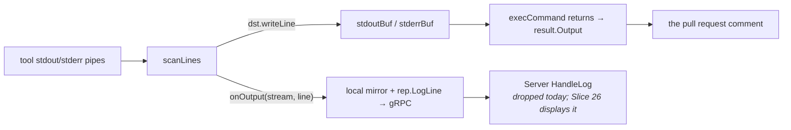

# Design: Show What Ran and With What Scope (Slice 33)

## Overview

Two things turnip knows and does not say: the scope a plan ran with, and
the command it actually executed. The first is a field on the comment; the
second is lines written into the Operation's own output.

Nothing about the wire format changes. `OperationResult` gains no field,
the proto is untouched, and the transcript arrives at the Server the way
every other line of tool output does.

## A correction to Requirement 4.2's mechanism

The requirement says the transcript reaches the comment "through the
Operation's existing output, requiring no new field on `OperationResult`",
and describes emitting it "through `OnOutput`". The intent holds; the
mechanism as written does not, and the difference matters.

`execCommand` has **two** destinations, not one:



`onOutput` feeds the **live** path. The comment is built from the
**captured buffers**. A transcript emitted only through `onOutput` would
appear in a future live view and be absent from every comment — the
opposite of what the requirement wants.

So the seam writes the transcript to the captured buffer *and* mirrors it
through `onOutput`: one emission, both destinations, still inside
`execCommand`, still no plugin involvement and no proto change.

## Decision 1: The seam emits, before the process starts

In `execCommand`, after `cmd.Start()` succeeds and before the scanners run,
each transcript line is written to `stdoutBuf` and passed to `onOutput`
with stream `"stdout"`.

Ordering falls out of this: the transcript is in the buffer before any
tool output can be appended to it, so the command always precedes its own
output without anything having to sort them.

**Alternative considered**: have each Plugin prepend the transcript to its
`ExecuteResult.Output`.

**Rejected because** a Plugin that forgets is indistinguishable from a
command that never ran, and Requirement 4.1 asks for the shared seam
precisely so a Plugin added later is covered by existing code. It would
also put the transcript *after* the fact rather than at execution, losing
the ordering above and the live-view property Slice 26 inherits.

**Alternative considered**: emit before `cmd.Start()`.

**Rejected because** a command that fails to start would report a
transcript for something that never ran. After `Start` returns nil, the
process exists.

## Decision 2: What the lines say

```
# turnip · <project-dir> · helmfile v0.169.0
# helmfile --environment <env> diff -l name=<release>
<tool output>
# exit 0 · 4.2s
```

`#` rather than `$`, for two reasons found while designing: in a `diff`
fence GitHub renders `#` as a muted comment, which is what an annotation
subordinate to the payload should look like; and `$` implies a shell line
you could paste, which is false — `exec.CommandContext` takes argv, so
quoting does not round-trip.

**`+` and `-` are the payload's and are never used.** An annotation so
prefixed renders as an addition or deletion and is counted by eye as part
of the change. `@@` is deliberately left unused here, so that it remains
available to mean "a new command starts" when a multi-command Plugin
lands.

**Two lines, not one.** The provenance line is turnip-authored text plus a
version string — nothing user-controlled. The command line is argv, which
is the only part needing redaction and fence-escaping. Splitting them
keeps the blast radius on one line instead of both.

## Decision 3: The version travels as an environment variable

`BuildJob` already resolves it (`build.go:101`) to build the tool image
tag. It passes the same string to the Runner as an environment variable,
and `internal/runner/config.go` reads it beside `Tool`.

**Alternative considered**: have the Runner ask the tool (`helmfile
version`).

**Rejected because** it is an extra subprocess per Operation and needs a
per-tool "how do I ask" concept on the `Plugin` interface, which Slice 7's
plugins would then have to implement. The Server already knows the answer.

**Its limit, stated**: this records the version turnip *requested*. Today
that is the version that runs, because `resolveVersion` rejects a floating
tag and returns either the requested version or the tool's default. If
floating tags are ever allowed — the Backlog's "Resolving a floating tool
version" — this line becomes the surface that entry fills in, and it must
then say what resolved rather than what was asked for.

## Decision 4: Redaction and path-stripping happen once, in the Runner

`run.go` already composes `Output: strip(result.Output)`. It gains
redaction in the same expression, using the secrets it already holds
(`cfg.GitHubToken`) and the `redact` helper that exists in
`internal/runner/clone.go`.

This places both rules where the secrets are, rather than plumbing a
redactor into `internal/plugin`, which has no business knowing them. The
transcript is inside `result.Output` by then, so it is covered by the same
pass as the tool's own output.

**It closes a gap wider than this slice.** Today `redact` is applied to
clone errors only; a tool that echoes a token in its output has never been
redacted at all. Adding the transcript is what makes that worth fixing
now, but the fix is not about the transcript.

**The environment is never recorded.** Credentials reach the tool through
the environment and mounted files — cloud credentials, kubeconfig, the
ServiceAccount token — not through argv. Recording argv is therefore safe
in a way that recording the environment would not be, and the seam is
given no access to the environment to record.

## Decision 5: The scope marker is a field, not a parse

```go
// ScopeArgs is the Trailing_Arguments this Project's Operation ran with,
// verbatim and in order. Empty means it ran with none.
//
// Carried as a field rather than recovered from the transcript: the
// renderer needs them on the summary line, which is built before the
// output is, and parsing turnip's own annotation back out of a blob the
// tool also writes into would be a guess.
ScopeArgs []string
```

Set from `rec.ExtraArgs` where `HandleResult` already builds the result,
beside `Locked` and `LockNote`.

**Rendered per Project, not per comment.** `ParseTriggers` stops
collecting Project names at the first `-`-prefixed token
(`parser.go:101`), so a trigger carrying arguments and no names applies
them to every selected Project. One marker per comment would attribute a
scope to Projects it may not be meaningful for.

**Verbatim, never classified.** Slice 20 put "teaching turnip which flags
affect scope" out of scope because such a list needs updating whenever a
tool gains a flag. The marker reports what was passed; the reader, who
knows their own tool, decides what it meant.

## Decision 6: The trailer already has an occupant

Slice 18 renders `LockNote` in the trailer, ahead of `nextSteps`. The
order becomes:

| Position | Content | Owner |
|---|---|---|
| summary line | status, name, operation, counts, **scope marker** | this slice |
| fenced block | **transcript** + tool output | this slice |
| trailer | blocked note → **lock note** → next steps | Slice 18 |
| footer | "holds locks on …", **scope-aware** | this slice |

The lock note stays first in the trailer: it explains the state that
decides which commands `nextSteps` offers, so it has to be read before
them. The scope marker is on the summary line and never enters the
trailer, so the two slices do not contend for the same position.

## Decision 7: The footer describes a scoped apply in prose

Where any locked Project's recorded plan carries arguments, the footer
says applying replays the recorded scope rather than implying whole-Project
coverage.

**It does not render a copy-pasteable command carrying the arguments.**
`execute.go:99` refuses a mutating Operation that supplies its own
arguments, so a footer offering `/turnip apply -l name=web` would be
offering a command turnip rejects. Prose cannot be pasted and therefore
cannot be wrong.

## Decision 8: Fence hardening covers the tool's output too

`Output` is interpolated into a fence with no escaping (`comment.go:407`).
Content terminating that fence early makes everything after it render as
markdown inside a comment authored by turnip — which readers trust
differently from one authored by a contributor.

The transcript adds a line built from trigger-supplied tokens, which
widens an exposure that already exists, so the neutralisation covers both.
It belongs in the renderer, applied to whatever goes inside a fence, not
at the seam: the seam does not know it is writing markdown.

**Failure renders in the same fence as success.** `fenceFor`
(`comment.go:508`) uses `diff` only on success, so today a failed
Operation's annotation would lose its styling in exactly the case a reader
scrutinises hardest. Its stated reason — a column-0 `-` in a failure
renders red — applies equally to success, where the same YAML can appear;
the consistent answer is one fence for both.

## What changes where

| File | Change |
|---|---|
| `internal/plugin/command.go` | `execCommand` writes the transcript to the captured buffer and mirrors it to `onOutput` |
| `internal/plugin/plugin.go` | `ExecuteOptions` carries the tool name and version for the provenance line |
| `internal/jobs/build.go` | pass the resolved version to the Runner |
| `internal/runner/config.go` | read it |
| `internal/runner/run.go` | redact as well as strip when composing `Output` |
| `internal/github/types.go` | `ScopeArgs` on `ProjectResult` |
| `internal/github/comment.go` | scope marker on the summary line; scope-aware footer; fence neutralisation; one fence for both outcomes |
| `internal/orchestrator/result.go` | set `ScopeArgs` from the record |
| `docs/usage.md` | what the annotation lines mean; that arguments are recorded and replayed |

## Testing strategy

**The transcript reaches the comment, not just the live stream.** The test
that would have caught the Requirement 4.2 mistake: assert the transcript
appears in `ExecuteResult.Output`, not only that `onOutput` was called
with it. A fake `commandRunner` cannot prove this — it needs the real
`execCommand` against a real short-lived process, which
`internal/plugin/command_test.go` already does.

**Ordering is asserted, not assumed.** The command line precedes the first
line of tool output in the captured buffer. Emitting after the scanners
start would usually still look right, and would race.

**Redaction is tested with a token that appears in tool output**, not only
in argv — that is the gap Decision 4 closes, and a test that only checks
argv would pass while the real hazard remains.

**Fence neutralisation is tested from both sources**: a tool whose output
contains a fence terminator, and a trigger argument that does. Both must
render inside the block.

**The marker is per Project.** A trigger with arguments and no Project
names, resolving to two Projects, must mark both — the fan-out
`parser.go:101` produces.

**The footer is tested for what it does not say**: no locked Project with
arguments must ever produce a copy-pasteable apply carrying them, because
`execute.go:99` would refuse it.

**Mutation checks** on each new edge: removing the transcript write, the
redaction pass, or the fence neutralisation must each fail a specific
test, and absence assertions come from recording fakes rather than from
output that happens to look unchanged.
