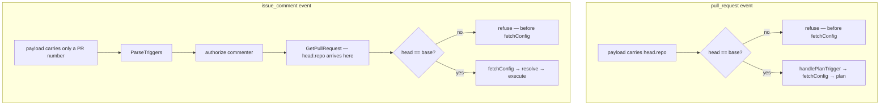

# Design: Refuse Fork Pull Requests (Slice 15)

## Introduction

The check itself is a string comparison. Three things make this a design
rather than a patch: where the comparison can be made on each trigger
path, what happens when the answer is unavailable, and how a refusal is
counted without corrupting a metric that already counts the same delivery.

## Where the answer becomes available



The asymmetry is the point. A `pull_request` payload carries
`head.repo` directly, so the comparison can happen immediately. An
`issue_comment` payload carries a pull request number and nothing else,
so the answer only exists after `GetPullRequest` — which is already
called (`comment.go:56`), so the check costs no extra API call.

Both refusals land *before* `fetchConfig`, satisfying Requirements 2.2 and
3.3: on a foreign pull request that file is attacker-controlled, so
reading it at all is a step too far.

## Decision 1: compare identity, carry it as a Repository

`PullRequest` gains one field:

```go
// HeadRepo identifies the repository a pull request's head branch lives
// in. Equal to the event's own repository for an ordinary branch pull
// request; different for one opened from a fork.
//
// Empty when GitHub reports no head repository — a fork deleted after the
// pull request was opened. Treated as foreign, never as a match: see
// Decision 2.
HeadRepo Repository
```

Reusing `Repository` rather than a bare `FullName` string keeps one shape
for "a repository" across the package, and `repositoryFrom` already maps
it — the head branch's `Repo` is an ordinary `*gh.Repository`, so the
existing mapper covers it.

The comparison is on `Owner` and `Name`, not on the `Fork` flag
(Requirement 1.4), and not on `URL` — a URL can differ in form for the
same repository, while owner and name are what GitHub canonicalises.

```go
// IsForeign reports whether this pull request's code comes from a
// repository other than base. A pull request with no head repository is
// foreign: see Decision 2.
func (p *PullRequest) IsForeign(base Repository) bool
```

A method on `PullRequest` rather than a free function in the orchestrator,
because both trigger paths ask the same question and the data lives here.

## Decision 2: an unknown head repository is foreign

`head.repo` is null when the fork was deleted after the pull request was
opened. `GetRepo()` then returns nil and `GetOwner().GetLogin()` yields
`""`, so a naive comparison would read "" against a real owner and
correctly report foreign — but only by accident, and only while the base
repository's owner is non-empty.

`IsForeign` therefore tests explicitly: an empty `HeadRepo.Owner` or
`HeadRepo.Name` is foreign, whatever `base` holds. Failing closed is the
only safe direction, and it costs nothing — a pull request whose head
repository no longer exists has nothing turnip should run anyway.

*Alternative considered*: treat an absent head repository as "same
repository", on the grounds that GitHub omits it for same-repo pull
requests. *Rejected because* it does not — GitHub populates `head.repo`
for ordinary branch pull requests too. The premise is simply false, and a
check that fails open on a malformed payload is the wrong failure.

## Decision 3: the refusal is counted once, not twice

This is the substantive decision of the slice.

`webhook.go` records `metrics.WebhookEvent(eventType, "dispatched")`
*after* the handler returns: the handler is called at `webhook.go:86`,
the counter increments at `:91`, and the error branch follows at `:92`.
So a refusal recorded at its own site would increment the counter twice
for one delivery — once `rejected`, once `dispatched` — and
`sum(webhook_events_total)` would stop equalling deliveries received.

The obvious repair is worse. Returning an error from the handler reaches
`if handleErr != nil { w.WriteHeader(http.StatusInternalServerError) }`
at `:92-95`, and a 500 makes GitHub **retry** a delivery turnip refused
on purpose.

So the refusal travels as a sentinel that the webhook layer recognises:

```go
// ErrRefused reports that a handler declined to act on a well-formed,
// correctly-signed delivery — not that anything failed. The webhook
// layer answers 200 and records the delivery as rejected rather than
// dispatched, so one delivery remains one counted outcome.
var ErrRefused = errors.New("github: delivery refused")
```

`ServeHTTP` tests for it before its existing error branch: on a match it
records `rejected` and returns **200**, because the delivery was received
and understood — turnip simply declined to act, and a retry would change
nothing.

*Alternative considered*: record `rejected` at the refusal site and accept
the double count. *Rejected because* the metric's arithmetic is the thing
that makes it usable — an operator alerting on a rate of refusals needs
the denominator to mean deliveries. Two increments for one delivery makes
every ratio wrong, quietly.

*Alternative considered*: a dedicated `fork_pull_requests_refused_total`.
*Rejected because* Requirement 4.4 asks for the existing metric, and a
second counter for one condition invites one per condition.

## Decision 4: silence is per-path, and one path loses something

| Path | Today | After |
|---|---|---|
| `pull_request`, foreign | plans, comments, locks | nothing at all |
| `issue_comment` by a collaborator, foreign | plans, comments, locks | nothing at all |
| `issue_comment` by a non-collaborator, foreign | "does not have permission" comment | unchanged |
| `pull_request`, `closed`, foreign | releases Locks | unchanged (Req 2.3) |

The third row is deliberate. The fork check sits *after* the existing
collaborator check on the comment path, so a non-collaborator still gets
today's permission message rather than silence. Moving the fork check
earlier would make every foreign comment silent, at the cost of reordering
`GetPullRequest` ahead of authorization — more churn, and it would issue
an API call on behalf of an unauthorized commenter. The information a
permission message leaks (that turnip is installed) is already public from
any pull request it has ever commented on.

The fourth row is Requirement 2.3: `handlePRClosed` executes no code, and
refusing it would strand a Lock that a foreign pull request might hold
from before this slice.

## Decision 5: the log entry is evidence, not a breadcrumb

Requirement 4.3 asks for base repository, pull request number, head
repository and the account. At `WARN`, because `ParseLevel` defaults to
`INFO` and a refusal is not routine.

The framing matters for what gets logged: a refusal means someone outside
the repository attempted to have turnip execute their code. A burst of
them against a repository holding cloud credentials is an attack in
progress, so the entry must be actionable on its own — an operator reading
it should be able to identify the actor and the source repository without
correlating against anything else.

```
WARN refusing operation on a pull request from another repository
     owner=... repo=... pr_number=... head_owner=... head_repo=... actor=...
```

`actor` is the pull request's author on the automatic path and the
commenter on the trigger path — in both cases the account that caused
turnip to consider acting.

## What changes

| File | Change |
|---|---|
| `internal/github/types.go` | `PullRequest.HeadRepo`; `IsForeign` |
| `internal/github/webhook.go` | map `head.repo`; `ErrRefused`; the 200-and-`rejected` branch |
| `internal/github/client.go` | map `head.repo` in `GetPullRequest` |
| `internal/orchestrator/pullrequest.go` | refuse before `handlePlanTrigger` |
| `internal/orchestrator/comment.go` | refuse after `GetPullRequest`, before `fetchConfig` |
| `docs/*` | Requirement 6 |

## Testing strategy

- **The refusal matrix**, both paths: same repository runs; different
  repository refuses; absent head repository refuses.
- **Nothing happened**, asserted positively — no Lock acquired, no Job
  created, no check run, no comment. Fakes that record calls, so "did not
  act" is observed rather than inferred from an absent comment.
- **`closed` still releases**, which is the regression Requirement 2.3
  exists to prevent and the easiest thing to break with an early return.
- **One delivery, one outcome**: a refused delivery increments
  `webhook_events_total` exactly once, with `rejected`. This is the test
  that would catch Decision 3 being undone.
- **200, not 500**, on a refused delivery — the assertion that keeps
  GitHub from retrying.

## Out of scope

Unchanged from the requirements: the installation token in `.git/config`
(its own slice), a stated security model and any opt-in, and forks of a
repository the App is separately installed on.
