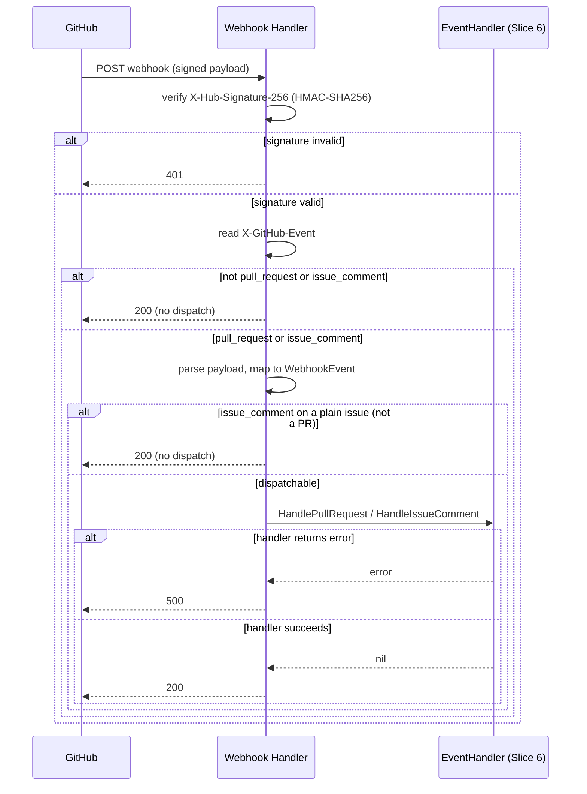

# Design Document: GitHub Client & Webhook Handler (Slice 4)

## Overview

This slice implements `internal/github`: GitHub App authentication, webhook
signature verification and event parsing, PR comment trigger parsing,
collaborator authorization, GitHub check-run lifecycle, and consolidated PR
comment formatting/posting. It has no dependency on Redis, gRPC, or
Kubernetes — Slice 6 owns deciding *when* to call each primitive here
during the webhook-to-operation flow; Slice 5 consumes the installation
token this slice generates for the Runner's repository clone.

The package replaces the placeholder `internal/github/doc.go` created in
Slice 0 with the real interface, types, and implementation.

## Package Layout

```
internal/github/
  doc.go        // updated package doc
  types.go      // WebhookEvent, Repository, PullRequest, Comment,
                // Installation, CheckRunOptions, TriggerCommand,
                // ProjectResult
  errors.go     // ErrFileNotFound, ErrNoTrigger, ErrMalformedTrigger
  auth.go       // AppAuth, InstallationClient
  client.go     // GitHubClient interface, Client (go-github-backed impl)
  webhook.go    // EventHandler interface, NewWebhookHandler (http.Handler)
  parser.go     // ParseTriggers
  authorize.go  // Authorizer (collaborator/write-permission cache)
  comment.go    // BuildConsolidatedComment
```

## Dependencies

Two new dependencies, both version-checked against the Go module proxy in
this session (`go list -m -versions`) to confirm currency:

- **`github.com/google/go-github/v90`** — the official Go GitHub REST API
  client (confirmed current: v90.0.0, the latest major/minor as of this
  session). Used for check runs, PR comments, file contents, modified-file
  listing, collaborator/permission checks, and webhook payload
  parsing/signature validation (`github.ValidatePayload`,
  `github.ParseWebHook`, `github.WebHookType`).
- **`github.com/bradleyfalzon/ghinstallation/v2`** — the standard GitHub
  App JWT + installation-token `http.RoundTripper` (confirmed current:
  v2.19.0). Handles JWT signing and installation-token caching/refresh
  internally, so this slice does not reimplement token expiry tracking
  (Requirement 1.3).

**Naming collision note**: this package is named `github` (matching the
directory, per Go convention), which collides with `go-github`'s own
`github` package name. Every file that imports `go-github` aliases it:
`gh "github.com/google/go-github/v90/github"`. `ghinstallation` needs no
alias (different name already).

## Reconciling the interface sketches with a real GitHub client

**`GenerateInstallationToken` drops the `installationID` parameter.** The
global design's sketch (`design.md:425`) is
`GenerateInstallationToken(ctx, installationID) (string, error)` on a
single shared `GitHubClient`. `ghinstallation.Transport` — the library
providing token caching/refresh — is constructed per installation
(`ghinstallation.NewFromAppsTransport(appsTransport, installationID)`), and
its `Token(ctx)` method takes no installation argument because the
`Transport` already is scoped to one. *Alternative considered*: keep a
single long-lived `Client` and thread `installationID` through every call,
maintaining our own `map[int64]*ghinstallation.Transport` cache with its
own locking. *Rejected* — that reimplements exactly the per-installation
scoping `ghinstallation.Transport` already gives for free, adds a second
cache (this slice already needs one for Requirement 5's collaborator
cache) for no behavioral difference, and every other `GitHubClient` method
(`GetFile`, `CreateCheckRun`, etc.) needs a `*gh.Client` anyway — which is
naturally installation-scoped too, since a `*gh.Client`'s transport is what
authenticates its requests. This slice instead exposes
`AppAuth.InstallationClient(installationID) *Client`: construct one
`*Client` per installation (cheap — it's just two struct wraps around the
shared `*ghinstallation.AppsTransport`, which is the thing that actually
parses/holds the RSA key), and call `GenerateInstallationToken(ctx)` with
no further argument. Slice 6 is expected to build one `*Client` per
webhook (or cache them keyed by installation ID itself, if profiling shows
it matters) rather than this package doing so invisibly.

**`GetPullRequest` is added to `GitHubClient`**, beyond the global design's
sketch (`design.md:423-450`). Rationale: an `issue_comment` webhook payload
(the event `ParseTriggers`' caller reacts to) carries only the PR's
*number* — GitHub's `IssueCommentEvent.Issue` has no `Head`/`Base` SHA
fields, only `PullRequestEvent` (opened/synchronize) does. Slice 6 will
need the PR's current `HeadSHA` when an apply is comment-triggered (to
know what the Runner should check out), and no other method on the
interface can produce it. This mirrors how Slice 3 added `lockedBy` to
`AcquireLock`'s sketch: extending a committed interface to close a gap the
data model didn't otherwise cover, rather than leaving Slice 6 to invent
its own ad hoc fetch.

**`CheckRunOptions` fields stay plain `string`**, matching the global
sketch (`design.md:452-460`) exactly, even though `go-github`'s
`CreateCheckRunOptions`/`UpdateCheckRunOptions` use `*string` for every
optional field. `Client.CreateCheckRun`/`UpdateCheckRun` convert at the
boundary: an empty `CheckRunOptions` field becomes a `nil` pointer (field
omitted, GitHub applies its own default) rather than an empty-string
pointer. This keeps the package's public surface free of `go-github`
pointer-field ergonomics, matching this codebase's existing preference
(e.g. `internal/config`'s `Project` struct uses plain fields, not
pointers-for-optionality).

## Data Model

```go
// WebhookEvent is this package's VCS-agnostic representation of a parsed,
// signature-verified GitHub webhook delivery.
type WebhookEvent struct {
    Type         string // "pull_request", "issue_comment"
    Action       string // "opened", "synchronize", "created", etc.
    Repository   Repository
    PullRequest  *PullRequest // nil for non-PR issue_comment events
    Comment      *Comment     // nil for pull_request events
    Installation Installation
}

type Repository struct {
    Owner string
    Name  string
    URL   string
}

// PullRequest carries what's available from the triggering payload. For a
// pull_request event, every field is populated. For an issue_comment
// event, only Number is populated — see "GetPullRequest is added to
// GitHubClient" above for why HeadSHA/BaseRef/HeadRef require a follow-up
// API call in that case.
type PullRequest struct {
    Number  int
    HeadSHA string
    BaseRef string
    HeadRef string
}

type Comment struct {
    ID     int64
    Body   string
    Author string
}

type Installation struct {
    ID int64
}

// CheckRunOptions mirrors the global design's sketch field-for-field.
type CheckRunOptions struct {
    Name       string
    HeadSHA    string
    Status     string // "queued", "in_progress", "completed"
    Conclusion string // "success", "failure", "neutral", "cancelled", ...
    Title      string
    Summary    string
    Text       string
}

// TriggerCommand is one element of ParseTriggers' result — one per
// matched line in a comment body.
type TriggerCommand struct {
    Tool      string   // "turnip", "terraform", "pulumi", "helmfile"
    Operation string   // tool-native operation, unvalidated by this package
    Projects  []string // empty means "all projects"
    ExtraArgs []string // tokens after "--", verbatim
}

// ProjectResult is BuildConsolidatedComment's per-Project input. It is a
// deliberately slim, package-local type — not the global design's full
// OperationResult (design.md:565-577), which carries orchestration-only
// fields (Duration, StartedAt/CompletedAt, OperationID) that don't exist
// yet because Slice 6 hasn't shipped. Slice 6 maps its richer result type
// down to this one when it calls the formatter.
type ProjectResult struct {
    ProjectName string
    Operation   string
    Success     bool
    Output      string
}
```

## API Surface

### Authentication (`auth.go`)

```go
type AppAuth struct {
    appsTransport *ghinstallation.AppsTransport
}

// NewAppAuth parses appPrivateKeyPEM once (Requirement 1.4: returns an
// error immediately on a malformed key) and returns an AppAuth that can
// mint an installation-scoped Client for any installation of this App.
func NewAppAuth(appID int64, appPrivateKeyPEM []byte) (*AppAuth, error)

// InstallationClient returns a Client authenticated as the given
// installation. Cheap to call repeatedly — see "GenerateInstallationToken
// drops the installationID parameter" above.
func (a *AppAuth) InstallationClient(installationID int64) *Client
```

### GitHub Client (`client.go`)

```go
type GitHubClient interface {
    GenerateInstallationToken(ctx context.Context) (string, error)
    GetFile(ctx context.Context, owner, repo, path, ref string) ([]byte, error)
    GetModifiedFiles(ctx context.Context, owner, repo string, prNumber int) ([]string, error)
    GetPullRequest(ctx context.Context, owner, repo string, prNumber int) (*PullRequest, error)
    CreateCheckRun(ctx context.Context, owner, repo string, opts CheckRunOptions) (int64, error)
    UpdateCheckRun(ctx context.Context, owner, repo string, checkRunID int64, opts CheckRunOptions) error
    PostComment(ctx context.Context, owner, repo string, prNumber int, body string) (int64, error)
    UpdateComment(ctx context.Context, owner, repo string, commentID int64, body string) error
    IsCollaborator(ctx context.Context, owner, repo, username string) (bool, error)
    GetCollaboratorPermission(ctx context.Context, owner, repo, username string) (string, error)
}

// Client implements GitHubClient by wrapping a *gh.Client whose transport
// is an installation-scoped *ghinstallation.Transport.
type Client struct {
    gh  *gh.Client
    itr *ghinstallation.Transport
}

var _ GitHubClient = (*Client)(nil)
```

`Client` is a thin adapter: each `GitHubClient` method delegates to the
matching `go-github` service (repository contents, pull requests, checks,
issue comments, collaborators) and translates its response into this
package's own types. That delegation is mechanical enough not to spell out
call-by-call here — it's what code review is for — but three behavioral
decisions are worth calling out since they aren't obvious from the method
signatures alone:

- **`GetFile` on a directory path is an error, not a result.** The
  underlying content-fetch API returns either a single file's content or a
  directory listing from the same endpoint; this package only ever
  returns file bytes, so a directory response is rejected rather than
  silently returning something the caller didn't ask for.
- **`GetFile`'s "not found" is a distinguishable error.** A 404 from
  GitHub maps to the sentinel `ErrFileNotFound`; every other failure
  (network, auth, rate limit) does not, so a caller can tell "this file
  genuinely doesn't exist at this ref" apart from "something went wrong
  asking."
- **`GetModifiedFiles` paginates to completion.** The PR-files API caps
  each response page well below what a large PR can touch; this method
  keeps requesting subsequent pages until GitHub reports none remain,
  never handing the caller a silently truncated list (Requirement 3.3).

### Webhook Handler (`webhook.go`)

```go
type EventHandler interface {
    HandlePullRequest(ctx context.Context, event *WebhookEvent) error
    HandleIssueComment(ctx context.Context, event *WebhookEvent) error
}

// NewWebhookHandler returns an http.Handler that verifies the
// X-Hub-Signature-256 header against secret, parses pull_request and
// issue_comment payloads into a WebhookEvent, and dispatches to handler.
// Every other event type gets HTTP 200 with no dispatch (Requirement 2.5).
func NewWebhookHandler(secret []byte, handler EventHandler) http.Handler
```

Request handling, end to end:



The 401/200/500 split maps onto Requirements 2.1/2.2 (bad signature),
2.5 (uninteresting event type, and `issue_comment` on a plain issue), and
2.6 (handler failure) respectively — the last one generalizing Requirement
15.5's "token generation fails → HTTP 500" to "handler fails → HTTP 500,"
since token generation is one of several things `EventHandler` might do
once Slice 6 implements it.

### Comment Trigger Parser (`parser.go`)

```go
func ParseTriggers(body string) ([]*TriggerCommand, error)
```

Grammar (Requirement 4.2), applied independently to *every* line of
`body` — not stopping at the first match, per Requirement 4.2's
multi-command support (a comment batching `/turnip plan project-1` and
`/turnip plan project-2` on separate lines yields two `TriggerCommand`s):

```
line       := "/" tool WS operation (WS project)* (WS "--" (WS extraArg)*)?
tool       := token          ; "turnip", or a Plugin's own Name() — this
                              ; package has no Plugin registry to check
                              ; against, so any token is syntactically
                              ; accepted here; Slice 6 is what rejects a
                              ; Tool no Plugin actually registers
operation  := token          ; not validated against a Plugin's operations
project    := token
extraArg   := token
WS         := one or more spaces/tabs
token      := one or more non-whitespace characters
```

Leading/trailing whitespace on each line is trimmed before matching. A
line not starting with `/<token>` at all (ordinary prose, blank lines) is
silently skipped — it's not a trigger candidate, malformed or otherwise.
Among lines that *do* start with `/<token>`:

- **Well-formed** (`tool` and `operation` both present): becomes one
  `TriggerCommand`, appended to the returned slice in line order
  (Requirement 4.6). Tokens between `operation` and `--` (or line end, if
  no `--`) become that line's `TriggerCommand.Projects`; tokens after
  `--` become `TriggerCommand.ExtraArgs`, verbatim, including any literal
  `--` among them (only the *first* `--` on a line is that line's
  delimiter).
- **Malformed** (`tool` present, no `operation` token): recorded as one
  `*MalformedTriggerError{Line, Content}` rather than aborting the whole
  parse (Requirement 4.8) — mirroring `internal/config`'s
  `ValidationErrors` accumulate-everything convention, so one typo'd line
  doesn't discard every well-formed command in the same comment.

Return value by case:

| Well-formed lines | Malformed lines | Return |
|---|---|---|
| none | none | `(nil, ErrNoTrigger)` — silently ignorable |
| none | ≥1 | `(nil, MalformedTriggerErrors{...})` |
| ≥1 | none | `(commands, nil)` |
| ≥1 | ≥1 | `(commands, MalformedTriggerErrors{...})` — both populated; caller executes the good ones and can still report the bad ones |

`errors.Is(err, ErrMalformedTrigger)` is true for any non-nil
`MalformedTriggerErrors` value (see "Errors" below), so a caller that only
wants a yes/no check doesn't need to know about the aggregate type.

### Authorization (`authorize.go`)

```go
type Authorizer struct {
    client GitHubClient
    // unexported TTL cache and now func() time.Time seam, see below
}

func NewAuthorizer(client GitHubClient) *Authorizer

// IsCollaborator reports whether username has any access to owner/repo.
func (a *Authorizer) IsCollaborator(ctx context.Context, owner, repo, username string) (bool, error)

// HasWritePermission reports whether username's permission level is
// "write" or higher (write, maintain, admin).
func (a *Authorizer) HasWritePermission(ctx context.Context, owner, repo, username string) (bool, error)
```

**Single cached call, not two.** Requirement 5.1/5.2 name two checks
(collaborator, write-permission), and the global `GitHubClient` sketch has
two corresponding methods (`IsCollaborator`, `GetCollaboratorPermission`).
*Alternative considered*: `Authorizer` caches each method's result
separately, calling whichever the caller asked for. *Rejected* —
`GetCollaboratorPermission` returning successfully already implies
collaborator status (GitHub's API returns 404 for a non-collaborator on
that endpoint), so `Authorizer` internally calls only
`client.GetCollaboratorPermission` and caches the resulting permission
string keyed by `(owner, repo, username)`; both `IsCollaborator` (any
non-404 result) and `HasWritePermission` (rank comparison) read the same
cache entry. This means one Trigger Comment costs at most one GitHub API
call for authorization, not two. `Client.IsCollaborator` itself is still
implemented (Requirement surface completeness / a direct caller that only
needs a yes/no with no rank comparison), it's just not what `Authorizer`
calls internally.

Permission ranking: `none < read < triage < write < maintain < admin`,
an unrecognized string ranks below `none` (fails every `HasWritePermission`
check rather than being silently treated as sufficient).

Cache: a `map[string]cacheEntry{permission string, expiresAt time.Time}`
guarded by a `sync.Mutex` (Requirement 5.4 — concurrent webhook handling),
5-minute TTL (Requirement 5.3), with an unexported `now func() time.Time`
field defaulting to `time.Now` and overridable in tests — the same seam
pattern `internal/plugin`'s `commandRunner` established for testability
without wall-clock sleeps.

### Consolidated Comment Builder (`comment.go`)

```go
const maxCommentLength = 65536 // GitHub's documented PR/issue comment cap

// BuildConsolidatedComment renders results into one or more comment
// bodies, splitting across bodies only when the combined content would
// exceed maxCommentLength (Requirement 7.4).
func BuildConsolidatedComment(results []ProjectResult) []string
```

Format of a single body:

```markdown
| Project | Operation | Status |
|---|---|---|
| vpc | plan | ✅ success |
| k8s-apps | diff | ❌ failure |

<details>
<summary>vpc (plan) — success</summary>

```
<Output verbatim>
```

</details>

<details>
<summary>k8s-apps (diff) — failure</summary>

```
<Output verbatim>
```

</details>
```

The summary table (Requirement 7.2) appears once, in the first body only.
Each `ProjectResult` becomes one or more `<details>` *pieces* (Requirement
7.3) with its `Output` in a fenced code block. Pieces are packed greedily
into the first body until adding the next piece would exceed
`maxCommentLength`; overflow pieces start a new body, each prefixed with a
`_(continued N/M)_` line instead of the table (Requirement 7.4).

**A single Project's `Output` too large for one body is split across
multiple pieces, not truncated.** Each piece is a fully self-contained
`<details>` block — it opens and closes its own code fence and `<details>`
tag — so it never depends on a neighboring piece to be valid markdown on
its own. A split piece's `<summary>` gains a `(output part N/M)` suffix so
the reader knows it's a fragment. *Alternative considered (this slice's
original design)*: truncate the oversized section with an
`[output truncated]` marker instead of splitting it. *Rejected* — silently
dropping the tail of a Terraform/Pulumi plan is exactly the output a
reviewer most needs to see in full; Requirement 7.4 already says content
should be *split* across bodies, and there's no reason that guarantee
should stop applying just because the overflow comes from one Project
instead of many.

**Sizing a piece so it fits wherever it lands.** Before packing, each
Project's `Output` is pre-split (`splitDetailSection`) against a `reserve`
— the largest overhead any body could impose on it. The summary table
(group 0's overhead) is virtually always larger than a continuation
header (a short `_(continued N/M)_` line), so reserving against
`len(table)` (with a small fixed floor for tiny tables) is the
conservative choice regardless of which body a piece ends up in — no
piece needs to know its eventual body in advance. Each piece's own
`<details>`/`<summary>`/fence scaffold size is computed against a
pessimistic 4-digit `part`/`total` placeholder, so the real suffix -
whatever it turns out to be - never makes a piece a few bytes larger than
budgeted.

**`truncateBody` is now a last-resort safety net, not the primary
mechanism.** Since every piece is pre-sized to fit, the packed body should
already be within `maxCommentLength`; `truncateBody`'s hard clamp exists
only to cover the residual byte-level overhead `packSections` doesn't
count (the `"\n\n"` join separators between pieces, and the exact
continuation-header length) — a few bytes at most, in the rare case many
pieces land in one body. If it does fire, its marker
(`` "\n```\n\n_(truncated)_\n</details>" `` ) closes the code fence and
`<details>` tag it's cutting through, appended last so it's never itself
clipped by the length check — the same "reserve room to close the block"
principle `splitDetailSection` applies proactively, applied here
defensively.

## Errors

```go
var (
    ErrFileNotFound      = errors.New("github: file not found at ref")
    ErrNoTrigger         = errors.New("github: no trigger command found in comment")
    ErrMalformedTrigger  = errors.New("github: trigger command missing an operation")
)

// MalformedTriggerError describes one malformed trigger line found by
// ParseTriggers: a line starting with "/<token>" but with no operation
// token following it.
type MalformedTriggerError struct {
    Line    int    // 1-indexed line number within the comment body
    Content string // the offending line, trimmed
}

func (e *MalformedTriggerError) Error() string
func (e *MalformedTriggerError) Unwrap() error // returns ErrMalformedTrigger

// MalformedTriggerErrors aggregates every malformed trigger line found in
// one ParseTriggers call — mirroring internal/config's ValidationErrors
// (accumulate every problem in one call, not just the first) rather than
// aborting the whole parse on the first bad line.
type MalformedTriggerErrors []*MalformedTriggerError

func (e MalformedTriggerErrors) Error() string          // joins each line's Error(), one per line
func (e MalformedTriggerErrors) Is(target error) bool    // true for target == ErrMalformedTrigger
```

`GetFile` wraps `ErrFileNotFound` with the owner/repo/path/ref for context.
`ParseTriggers` returns `ErrNoTrigger` directly when nothing at all
matches, and a non-nil `MalformedTriggerErrors` (never a lone
`ErrMalformedTrigger` — always the aggregate type, even for a single
malformed line, so callers have one type to handle) whenever at least one
line was a malformed trigger attempt.

## Edge Cases

| Case | Behavior |
|---|---|
| Webhook body's HMAC doesn't match the configured secret | HTTP 401, `EventHandler` never invoked |
| Webhook `X-GitHub-Event` is `ping` or any other non-PR/comment type | HTTP 200, `EventHandler` never invoked |
| `issue_comment` event on a plain issue (not a PR) | HTTP 200, `EventHandler` never invoked (checked via `Issue.IsPullRequest()`) |
| `ParseTriggers("just a regular comment")` | `(nil, ErrNoTrigger)` |
| `ParseTriggers("/turnip")` (no operation) | `(nil, MalformedTriggerErrors{{Line: 1, Content: "/turnip"}})` |
| `ParseTriggers("/turnip plan -- -destroy -- extra")` | One `TriggerCommand` with `ExtraArgs = ["-destroy", "--", "extra"]` — only the first `--` delimits |
| `ParseTriggers` body with an explanation line before the command (`"looks good\n/turnip apply"`) | One `TriggerCommand` from line 2; unrelated lines are skipped, not an error |
| `ParseTriggers("/turnip plan project-1\n/turnip plan project-2")` | Two `TriggerCommand`s, in line order — batching multiple actions in one comment (Requirement 4.2) |
| `ParseTriggers("/turnip plan project-1\n/turnip\n/turnip plan project-2")` | `([project-1 command, project-2 command], MalformedTriggerErrors{{Line: 2, Content: "/turnip"}})` — the malformed middle line doesn't discard the two well-formed ones |
| `ParseTriggers("/deploy plan")` — `deploy` isn't a real tool or Plugin name | Succeeds: one `TriggerCommand{Tool: "deploy", Operation: "plan"}` — this package has no registry to reject it against; Slice 6 is what would find no matching Plugin and drop it |
| `GetFile` on a path that is a directory, not a file | Error (not `ErrFileNotFound` — `GetContents` returns `directoryContent`, not `fileContent`) |
| `GetModifiedFiles` on a PR with more than 100 changed files | Paginates via `ListOptions.PerPage`/`Response.NextPage` until exhausted |
| `Authorizer.HasWritePermission` for a user GitHub reports as `"triage"` | `false` — below `write` in the rank order |
| `Authorizer` called twice for the same user within 5 minutes | Second call serves the cached permission, no GitHub API call |
| `Authorizer` called for the same user after the 5-minute TTL expires | Cache miss, fresh GitHub API call |
| `BuildConsolidatedComment` with results totaling under `maxCommentLength` | Exactly one body |
| `BuildConsolidatedComment` with results totaling over `maxCommentLength` | Multiple bodies; every body remains valid standalone markdown |
| A single `ProjectResult.Output` alone exceeds `maxCommentLength` | Split into multiple self-contained `<details>` pieces (`(output part N/M)`), each closing its own fence — no content lost, no truncation marker |
| `packSections`' unaccounted per-piece join overhead pushes an assembled body over `maxCommentLength` anyway (rare) | `truncateBody`'s last-resort clamp fires, closing the fence/`<details>` tag it cuts through with `` "\n```\n\n_(truncated)_\n</details>" `` |
| `CheckRunOptions{}` (all fields empty) passed to `CreateCheckRun` | Every optional `go-github` pointer field is `nil`; GitHub applies its own defaults (e.g. `status: queued`) |

## Testing Strategy

Per the global spec's dual testing approach and this package's coverage
targets (80% for "Server webhook handling", 90% for "Comment parser", per
the global design doc's Testing Strategy — the check-run/comment/auth
pieces of this package fall under the same 80% "Server webhook handling"
bucket since the global doc doesn't break them out further):

- **Unit tests** point `Client` at a local `httptest` server instead of
  real GitHub — the same approach `go-github`'s own test suite uses
  internally — and assert on both the outgoing request (method, path,
  body) and the translated return value. `webhook_test.go` posts real HMAC-signed
  request bodies (computed with the same secret) at
  `NewWebhookHandler`'s `http.Handler` and asserts status codes plus which
  `EventHandler` method fired, using fixture JSON payloads shaped like
  real GitHub deliveries. `auth_test.go` generates a throwaway RSA key
  with `crypto/rsa.GenerateKey` at test time (never a committed key
  fixture) to exercise `NewAppAuth`'s parse-success and
  parse-failure (garbage PEM) paths.
- **Property tests** using `pgregory.net/rapid`, ≥100 iterations
  (`rapid.Check`'s default `checks` count), tagged per the global
  convention:
  - `// Feature: multi-iac-automation-platform, Property 7: Comment Trigger Pattern Recognition` — for a single-line body assembled from a random tool token (not restricted to `"turnip"` or any fixed set — this package doesn't enumerate real tool names), a random operation token, and random extra-arg tokens, assert `ParseTriggers` returns exactly one `TriggerCommand` recovering the same tool/operation/extra-args.
  - `// Feature: multi-iac-automation-platform, Property 8: Selective Project Triggering from Comments` — reinterpreted at this slice's scope, per the "Property 10 mismatch" precedent set in `redis-lock-manager/design.md`: for a random single project-name token, `ParseTriggers("/turnip apply " + project)`'s one `TriggerCommand.Projects` is exactly `[project]`, never empty and never containing any other name — the actual *triggering* behavior (only that Project runs) is Slice 6's to prove once it exists.
  - `// Feature: multi-iac-automation-platform, Property 15: Consolidated Comment Per PR` — reinterpreted the same way: for any random set of `ProjectResult`s whose total content stays under `maxCommentLength`, `BuildConsolidatedComment` returns exactly one body (the "exactly one comment posted" half of the property that's actually this slice's to prove — *posting* one comment per PR is Slice 6's).
  - `// Feature: multi-iac-automation-platform, Property 17: Comment Contains All Project Results` — for any random set of `ProjectResult`s, every project name appears in the concatenation of all returned bodies.
  - `// Property (slice-local, Requirements 4.2/4.6/4.8 — no corresponding global-design property number, since the global CommentParser sketch only ever returns one TriggerCommand): Multi-Line Trigger Ordering and Partial-Failure Isolation` — for a random sequence of N well-formed command lines interleaved with M malformed lines (each built the same way as Property 7's single line) assembled into one body, assert `ParseTriggers` returns exactly N `TriggerCommand`s in the original well-formed lines' order, and — when M > 0 — a `MalformedTriggerErrors` of length M, regardless of how the well-formed and malformed lines are interleaved.

No real GitHub API or webhook delivery is used in this slice's tests — a
local `httptest` server and hand-built signed payloads are sufficient and
match the global design's stated approach ("GitHub API mocking library for
unit tests, real API for integration tests"). Integration testing against
real GitHub belongs to the global roadmap's Slice 11.

## Backward Compatibility

N/A — new functionality with no prior consumers; `internal/github`
currently contains only the Slice 0 placeholder `doc.go`, which this slice
replaces outright.
