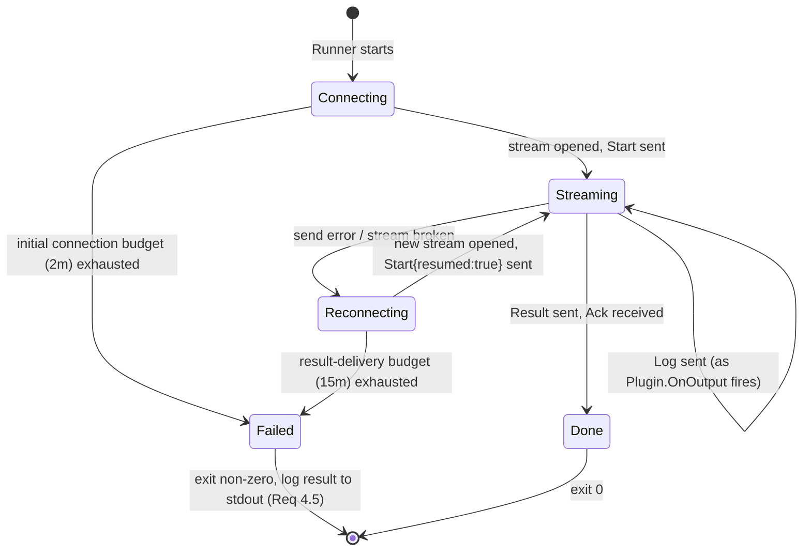
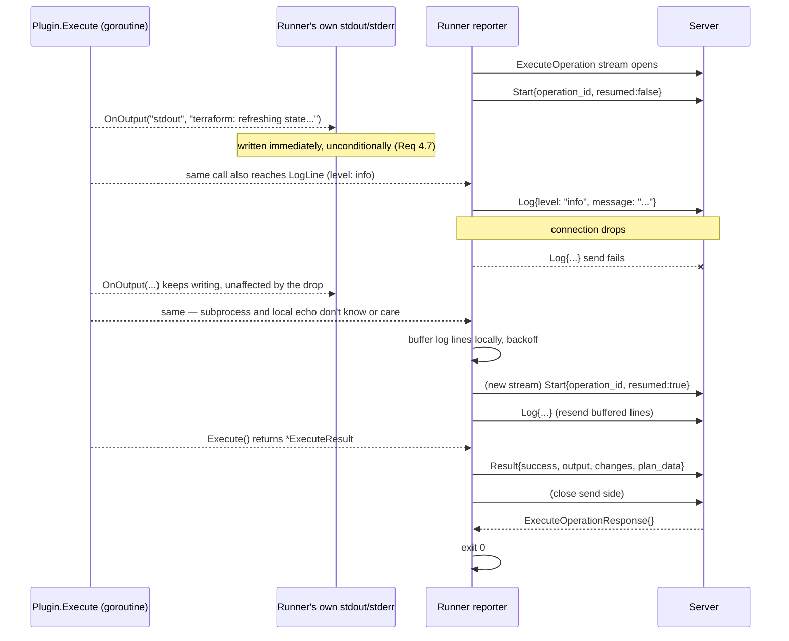

# Design Document: gRPC & Runner (Slice 5)

## Overview

This slice implements the gRPC contract between Server and Runner, the
Runner process (clone, dispatch, report), and the Server-side primitives
for launching and cleaning up Runner Jobs. It fills in the previously
empty `proto/turnip/v1/operation.proto` scaffolded in Slice 0, and adds
four new packages: `internal/runner` (the Runner binary's logic),
`internal/rpc` (the Server-side gRPC hosting glue), `internal/jobs` (the
Kubernetes Job builder), plus one additive change to the already-complete
`internal/plugin` (Slice 2).

Two decisions here are significant enough to call out before anything
else, because they shape everything downstream in this document:

### Decision 1: the RPC is client-streaming, not server-streaming

Requirement 8.5's literal wording ("Server SHALL stream operation logs
back to the Runner") is backwards — see requirements.md's Introduction for
why. The fix: `ExecuteOperation` is a **client-streaming** RPC. The Runner
(gRPC client) sends a stream of messages — one `start` message, then
`log` messages as output is produced, then one `result` message — and the
Server (gRPC server) sends back a single, near-trivial acknowledgment once
it has durably received everything. This is the same data the global
design's `OperationResponse` sketch carried (`LogLine | OperationResult`
oneof); it just moves from the response side to the request side, because
the Runner — not the Server — is the one that produces it.

*Alternative considered*: bidirectional streaming, so the Server could
push control messages back mid-operation. *Rejected* — nothing in any
requirement needs the Server to tell a running Runner anything; adding a
second stream direction with no message ever intended to flow through it
is pure unused complexity.

### Decision 2: `Plugin.Execute` needs an incremental-output hook (Slice 2 amendment)

Requirement 4.1 needs log lines to reach the Server as the Operation runs,
not only after it finishes. `Plugin.Execute` and the `commandRunner` seam
underneath it (`internal/plugin/command.go`) are both fully blocking today
— `execCommand` returns `(stdout, stderr []byte, ...)` only after the
subprocess exits, and `HelmfilePlugin.Execute` returns `*ExecuteResult`
only once `execCommand` returns. There is no point in that call chain
where a partial line is observable.

*Alternative considered*: have the Runner bypass `Plugin.Execute` for its
own line-by-line capture (e.g. run the tool binary directly instead of
going through the Plugin). *Rejected* — that would make the Runner
tool-aware in exactly the way the Plugin interface exists to prevent
(Slice 2's whole point is that adding a tool shouldn't require Runner
changes), and would leave two different code paths capable of invoking a
tool's CLI with different argument-building logic.

*Alternative considered*: have `Plugin.Execute` return a `<-chan string`
instead of a `string`. *Rejected* — this is a breaking change to every
existing caller and test in `internal/plugin` for a capability only this
slice needs yet; `ExecuteResult.Output` (the full captured string) still
has direct value on its own (e.g. it's what gets embedded in a
`<details>` PR comment block by Slice 4's `BuildConsolidatedComment`,
which has no interest in an incremental channel).

**Resolution**: add an optional callback, additive and backward-compatible
with every existing caller:

```go
// internal/plugin/plugin.go
type ExecuteOptions struct {
    WorkingDir string
    Config     map[string]string
    ExtraArgs  []string
    PlanData   []byte
    OnOutput   func(stream, line string) // optional; nil means "no incremental callback", today's behavior
}
```

`stream` is `"stdout"` or `"stderr"` — carrying which pipe a line actually
came from, not just its text. This is what lets the Runner do two things
with every line as it's produced, not just one: mirror it immediately to
its *own* stdout/stderr (Requirement 4.7), and pick the right `LogLine`
`level` — `"stdout"` → `"info"`, `"stderr"` → `"error"` — when reporting
it to the Server (Requirement 4.1). Without a stream tag, the Runner
would have to guess at `level`, or lose stream fidelity when mirroring
locally.

`execCommand` switches from `cmd.Output()`-style whole-buffer capture to
scanning the subprocess's stdout and stderr pipes line-by-line
concurrently (one goroutine per pipe, both writing into the same
`bytes.Buffer` under a mutex for the final combined capture, and — when
`OnOutput` is non-nil — invoking it once per line as it's read, tagged
with which pipe that goroutine is reading). `ExecuteResult.Output` is
still populated exactly as before once the subprocess exits; `OnOutput`,
when set, is however the Runner observes lines *before* that point. This
is a Slice 2 amendment (`plugin-helmfile`'s `tasks.md` gains a new
numbered task per this repo's audit-trail convention — see this slice's
own `tasks.md`).

## Package Layout

```
proto/turnip/v1/operation.proto   // filled in (Requirement 1)

internal/plugin/                  // Slice 2, amended (Decision 2)
  plugin.go                       // + ExecuteOptions.OnOutput
  command.go                      // execCommand: line-scanning, not whole-buffer capture

internal/runner/                  // NEW — the Runner binary's logic
  config.go     // env var parsing into a Config struct
  clone.go      // git clone via commandRunner-style subprocess seam (mirrors internal/plugin's)
  reporter.go   // the retrying gRPC client: connect, stream start/log/result, backoff
  run.go        // Run(ctx, Config) int — wires clone -> plugin dispatch -> reporter together

internal/rpc/                     // NEW — Server-side gRPC hosting (thin)
  server.go     // OperationHandler interface, NewServer(handler) *grpc.Server

internal/jobs/                    // NEW — Kubernetes Job builder + primitives
  build.go      // BuildJob(...) *batchv1.Job — env vars, initContainers, TTL
  versions.go   // per-tool vendor image table + version validation (Requirement 8.3-8.5)
  client.go     // Create(ctx, job) / Delete(ctx, name) via client-go's JobInterface
```

`internal/grpc/turnip/v1/` (generated code) is untouched by hand — only
`buf generate` writes there.

## Requirement 1: Protobuf Service Definition

```protobuf
syntax = "proto3";
package turnip.v1;

service OperationService {
  // Client-streaming: the Runner is the producer of everything in this
  // exchange (see Decision 1) — it opens the stream, sends one Start,
  // any number of Log lines, then one Result, then closes; the Server
  // sends a single Ack once it has durably received the stream.
  rpc ExecuteOperation(stream ExecuteOperationRequest) returns (ExecuteOperationResponse);
}

message ExecuteOperationRequest {
  oneof payload {
    OperationStart start = 1;
    LogLine log = 2;
    OperationResult result = 3;
  }
}

message OperationStart {
  string operation_id = 1;   // see "Operation ID" below
  string project_name = 2;
  string project_dir = 3;
  string tool = 4;
  string operation = 5;
  string repo_url = 6;
  string commit_sha = 7;
  string github_token = 8;
  map<string, string> tool_config = 9;
  repeated string extra_args = 10;
  bytes plan_data = 11;      // present only for an apply reusing a stored plan
  bool resumed = 12;         // true if this Start reopens a call broken by Requirement 2.4
}

message LogLine {
  string timestamp = 1;
  string level = 2;          // "info" | "warn" | "error"
  string message = 3;
}

message OperationResult {
  bool success = 1;
  string output = 2;
  int32 exit_code = 3;
  string error_message = 4;
  ChangeSummary changes = 5;
  bytes plan_data = 6;       // produced by a plan operation, for Slice 6 to hand to Slice 3
}

message ChangeSummary {
  int32 add = 1;
  int32 change = 2;
  int32 destroy = 3;
}

message ExecuteOperationResponse {} // deliberately empty — see below
```

**`ExecuteOperationResponse` is empty on purpose.** Every substantive
field already exists on the request side, because the Runner is who
produces it. The response's only job is to exist — its arrival is the
signal the Runner's reporter is waiting for to know delivery succeeded
(Requirement 4.4/4.5). Adding fields to it (e.g. an echoed
`operation_id`) would be redundant: a gRPC call is already scoped to
exactly one stream, so there's nothing ambiguous for a field to
disambiguate.

**Operation ID**, referenced throughout requirements.md but not
introduced by any single acceptance criterion, is resolved here: the
Server generates one (a UUID) when `internal/jobs.BuildJob` runs, passes
it to the Runner as an environment variable alongside everything else in
Requirement 7.2, and the Runner echoes it back in every `OperationStart`
it ever sends for that Job — including resumed ones — so the Server's
handler can recognize a reconnect as a continuation rather than a new
operation (Requirement 2.5).

## Requirement 2 & 4: Connection, Reconnection, and Reporting

### The reporter's state machine



The subprocess (via `Plugin.Execute`) runs on its own goroutine,
completely independent of this state machine — Requirement 2.4 is
enforced simply by never wiring subprocess cancellation to any reporter
event. The reporter's job is only to get `start`/`log`/`result` to the
Server; whether that's currently succeeding has no bearing on whether the
subprocess keeps running.

### Backoff parameters

| Retry loop | Base delay | Max delay | Jitter | Total budget |
|---|---|---|---|---|
| Initial connection (Req 2.3) | 1s | 30s | full | 2 minutes (the figure the global design's error-handling notes already call for) |
| Reconnection after a drop (Req 2.4) | 1s | 30s | full | shared with the result-delivery budget below |
| Final result delivery (Req 4.4) | 1s | 60s | full | 15 minutes |

Exponential backoff (factor 2) with *full* jitter (`delay = rand(0,
min(cap, base*2^attempt))`) — the standard shape for exactly the
"many clients reconnecting to a just-restarted server" scenario
Requirement 2.6 describes avoiding a thundering herd for. The two
distinct total budgets exist because the two failure modes have
different costs: giving up after 2 minutes at startup means the Job
retries from a clean slate later at essentially no cost (nothing has run
yet); giving up on reporting a *completed* `terraform apply`'s result
discards the one thing Slice 3/6 need to keep plan and apply consistent,
so it gets substantially more patience.

### Log buffering

A bounded ring buffer (256 KiB) holds log lines produced while
disconnected. On reconnect, the *entire current buffer* is resent — not
just lines produced since the last attempt — because a client-streaming
RPC gives the Runner no per-message acknowledgment from the Server, so it
has no way to know how much of a broken stream's content actually arrived
before the break. Some duplicate lines across a reconnect are an accepted,
documented cost (Requirement 4.3's own framing: logs are "only a minor
observability gap," not correctness-critical — unlike the result, which
this buffer does not apply to; the result is held as a single value and
resent in full on every attempt, per Requirement 4.4). When the buffer's
256 KiB fills, the oldest lines are dropped and replaced with a single
synthetic `LogLine{level: "warn", message: "N lines dropped"}` marker
(Requirement 4.3).

### Sequence: a mid-operation reconnect



## Requirement 3 & 6: Runner Startup and Plugin Dispatch

```go
// internal/runner/config.go
type Config struct {
    ServerAddr     string
    OperationID    string
    ProjectName    string
    ProjectDir     string
    Tool           string
    Operation      string
    RepoURL        string
    CommitSHA      string
    GitHubToken    string
    ToolConfig     map[string]string
    ExtraArgs      []string
    PlanData       []byte
    ToolsDir       string // see "TURNIP_TOOLS_DIR" note above
}

func ConfigFromEnv(env func(string) string) (Config, error)
```

`ConfigFromEnv` is a pure function (env map in, `Config` out) precisely so
it's testable without actually setting process-wide environment
variables in every test — mirroring `internal/plugin`'s `commandRunner`
testability-seam convention already established in this codebase.

`internal/runner/run.go`'s `Run(ctx, Config) int` sequence: clone the repo
at `CommitSHA` using `GitHubToken` (Requirement 5, shelling out to `git`
exactly as `internal/plugin` shells out to tool binaries — the Runner's
own Dockerfile already installs `git` for this, per Slice 0's
scaffolding); look up the `Plugin` matching `Config.Tool` (today, only
`HelmfilePlugin` exists per Slice 2; Slice 7 adds Terraform/Pulumi);
construct `ExecuteOptions` from the `Config` (`WorkingDir` = the clone
path joined with `ProjectDir`, `Config` = `ToolConfig`, `ExtraArgs`,
`PlanData`, and `OnOutput` wired as described below); call `Execute`;
translate the returned `*plugin.ExecuteResult` into an `OperationResult`
(Requirement 6.3) and hand it to the reporter.

**`OnOutput` does two things with every line, and the first one must
never wait on the second.** For each `(stream, line)` the Plugin produces,
`run.go`'s callback (a) writes `line` immediately to `os.Stdout` or
`os.Stderr` (matching `stream`) — a direct, synchronous, unbuffered write,
never queued behind anything network-related — and only then (b) hands
`(stream, line)` to the reporter's `LogLine` (task 11.2), which does its
own buffering/retrying independently. Ordering (a) before (b), and never
routing (a) through any channel or call that could block on the
reporter's connection state, is what makes Requirement 4.7 hold
regardless of whether the Server is reachable at all: local visibility
via `kubectl logs -f` is not allowed to degrade just because remote
reporting is degraded. `LogLine`'s `level` field is set from `stream` —
`"stdout"` maps to `"info"`, `"stderr"` to `"error"` — per Decision 2's
note above.

## Requirement 7, 8 & 9: Kubernetes Job Builder

```go
// internal/jobs/build.go
func BuildJob(project config.Project, op OperationParams) (*batchv1.Job, error)

type OperationParams struct {
    OperationID    string
    Operation      string
    RepoURL        string
    CommitSHA      string
    GitHubToken    string
    ServerAddr     string
    ExtraArgs      []string
    PlanData       []byte
}
```

`BuildJob` resolves `project.Config["version"]` against the per-tool
table below (Requirement 8.3-8.5) *before* constructing anything else,
returning an error immediately on an unrecognized version — so a bad
config never gets as far as a half-built Job spec.

| Tool | Vendor image | Binary path | Default version |
|---|---|---|---|
| terraform | `hashicorp/terraform:<version>` | `/bin/terraform` | (documented current stable at implementation time) |
| pulumi | `pulumi/pulumi-base:<version>` | `/pulumi/bin/pulumi` | (documented current stable at implementation time) |
| helmfile | `ghcr.io/helmfile/helmfile:v<version>` | `/usr/local/bin/helmfile` | (documented current stable at implementation time) |

(Table reproduced from the global design's "Tool Binary Provisioning"
section, which already verified these image/path pairs by pulling and
inspecting each one — re-verify at implementation time per that section's
own caveat that a vendor could restructure their image layout since.)

The Job's Pod spec: one initContainer per Requirement 8.1
(`command: ["sh", "-c", "cp <binary path> /tools/<tool>"]`, mounting an
`emptyDir` at `/tools`), the Runner main container with the environment
variables Requirement 7.2 lists — every one prefixed `TURNIP_`
(`TURNIP_SERVER_ADDR`, `TURNIP_OPERATION_ID`, `TURNIP_PROJECT_NAME`,
`TURNIP_PROJECT_DIR`, `TURNIP_TOOL`, `TURNIP_OPERATION`,
`TURNIP_REPO_URL`, `TURNIP_COMMIT_SHA`, `TURNIP_GITHUB_TOKEN`,
`TURNIP_TOOL_CONFIG`, `TURNIP_EXTRA_ARGS`, `TURNIP_PLAN_DATA`,
`TURNIP_TOOLS_DIR`) rather than bare names like `TOOL` or `OPERATION`,
to avoid colliding with anything Kubernetes itself injects into the Pod's
environment (e.g. `enableServiceLinks`' per-Service `<NAME>_SERVICE_HOST`
variables) or a future base-image `ENV` — `RestartPolicy: Never` (a
failed Operation is a reported failure, not something Kubernetes should
retry by re-running the whole Pod — that would re-run `terraform apply`
a second time, which is exactly the kind of drift Requirement 7's
lock-consistency goals exist to prevent), `BackoffLimit: 0` (the actual
mechanism that stops the Job controller from creating a *new* Pod after
a failure — `RestartPolicy` alone only governs in-Pod container
restarts), and `Spec.TTLSecondsAfterFinished` set per Requirement 7.4/9.1
(a `*int32`; 15 minutes, matching the result-delivery retry budget
above, so a Job whose Runner is still mid-retry never gets
garbage-collected out from under it).

**`TURNIP_TOOLS_DIR`, not a `PATH` override, is how the Runner finds the
provisioned tool binary.** The natural-looking approach — set `PATH` on
the Job spec to `/tools:$PATH` — doesn't actually work: Kubernetes'
`$(VAR_NAME)` env-value substitution only resolves references to *other
variables declared in that same Pod spec's `env` list*; it has no
visibility into a container image's own baked-in `PATH`, so `$(PATH)` (or
a literal, unexpanded `$PATH`) would not pick up whatever the Runner's
base image actually sets. Instead, `BuildJob` sets `TURNIP_TOOLS_DIR` to
the shared volume's mount path, and `internal/runner.Run` prepends it to
`os.Getenv("PATH")` via `os.Setenv` once, at Runner startup (before
cloning or invoking a Plugin) — the composition happens in the process
that actually has the image's real `PATH` to compose with, not in the Job
spec that can't see it.

*Alternative considered*: hardcode a full replacement `PATH` value (e.g.
`/tools:/usr/local/sbin:/usr/local/bin:/usr/sbin:/usr/bin:/sbin:/bin`) in
the Job spec, guessing at the base image's own `PATH`. *Rejected* — this
silently breaks if the Runner's base image ever changes (a different
base distro's default `PATH` differs), and duplicates a value that's
already correct inside the image itself; composing at Runner startup is
correct regardless of what base image `build/runner/Dockerfile` uses.

`internal/jobs/client.go`'s `Delete` (Requirement 9.2/9.3) passes
`metav1.DeleteOptions{PropagationPolicy: ptr.To(metav1.DeletePropagationBackground)}`
explicitly — relying on the API server's default propagation behavior
for a Job's owned Pods is the kind of implicit assumption that's cheap to
just make explicit instead.

## Requirement 5: Server-Side gRPC Hosting

```go
// internal/rpc/server.go
type OperationHandler interface {
    HandleLog(ctx context.Context, operationID string, line LogLine) error
    HandleResult(ctx context.Context, operationID string, result OperationResult) error
}

func NewServer(handler OperationHandler) *grpc.Server
```

Mirrors Slice 4's `EventHandler` pattern exactly: this package translates
the raw generated stream into two plain method calls on a
caller-supplied interface and contains no business logic of its own —
Slice 6 is what implements `OperationHandler` (deciding what a log line
or result *means* for a lock, a check run, or a PR comment). The
generated `ExecuteOperation(stream) (*Response, error)` handler loop:
receive until `io.EOF`, dispatching each `start`/`log`/`result` oneof
variant (`start` only matters for observability/logging at this layer,
not represented in `OperationHandler` at all, since nothing in this
slice's scope needs to react to an operation merely *starting*); return
`&ExecuteOperationResponse{}` once the client closes its send side.

## Testing Strategy

Per this repo's dual testing approach; no coverage target for this
package group is stated anywhere in the global design's Testing Strategy
section (its listed targets stop at "Project matcher: 90%" and don't
mention gRPC/Runner/Kubernetes code at all) — this slice adopts 80%,
matching the "Server webhook handling" bucket's rationale (integration
points with an external system are harder to drive to full coverage via
unit tests alone; the deeper coverage belongs to the global roadmap's
Slice 11 integration tests against a real `kind` cluster).

- **Unit tests**: `internal/runner`'s reporter is tested against a fake
  `OperationServiceClient` (or a real one backed by an in-process
  `bufconn` gRPC server, the standard pattern for testing gRPC clients
  without a real network listener) that can be told to fail N times
  before succeeding, to exercise the backoff/reconnect state machine
  deterministically and quickly (no real `time.Sleep`s — the backoff
  helper takes a `sleep func(time.Duration)` seam, same testability
  convention as `internal/plugin`'s `commandRunner`).
  `internal/jobs`'s `BuildJob` is tested purely as a function of its
  inputs (no real cluster) — asserting on the constructed `*batchv1.Job`'s
  fields. `internal/rpc`'s server is tested with a fake
  `OperationHandler` recording calls, driven via `bufconn`.
- **Property tests**: this slice maps onto the global design's Properties
  23 (Runner Job Environment Variables), 23a (Runner Job Tool
  Provisioning), 24 (Runner Clones Correct Commit), 25 (Job Cleanup After
  Completion — reinterpreted per this slice's TTL-based mechanism, not an
  explicit delete call), and 27 (Token Propagation to Runner) — each
  tagged and implemented against `internal/jobs`'s pure `BuildJob`
  function using `pgregory.net/rapid`, ≥100 iterations. Property 6
  (Runner Creation Per Triggered Project) and Property 26 (Installation
  Token Generation Per Webhook) belong to Slice 6, not this slice, per
  requirements.md's Out of Scope.
- No real Kubernetes cluster or `kind` environment is used in this
  slice's tests, matching the global design's stated approach — that's
  Slice 11.

## Backward Compatibility

`internal/plugin`'s `ExecuteOptions.OnOutput` addition (Decision 2) is
purely additive — every existing call site across `internal/plugin` and
any other package leaves the field unset (nil), which `execCommand`
treats identically to today's behavior (no incremental callback invoked,
`ExecuteResult.Output` populated the same way it always was). No existing
test's expected behavior changes.

`proto/turnip/v1/operation.proto`'s messages go from empty placeholders
to real fields; the RPC method's streaming direction on the request side
changes from unary to `stream` (Requirement 1.3 note: this is exactly the
kind of schema fill-in Slice 0's placeholder was left for — there are no
existing callers of the generated code to break).
