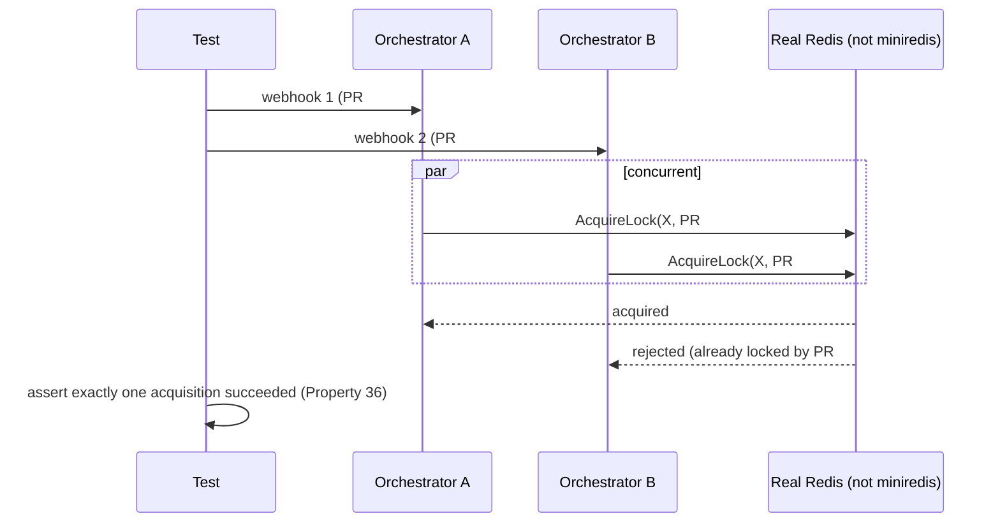

# Design Document: HA Validation & Documentation (Slice 11)

## Overview

New tests only — `internal/orchestrator/ha_test.go` (in-process,
multi-instance, real Redis, part of default CI), `internal/orchestrator/load_test.go`
(the in-process Load Test, run on demand — same package, for the same
reason as `ha_test.go`: package-internal access `orchestrator.New`'s
public constructor doesn't offer), and a `test/load/` directory (the
`kind`-cluster variant only, run on demand) — plus a new CI service
container, and documentation files outside `internal/` entirely
(`README.md`, `docs/`). No production code in `internal/` changes as a
result of this slice; it validates and documents what
`structured-logging`, `metrics`, and `deployment-kustomize` already
built.

## Requirement 1: Stateless Server Validation and Multi-Instance Concurrent-Load Testing



`internal/orchestrator/ha_test.go` (new file, part of the default
`go test -race ./...` suite per Requirement 1.3 — these are core
correctness properties worth running on every commit, not gated behind a
manual step) builds two full `*Orchestrator` instances sharing one
**real** Redis and drives Requirement 1.1/1.2's scenarios: Requirement
1.1 (Properties 34/35, statelessness) as a plan-on-one-instance,
apply-on-a-different-instance sequence — proving instance B can retrieve
instance A's lock and plan data entirely through Redis, with no in-process
state shared between the two `*Orchestrator` values — asserted to succeed
identically whether run on one instance or split across two; Requirement
1.2 (Property 36, the diagram above) as a genuinely concurrent race:
several simulated instances firing `AcquireLock` for the same Project Key
at once, asserting exactly one wins. This is a deliberate departure from
every existing `internal/orchestrator` test's
`miniredis` fixture (`newTestRedisClient`): `miniredis`'s single-threaded
command loop serializes every operation, which is exactly the kind of
accidental mutual exclusion that could make Properties 34-36 look true
against the fake while a real, genuinely-concurrent Redis exposes a race
— the one place in this codebase where the fake is actively the wrong
tool. `ha_test.go` reads a `TURNIP_TEST_REDIS_ADDR` environment variable
and `t.Skip`s (not fails) when it's unset, so a local `go test ./...` run
without a Redis handy still passes; `.github/workflows/ci.yml` gains a
`redis:` service container (a small, ~2s-to-start addition) and sets that
variable so CI always exercises the real path.

Requirement 1.4's Load Test (100 concurrent webhook events, in-process,
real Redis) lives in `internal/orchestrator/load_test.go`
(`//go:build load`), not `test/load/` — like `ha_test.go`, it needs
direct access to `Orchestrator`'s unexported fields to substitute a fake
`GitHubClient` and a fake `jobCreator`, which `orchestrator.New`'s public
constructor has no seam for (it always wires a real `*github.Client` via
`AppAuth.InstallationClient`). Requirement 1.5's `kind`-cluster variant
(RBAC and Runner↔Server networking, against a real cluster — see the
Decision below for why it isn't simply the same webhook burst replayed
over HTTP) *does* live in `test/load/kind_test.go`, since it never needs
package-internal access at all — it only shells out to `kubectl`/`kind`.
Both are invoked explicitly (`go test -tags load ./internal/orchestrator/...`,
`go test -tags kind ./test/load/...`, or Makefile targets `make test-load`
/ `make test-kind`) rather than folded into the default `make test` — per
Requirement 1.7. `make test-kind`
stands up a `kind` cluster, applies `deployment-kustomize`'s
`deploy/overlays/kind/` (plus a plain Redis Deployment/Service this
slice's test setup provides — the base deliberately owns no Redis of its
own, `deployment-kustomize` Requirement 1.3), waits on `/readyz`, runs
the checks below, and tears the cluster down — deliberately not mocking
Kubernetes for this specific kind of test (unlike `internal/jobs`'s unit
tests, which use `k8s.io/client-go/kubernetes/fake`), since RBAC/networking
is exactly what this variant exists to exercise for real (Requirement
1.5's own stated purpose).

Requirement 1.6 (distinguishing a slow/flaky `kind` runner from an actual
HA regression) is met by `test/load/`'s `kind`-cluster variant reporting
two distinct failure classes: a `KindTimeoutError` (cluster
provisioning/scheduling took longer than the documented bound — reported
as an inconclusive/skip, not a correctness failure) versus an assertion
failure on the Load Test's own correctness checks (a genuine Property
34-36 violation).

**Decision: the `kind`-cluster variant doesn't replay the webhook burst at
all — it validates RBAC and networking directly, bypassing GitHub
entirely.** Requirement 1.5 wants real RBAC and networking exercised, not
only in-process application logic. The natural first idea — fire the
Load Test's webhook burst at a real `kind`-deployed Server and see how
far it gets — doesn't reach *any* Redis logic at all: unlike
`execute.go` (where `AcquireLock` genuinely does run before the GitHub
calls), `handlePlanTrigger` calls `fetchConfig` → `client.GetFile`
*first* (`pullrequest.go`), and `HandleIssueComment` calls
`authorizer.IsCollaborator` → `client.GetCollaboratorPermission` *first*
(`comment.go`) — both real GitHub API calls, both before `executeOne`
is ever reached. A syntactically-valid but throwaway GitHub App key
(`NewAppAuth` only parses the PEM; it never contacts GitHub at
construction) still fails the instant `ghinstallation`'s transport
mints a token for that first real request, since the App isn't
actually registered with GitHub — so every webhook in the burst would
fail identically at the very first line of business logic, never
touching a lock, never creating a Job. Replaying it would prove nothing
this slice's design.md doesn't already claim were true (an HTTP request
completes and doesn't hang) and can't prove the one thing Requirement 1.5
actually wants (RBAC, Job-creation networking) — a wrong turn caught
before implementing it, not after.

**Resolution**: `test/load/kind_test.go` validates the two things
Requirement 1.5 actually cares about directly, neither of which needs
GitHub at all:
1. **RBAC**: build a real Job via `jobs.BuildJob` and create it with a
   real `jobs.Client` (`internal/jobs` — the exact production code path
   `execute.go` itself uses), authenticated as the
   `turnip-server` `ServiceAccount` the `kind` overlay actually deployed
   — proving `deploy/base/role.yaml`'s grant (Jobs
   create/delete/get/list/watch, Pods get/list — `deployment-kustomize`
   Requirement 1.1) is sufficient in a live cluster, not just
   syntactically present.
2. **Networking**: that real Job's Runner Pod dials the real Server's
   real gRPC Service address and completes one trivial Operation
   end-to-end (log line + result), proving the Runner→Server path the
   `kind` overlay's Service actually routes, for real — the same
   `ExecuteOperation` stream `integration_test.go` already drives over
   `bufconn`, now over a real Kubernetes Service instead.

This needs a throwaway GitHub App key only far enough for the Server
process to start (`NewAppAuth` parsing) — it never needs to be a real,
registered App, since nothing in this test calls GitHub. `TURNIP_GITHUB_APP_ID`
stays whatever placeholder value the `kind` overlay's own
`kustomization.yaml` already documents (`deployment-kustomize`).

The concurrent-load angle (Requirement 1.4's "100 concurrent events, no
deadlock") is *not* re-run against `kind` at the webhook-HTTP layer for
the reason above; it's covered where it can actually reach the lock
logic — the in-process `internal/orchestrator/load_test.go` variant (Req
1.4) and `ha_test.go` (Req 1.1-1.3), both against a real Redis.
Requirement 1.5's own wording ("exercising the actual Kubernetes
RBAC and networking path — not only application logic in-process") reads
as satisfied by RBAC+networking specifically, not as a mandate to
re-prove lock-coordination correctness a second time through a channel
that can't reach it.

*Alternative considered*: provision a real (throwaway) GitHub App and
test repository so the full webhook-to-Job flow succeeds end-to-end.
*Rejected* — a live external dependency this validation suite would then
require just to run at all, contradicting Requirement 1.7's "runnable on
demand" framing (on demand by anyone, not gated on a maintainer's
personal GitHub App); the direct Job/networking check proves the same
two things (RBAC sufficiency, Runner↔Server networking) without it. An
operator who *does* have a real test App can still point `make
test-kind` at a real Secret (same prerequisite `deployment-kustomize`'s
`kind` overlay already documents) and drive the full flow by hand; nothing
here requires it.

## Requirement 2: Documentation

`README.md`: what turnip is (the existing `CLAUDE.md` "What this is"
section is the source of truth to summarize, not duplicate at length),
architecture diagram (reuse the global `design.md`'s Mermaid component
diagram rather than redrawing it), and a link to
`deployment-kustomize`'s `deploy/` as the primary deployment path.

`docs/deployment.md`: prerequisites, the overlay values an operator must
supply (cross-referencing `deployment-kustomize`'s `deploy/overlays/kind/`
as a concrete worked example), and a "verify your deployment" section
built directly on `metrics`'s endpoints (`curl .../healthz`, `curl
.../readyz`).

`docs/troubleshooting.md`: one entry per failure mode already narrated in
the global `design.md`'s "Error Handling" section (Configuration Errors,
Lock Contention, GitHub API Errors, Runner Execution Errors, Plugin
Execution Errors, Authorization Errors), each translated from that
section's developer-facing "what the code does" framing into an
operator-facing "what you'll see, and what to do about it" framing —
e.g. the design doc's "Repository Clone Failure: ... runner returns an
error result via gRPC" becomes "the PR comment says `clone failed:
merge conflict` — the PR's branch conflicts with its base; resolve the
conflict in the PR the normal way, no turnip-side action needed" (a
concrete instance of grpc-runner's `*MergeConflictError`,
Requirement 5.4 of that slice).

## Package Layout

```
internal/orchestrator/ha_test.go     // NEW (Requirement 1.1-1.3)
internal/orchestrator/load_test.go   // NEW (Requirement 1.4) — needs
                                      // package-internal access, see the
                                      // amended note above
test/load/kind_test.go               // NEW (Requirement 1.5-1.6)
test/load/redis.yaml                 // NEW — throwaway Redis for the kind cluster
Makefile                              // amended: test-load, test-kind targets
.github/workflows/ci.yml              // amended: redis service container

README.md                             // NEW (Requirement 2)
docs/deployment.md                     // NEW
docs/troubleshooting.md                // NEW
```

## Testing Strategy

This slice *is* test infrastructure — see Requirement 1's design section
above for `ha_test.go`, `load_test.go`, and `test/load/kind_test.go`'s
shape. No property tests:
Requirement 1's Properties 34-37 are exercised by example-based
integration tests (specific interleavings across real instances), not
property-based ones, since the property itself ("N instances behave like
1") is about *coordination*, not input-space coverage the way
`config-parsing`'s glob matching or `plugin-helmfile`'s command
construction are.

## Backward Compatibility

Purely additive — new test files, a new CI service container, and new
documentation files. No production code changes.
