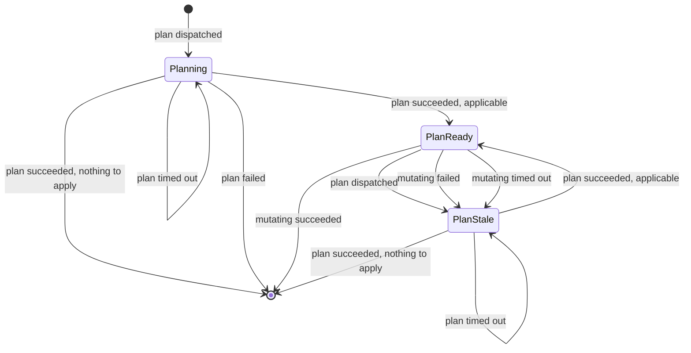

# Design: The Lock's Lifecycle as a State Machine (Slice 18)

## Overview

Today the Lock's lifecycle is implicit: one branch at result time, plus
release on unlock and close. This slice makes it explicit — a held Lock
occupies one of three states, and every rule is an edge.

The atomicity primitive does not change. `SET NX` and the
compare-and-mutate script keep deciding *who* holds a Lock; the state
lives inside the value they already guard.

## Prior art: Atlantis hit this, and it was a bug

Atlantis plans only the projects whose files changed — its autoplan
filters the modified files against `--autoplan-file-list` (or a project's
`when_modified`) and plans the directories those files are in. So the
path-filtered model this slice assumes is not a turnip invention, and an
unrelated commit replans nothing there either.

What is instructive is that Atlantis reached our hazard from the other
direction. Its plans are files on disk, one per project, and apply
collects whatever it finds for the pull request. Issue #1624: a pull
request plans several projects, is then updated so some are no longer
affected, and Atlantis re-plans only the still-affected ones — leaving the
others' plan files in place for apply to pick up. In the reporter's words,
apply "will pick up all the plans it can find for a specific PR and try to
apply them, which can include things that were not meant to be applied by
the end user". It was closed by two fixes.

Different plumbing, identical shape: an apply that no longer corresponds
to the pull request, with nothing on the page to say so. turnip's version
comes from the Lock carrying a plan while Helmfile replays arguments at
whatever HEAD the Runner clones.

The difference this design makes is where validity lives. Atlantis infers
it from which plan files happen to be on disk, which is why the bug was
invisible. Here it is a state on the Lock, changed by named edges, and
every edge says so on the pull request.

## The states

| State | Meaning | Mutating_Operation |
|---|---|---|
| *(no key)* | Project is free | — |
| `Planning` | held; nothing successfully planned yet | refused — no plan recorded |
| `PlanReady` | held; the recorded plan describes the delta from current infrastructure to the desired state at the current head | **admitted** |
| `PlanStale` | held; a plan was recorded and something has invalidated it | refused — plan no longer valid |

`PlanReady` is the only state that admits a Mutating_Operation, which
replaces the present pair of conditions at `execute.go:140-161`
(`IsLockedByPR`, then `GetPlan` not returning `ErrNoPlan`).

## The transition table



`EventUnlocked` and `EventPullRequestClosed` release from any state. They
take the same path as every other edge rather than keeping their own
`ReleaseLock` calls at `comment.go:247` and `pullrequest.go:148` — not
because they decide anything today, but because two callers that never
consult the table are how the table stops being the whole story.

An event for a Lock that no longer exists is a no-op, not an error: closing
a pull request mid-apply deletes the Lock, and the apply's result still has
to reach the reader.

**One transition the machine cannot see.** A push that matches no Project
dispatches no plan for it, so its `PlanReady` survives a commit. The plan
is arguably still valid — `whenModified` says those files do not affect it
— but `whenModified` is a claim about the repository that can be wrong,
and it does not follow symlinks. This is the residual hole the deferred
head-commit item would close.

What each edge announces (Requirement 7.3 — the reason belongs to the
edge, not to the state arrived at):

| From | Event | To | Lock | Announced |
|---|---|---|---|---|
| *(free)* | plan dispatched | `Planning` | created | — |
| `Planning` | plan succeeded, applicable | `PlanReady` | held | — |
| `Planning` | plan succeeded, nothing to apply | *(free)* | released | the plan found nothing to apply |
| `Planning` | plan failed | *(free)* | released | the plan failed; nothing was recorded |
| `Planning` | plan timed out | `Planning` | held | — |
| `PlanReady` | plan dispatched | `PlanStale` | held | a new commit superseded the stored plan |
| `PlanReady` | mutating succeeded | *(free)* | released | the operation completed |
| `PlanReady` | mutating failed | `PlanStale` | held | the apply failed part-way; re-plan before retrying |
| `PlanReady` | mutating timed out | `PlanStale` | held | no result arrived; the operation may still be running |
| `PlanStale` | plan succeeded, applicable | `PlanReady` | held | — |
| `PlanStale` | plan succeeded, nothing to apply | *(free)* | released | the plan found nothing to apply |
| `PlanStale` | plan failed | `PlanStale` | held | the plan failed; the stored plan is still unusable |
| `PlanStale` | plan/mutating timed out | `PlanStale` | held | — |

**Three unreachable combinations, by construction.** `PlanReady` never
sees a plan result — every result is preceded by a dispatch, and dispatch
moves `PlanReady` to `PlanStale` first. That is a property to test, not to
assume: if a plan result ever arrives in `PlanReady`, Requirement 2.2's
dispatch-time edge has regressed to result-time.

## Decision 1: One entry point per category of caller

Four places touch a Lock's lifecycle: `executeOne` (dispatch),
`HandleResult` (results), `sweepOnce` (timeouts), and the unlock/close
paths. If each applies its own edges, the table is scattered again — which
is the condition this slice exists to end.

```go
// LockState is the lifecycle position of a held Lock. The absence of a
// Lock has no LockState: it is the absence of the Redis key.
type LockState string

const (
	StatePlanning  LockState = "planning"
	StatePlanReady LockState = "plan_ready"
	StatePlanStale LockState = "plan_stale"
)

// Event is what happened to an Operation, as the Lock sees it. Plan and
// mutating timeouts are distinct events because they move differently: a
// plan timeout changes nothing, a mutating timeout invalidates the plan.
type Event string

const (
	EventPlanDispatched     Event = "plan_dispatched"
	EventPlanApplicable     Event = "plan_applicable"
	EventPlanNothingToApply Event = "plan_nothing_to_apply"
	EventPlanFailed         Event = "plan_failed"
	EventPlanTimedOut       Event = "plan_timed_out"
	EventMutatingSucceeded  Event = "mutating_succeeded"
	EventMutatingFailed     Event = "mutating_failed"
	EventMutatingTimedOut   Event = "mutating_timed_out"
)

// Transition reports what an operation did to the Lock, so the caller can
// announce it. To is empty when Released.
type Transition struct {
	From     LockState
	To       LockState
	Released bool
}

// AcquireForPlan acquires the Lock for a plan, or confirms this pull
// request already holds it, applying EventPlanDispatched in the same
// atomic step. Returns acquired=false only when a different pull request
// holds it, in which case no state changes.
AcquireForPlan(ctx context.Context, projectKey string, prNumber int, pullRequestURL, lockedBy string) (acquired bool, t Transition, err error)

// Apply moves the Lock according to the transition table. plan is
// required for EventPlanApplicable and ignored otherwise.
Apply(ctx context.Context, projectKey string, prNumber int, ev Event, plan *PlanRecord) (Transition, error)
```

`Transition` deliberately carries no message. The lock package owns the
table; `internal/github` owns what a reader sees. The orchestrator has the
event and the transition, which together name the edge.

**Alternative considered**: keep `AcquireLock`, `StorePlan` and
`ReleaseLock`, and add a separate `SetState`.

**Rejected because** it makes every edge two calls that must agree, across
four call sites, with no atomicity between them. The failure mode is a
Lock whose state and plan record disagree, which no caller can detect.

## Decision 2: The dispatch edge lives in the acquire script

`EventPlanDispatched` is applied inside the acquire script rather than as
a second call after it.

The script today reads the key, returns 1 if absent (creating) or if held
by the same pull request, and 0 otherwise — the stored value is untouched
on re-acquire, which is why a re-plan currently preserves its plan. That
last part is what changes: a re-acquire in `PlanReady` now rewrites the
state to `PlanStale` in the same evaluation.

Doing it atomically matters because the alternative — acquire, then
invalidate — leaves a window where the Lock is acquired for a new plan and
still reports `PlanReady`. That window is precisely what Requirement 2.2
exists to close, so reintroducing it one call later would be a circular
failure.

## Decision 3: The announcement is structured, not appended to output

Today the single existing announcement is `pr.Output += "\n\nLock released
— …"` (`result.go:161`). `Output` is interpolated *inside* the fenced
block by `buildDetailSectionPart`, so turnip's own sentence renders as
tool output; and `Output` is what gets split across `part N/M`, so the
sentence lands at the end of the final part, behind a fold.

Instead `ProjectResult` carries it:

```go
// LockNote states what happened to this Project's Lock and why — a
// release, or an invalidation that kept the Lock. Empty means neither
// happened, which covers a Lock still held unchanged and an Operation
// that never held one, since a rejected Operation touches no Lock.
//
// Set only after the Lock manager confirms the transition, in the same
// place Locked is set, so the two can never disagree.
LockNote string
```

It renders in the trailer beside `nextSteps`, which already keys off
`Locked` — outside the fence, never truncated.

**On the invariant**: "not locked" and "released" are different.
`rejectedResult` (`execute.go:308`) builds a result with `Locked` at its
zero value because the Operation never held a Lock. `LockNote` is
therefore not derivable from `!Locked`; it is set at the transition and
nowhere else.

## Decision 4: Announce only after the transition is confirmed

`Locked` and `LockNote` are set from the returned `Transition`, after the
call returns without error. A failed release leaves the Lock reported as
held, no note, and a logged error — preserving today's behavior at
`result.go:157-162`.

The tempting shape is to decide the edge, compose its message, then
perform it. That reads better and is wrong in the one direction that
matters: it tells an author a Project is free while Redis still holds it,
so the next pull request's plan is rejected naming a pull request whose
comment claims it released.

## Decision 5: A tolerant decode, not a migration

A Lock written before this slice decodes with an empty `LockState`. It is
treated as not `PlanReady` — a new plan is required.

**Alternative considered**: derive the state from the existing `HasPlan`
field, so a pre-upgrade Lock carrying a plan becomes `PlanReady`.

**Rejected because** `HasPlan` cannot distinguish a plan that is still
valid from one a push or a failed apply has invalidated — that distinction
is the entire slice. Promoting old Locks to `PlanReady` would grant
exactly the appliability this slice exists to withdraw. Failing toward
re-planning costs one plan; the precedent is already set at
`execute.go:149-151`.

## Decision 6: Execution state stays in the Operation record

"A plan is in flight" is not a Lock state. `OperationRecord` already
carries the start deadline that `sweepOnce` claims against, and a Job name
to ask Kubernetes about.

**Alternative considered**: a `Running` state, so the Lock knows an
Operation is active.

**Rejected because** it duplicates the record and creates two sources of
truth about one Job, which then disagree exactly when something has gone
wrong — a Runner that dies leaves the record sweepable and the Lock stuck
in `Running` with nothing to clear it.

## Decision 7: The timeout path is an edge, not an exception

`sweepOnce` applies `EventPlanTimedOut` or `EventMutatingTimedOut` through
`Apply`, like every other event, and sets `Locked` and `LockNote` from the
returned `Transition`.

This fixes a live defect. `reportTimeout` constructs its `ProjectResult`
field by field and omits `Locked`, which therefore defaults to false while
the Lock is genuinely held. `nextSteps` and `buildFooter` both key off it,
so today a timed-out Project vanishes from the footer and is never offered
`unlock` — held and invisible at once.

**Alternative considered**: leave the sweep deciding for itself, since a
plan timeout changes no state anyway.

**Rejected because** "changes no state" is a property of the current
table, not a guarantee — and it is already false for the mutating
timeout, which moves to `PlanStale`. The sweep would need half the table
to know which case it was in, which is a second decision site, which is
exactly what produced the defect above.

**A known limitation this does not remove**: the comment reaches the pull
request only if the Server instance that dispatched the Operation is still
in `waitForDone`. After a restart the sweeping replica still updates the
check run, but no comment is posted. That bounds how far Requirement 7 can
reach, and it is not introduced here.

## The Plugin declaration

```go
// ActsWithoutChanges reports whether any Mutating_Operation this Plugin
// exposes can still affect infrastructure when the plan reported no
// changes.
//
// It answers for the Plugin's whole operation surface, not for its
// designated apply Operation, because a Lock is released once — before
// turnip knows which Mutating_Operation the author will later choose.
//
// Helmfile answers true on account of `sync`, which upgrades every
// release regardless of the diff. `helmfile apply` alone would answer
// false: it diffs first and syncs only what changed.
ActsWithoutChanges() bool
```

It selects between two edges out of a successful plan: `EventPlanApplicable`
when the plan reported changes **or** the Plugin answers true, and
`EventPlanNothingToApply` otherwise.

## The amendment to global Requirement 7

| Criterion | Now | After |
|---|---|---|
| 7.3 | "WHEN a plan Operation completes successfully, THE Server SHALL store the plan result in the Lock and THE Lock SHALL remain held" | "WHEN a plan Operation completes successfully **and leaves something to apply**, THE Server SHALL store the plan result in the Lock and THE Lock SHALL remain held. A plan leaves something to apply when it reported changes, or when the Project's tool can act without them." |
| 7.4 | "THE Lock SHALL persist without TTL until the PR is merged, closed, manually unlocked, or a successful apply completes" | "THE Lock SHALL persist without TTL until the PR is merged, closed, manually unlocked, a successful Mutating_Operation completes, **or a plan ends with nothing to apply — whether because it failed with nothing recorded, or because it found no changes for a tool that cannot act without them**." |

## What changes where

| File | Change |
|---|---|
| `internal/lock/lock.go` | `LockState`, `Event`, `Transition`; `LockStatus.HasPlan` becomes `State`; interface gains `AcquireForPlan` and `Apply` |
| `internal/lock/scripts.go` | acquire script applies the dispatch edge; a transition script applies the rest |
| `internal/lock/redis.go` | tolerant decode of an absent state |
| `internal/plugin/plugin.go` | `ActsWithoutChanges()` joins the interface |
| `internal/plugin/helmfile.go` | returns true, recording `sync` as the reason |
| `internal/github/types.go` | `LockNote` on `ProjectResult` |
| `internal/github/comment.go` | render `LockNote` in the trailer |
| `internal/orchestrator/execute.go` | dispatch via `AcquireForPlan`; admit a Mutating_Operation only from `PlanReady`; distinguish the two refusals |
| `internal/orchestrator/result.go` | map a result to an Event; set `Locked` and `LockNote` from the `Transition`; citation fix at `:45` |
| `internal/orchestrator/sweep.go` | apply the timeout event through `Apply`; set `Locked`/`LockNote` from the `Transition` (today `Locked` is never set); citation fix at `:89` |
| `internal/orchestrator/target.go` | bare selection reads `State == PlanReady` (was `HasPlan`) |
| global `requirements.md` | amend 7.3 and 7.4 in place |
| `roadmap.md` | record the amendment; Slice 18 to Complete |
| `redis-lock-manager/tasks.md` | amendment task: the documented lifecycle is now a state machine |
| `docs/` | states, what moves between them, and the re-plan requirement after a failed apply |

## Interaction with other slices

**Slice 20 (plan-scoped apply)** is the reason Helmfile answers true, and
its guarantee is strengthened rather than changed: a Mutating_Operation
still replays the recorded scope, and now can only do so from `PlanReady`.

**Slice 17 (comment output)** gains a field and a trailer line. `unlock`
and the footer already render from `Locked`, so released Projects drop out
unchanged.

**Slice 33 (execution provenance)** also adds a `ProjectResult` field and
renders into the same trailer. Independent; whichever lands second
rebases.

**Slice 26 (real-time output)** is unaffected — no Lock state is involved
in streaming.

## Testing strategy

**The transition table is the test.** One table test over every row,
asserting the resulting state, whether the key survives, and whether a
note was produced. A row asserting only the state would pass while the
comment said nothing.

**Unreachability is asserted, not assumed.** A plan result arriving in
`PlanReady` must be impossible; the test that pins it is what catches
Requirement 2.2 regressing from dispatch-time to result-time — a change
that breaks nothing else and reopens the window silently.

**Atomicity needs a real Redis.** The dispatch edge is a claim about what
two Servers can observe, and miniredis serializes every command, so it
cannot fail the way a real instance would. This belongs with the existing
`TURNIP_TEST_REDIS_ADDR` tests in `ha_test.go`, which skip when no real
instance is available.

**Announce-after-confirm gets its own test**, because no happy-path row
reaches it: a transition that returns an error must leave `Locked` true
and `LockNote` empty.

**`ActsWithoutChanges` is tested from both sides** — that Helmfile returns
true, and that a fake Plugin returning false releases the Lock on a
no-change plan while one returning true does not. Helmfile alone can only
ever exercise one side, so the fake is what proves the declaration is
consulted rather than ignored.

**Pre-upgrade Locks get a test.** A stored value with no state field must
refuse a Mutating_Operation, not admit one. This is the single edge where
a wrong default applies something nobody reviewed.

**Non-vacuousness.** Each new edge is mutation-checked: disabling it must
fail its row. Absence assertions ("no Lock call was made") come from fakes
that record calls, never from state that happens to look unchanged.
