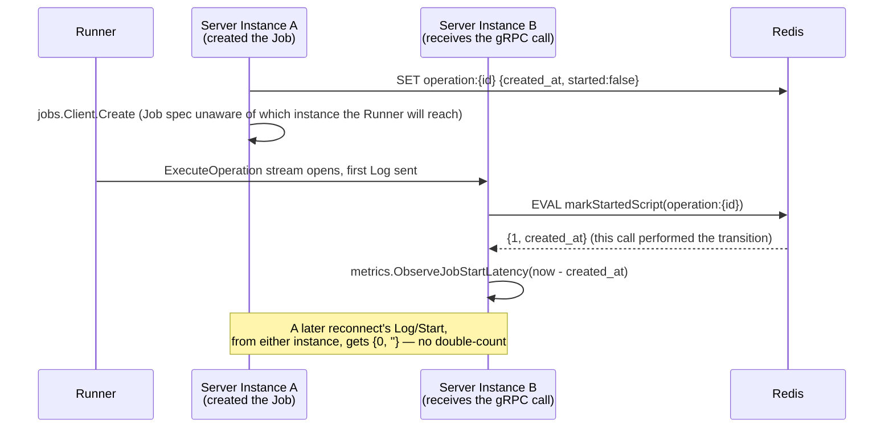

# Design Document: Metrics & Health Endpoints (Slice 9)

## Overview

Two new leaf packages (`internal/health`, `internal/metrics`), a routing
change in `cmd/server/main.go` (a real `*http.ServeMux` replacing the
single direct `Handler` assignment), a small extension to
`internal/orchestrator/record.go`'s existing atomic-CAS mechanism, and
metrics instrumentation at a handful of existing call sites in
`internal/github` and `internal/orchestrator`. `cmd/runner/main.go` is
untouched — Requirement 2.4 explicitly excludes Runner-side metrics.

## Decision 1: HTTP routing via `http.ServeMux`, introduced here

`cmd/server/main.go` today sets `httpServer.Handler =
github.NewWebhookHandler(...)` directly — the entire `http.Server` has
exactly one route, implicitly. Requirement 1.3 needs `/healthz`,
`/readyz`, and (Requirement 2.1) `/metrics` added without touching the
webhook path's own behavior.

**Resolution**: build a Go 1.22+-style `*http.ServeMux` in `run(cfg)`
(`cmd/server/main.go` already requires Go 1.26 per `go.mod`):

```go
mux := http.NewServeMux()
mux.Handle("GET /healthz", health.Healthz())
mux.Handle("GET /readyz", health.Readyz(pingRedis))
mux.Handle("GET /metrics", metrics.Handler())
mux.Handle("/", github.NewWebhookHandler([]byte(cfg.GitHubWebhookSecret), orch))
httpServer.Handler = mux
```

`"/"` remains a catch-all (unchanged webhook behavior for any path a
GitHub App's webhook URL happens to be configured with), while the three
exact-path registrations take precedence for their specific paths under
`ServeMux`'s longest-match rule — no change to how an operator configures
their GitHub App's webhook URL. This is the one piece of this slice
`deployment-kustomize` (Slice 10) and `ha-validation` (Slice 11) both
build on: Slice 10's `readinessProbe`/`livenessProbe` point at these
exact paths, and Slice 11's test harness polls `/readyz`.

No new package is introduced purely for this wiring — it's ~4 lines in
`cmd/server/main.go`, not a "routing layer" this codebase needs a
dedicated package for.

```go
// internal/health/health.go
func Healthz() http.HandlerFunc

// Readyz returns 200 only when ping currently succeeds; ping is a small
// func-type seam (this codebase's established convention — gitRunner,
// cloner, pluginSelector) rather than an interface, since exactly one
// method is needed. cmd/server/main.go constructs it as
// func(ctx context.Context) error { return redisClient.Ping(ctx).Err() }.
func Readyz(ping func(context.Context) error) http.HandlerFunc
```

`Healthz` always returns 200 once the process is running `main`'s HTTP
server at all — Requirement 1.1 deliberately doesn't check Redis
reachability there, so a Redis blip doesn't restart a Server Pod that's
otherwise fine (the standard Kubernetes liveness/readiness distinction —
`/readyz` is where that check belongs).

## Decision 2: Runner Job Start Latency reuses `MarkStarted`'s existing CAS, extended to report the transition

Requirement 2.3 wants a Runner Job Start Latency histogram: the window
between a Job's creation and the Server first hearing from that Job's
Runner. This is genuinely a distributed-systems problem — whichever
Server instance's `rpc.Server` happens to receive the Runner's gRPC
connection may not be the instance that created the Job (any instance
behind the Service can receive it, per the HA properties `ha-validation`
validates), and a dropped/resumed connection (grpc-runner's Requirement
2.4/2.5) can call `HandleLog` for the same Operation ID more than once,
from more than one instance, so "first callback wins" needs to be
decided exactly once, cluster-wide.

`internal/orchestrator/record.go` already solves exactly this shape of
problem for a different purpose: `OperationRecord.Started` (added for
server-orchestration's Requirement 8.2 sweep-timeout distinction) is
flipped by `markStartedScript`, a Redis Lua CAS — single-threaded Redis
script execution makes the flip atomic and race-free across however many
Server instances call it concurrently. Requirement 2.3 needs exactly
this primitive, plus the record's `CreatedAt` and whether *this* call
was the one that performed the flip.

*Alternative considered*: a separate `SET NX operation:<id>:started-metric`
key dedicated to the metrics concern. *Rejected* — it would duplicate
`markStartedScript`'s existing CAS for the same underlying fact ("has
this operation started"), racing independently against the same
`Started` field for no reason; extending the one existing script to
report what it did is simpler than adding a second, parallel claim.

**Resolution**: `markStartedScript` changes its return shape from a bare
integer to a two-element array, and `MarkStarted`'s Go signature grows a
`justStarted bool` return:

```lua
local existing = redis.call('GET', KEYS[1])
if not existing then
    return {-1, ''}
end
local data = cjson.decode(existing)
if data.finalized then
    return {-1, ''}
end
if not data.started then
    data.started = true
    redis.call('SET', KEYS[1], cjson.encode(data), 'KEEPTTL')
    return {1, data.created_at}
end
return {0, ''}
```

```go
// MarkStarted records that operationID has produced output (server-
// orchestration Requirement 8.2). justStarted is true only for the one
// caller, across every Server instance and every reconnect, whose call
// actually performed the false→true transition — everyone else
// (including a call against an already-started, already-finalized, or
// already-deleted record) gets false, so Requirement 2.3's histogram is
// observed exactly once per Operation.
func (s *recordStore) MarkStarted(ctx context.Context, operationID string) (justStarted bool, createdAt time.Time, err error)
```

`result.go`'s `HandleLog` becomes:

```go
func (o *Orchestrator) HandleLog(ctx context.Context, operationID string, line rpc.LogLine) error {
    justStarted, createdAt, err := o.records.MarkStarted(ctx, operationID)
    if err != nil {
        return err
    }
    if justStarted {
        metrics.ObserveJobStartLatency(time.Since(createdAt))
    }
    return nil
}
```



## Requirement 2: Prometheus Metrics — instrumentation map

| Metric | Type | Labels | Instrumentation point |
|---|---|---|---|
| `turnip_webhook_events_total` | Counter | `event_type`, `outcome` (`dispatched`\|`skipped`\|`rejected`) | `internal/github/webhook.go`'s `ServeHTTP`, every return path |
| `turnip_operations_dispatched_total` | Counter | `tool`, `operation`, `outcome` (`success`\|`failure`\|`rejected`) | `internal/orchestrator/execute.go`'s `executeOne`, at every return |
| `turnip_lock_attempts_total` | Counter | `outcome` (`acquired`\|`rejected`) | `executeOne`'s `AcquireLock` call |
| `turnip_operation_duration_seconds` | Histogram | `tool`, `operation` | `executeOne`, `time.Since` from entry to return |
| `turnip_runner_job_start_latency_seconds` | Histogram | (none) | `result.go`'s `HandleLog`, only when `MarkStarted` reports `justStarted` (Decision 2) |

```go
// internal/metrics/metrics.go
func Handler() http.Handler // promhttp.Handler(), wrapping the default Prometheus registry

func WebhookEvent(eventType, outcome string)
func OperationDispatched(tool, operation, outcome string)
func LockAttempt(outcome string)
func ObserveOperationDuration(tool, operation string, d time.Duration)
func ObserveJobStartLatency(d time.Duration)
```

Every caller (`internal/github`, `internal/orchestrator`) calls these
package-level façade functions rather than importing
`github.com/prometheus/client_golang/prometheus` directly — the same
narrow-seam preference this codebase already applies elsewhere (`gitRunner`,
`jobCreator`), so swapping the metrics library later touches one file, and
so `internal/orchestrator`'s already-large import list doesn't grow with a
metrics-library type nothing outside `internal/metrics` needs to know
about.

`internal/github/webhook.go`'s `ServeHTTP` gains a new dependency on
`internal/metrics` — a deliberate, small exception to that package's
otherwise GitHub-only scope, since a full accounting of received webhooks
(including rejected/skipped ones, which never reach
`internal/orchestrator`) requires instrumenting at the point those
outcomes are actually decided.

Requirement 2.4 (no Runner-side `/metrics`) needs no code — it's the
absence of an `internal/health`/`internal/metrics` HTTP wiring in
`cmd/runner/main.go`.

## Requirement 3: Grafana Dashboard

`dashboards/turnip.json` — five panels, one per metric in the table
above: webhook throughput/error rate (`rate(turnip_webhook_events_total[5m])`
by `outcome`), Operation dispatch rate by tool/outcome, lock rejection
rate (`rate(turnip_lock_attempts_total{outcome="rejected"}[5m])`), a
`histogram_quantile(0.99, ...)` panel for Runner Job Start Latency, and
one for Operation duration. Built once via Grafana's UI against a
locally-run Server (this slice doesn't need a real cluster — a `docker
compose`-style local Prometheus/Grafana pointed at `go run ./cmd/server`'s
`/metrics` is sufficient) and exported as JSON — Requirement 3.2's
"checked in, not hand-exported once" means future edits happen by
re-exporting after a UI change, same as any other infra-as-code dashboard
workflow, not that the JSON is hand-written.

The ConfigMap/label convention (Requirement 3.3) is specified here
(`grafana_dashboard: "1"`, the standard Grafana sidecar-discovery label);
packaging it as an opt-in Kustomize component lives in
`deployment-kustomize` (Slice 10), which owns all Kustomize structure.

## Package Layout

```
internal/health/
  health.go          // Healthz() / Readyz(ping) — Decision 1
  health_test.go

internal/metrics/
  metrics.go          // promauto collectors + façade funcs + Handler() — Requirement 2
  metrics_test.go

internal/orchestrator/       // amended
  record.go            // MarkStarted signature (Decision 2)
  result.go             // HandleLog calls metrics.ObserveJobStartLatency
  execute.go              // metrics.OperationDispatched / LockAttempt / ObserveOperationDuration

internal/github/
  webhook.go            // amended: metrics.WebhookEvent at every ServeHTTP return path

cmd/server/main.go        // amended: ServeMux (Decision 1), health/metrics wiring

dashboards/turnip.json      // NEW (Requirement 3)
```

## Dependencies

`github.com/prometheus/client_golang` is a new direct dependency
(Requirement 2.1) — no existing dependency provides a `/metrics`
exposition surface.

## Testing Strategy

- **Unit tests**: `internal/health` (`httptest.NewRecorder`, a fake
  `ping` seam succeeding/failing), `internal/metrics` (collector
  registration and label correctness via
  `prometheus/client_golang/prometheus/testutil`'s
  `CollectAndCompare`) — no coverage target exists yet for this slice's
  domain; adopting 80%, matching grpc-runner's and server-orchestration's
  precedent for a similarly-shaped new package group (external-system
  integration points — here, the Prometheus registry — are harder to
  drive to full coverage via unit tests alone).
- `internal/orchestrator/record_test.go` gains cases for `MarkStarted`'s
  new return values: first call (`justStarted=true`, correct
  `createdAt`), second call on the same record (`justStarted=false`),
  and calls against a gone/finalized record.
- `internal/orchestrator/execute_test.go`/`result_test.go` gain
  assertions that the right façade function is called with the right
  labels at each instrumentation point (a fake `internal/metrics`
  observer isn't needed — these packages call the package-level
  functions directly, so tests use `testutil.ToFloat64`/
  `CollectAndCompare` against the real collectors, resetting them between
  tests).
- No property tests — this slice is wiring and instrumentation, not the
  kind of input-space behavior property-based testing in this codebase
  targets. `ha-validation` (Slice 11) is where the *behavior* these
  endpoints expose (HA correctness) gets property/integration coverage.

## Backward Compatibility

The HTTP `Handler` on `cmd/server`'s `http.Server` becomes a `*ServeMux`
instead of `github.NewWebhookHandler(...)` directly (Decision 1) —
behavior at the webhook path (whatever path an operator's GitHub App is
configured to POST to) is unchanged, since `"/"` remains the catch-all.
`MarkStarted`'s signature changes (Decision 2) — its only caller is
`result.go`'s `HandleLog`, updated in the same change.
