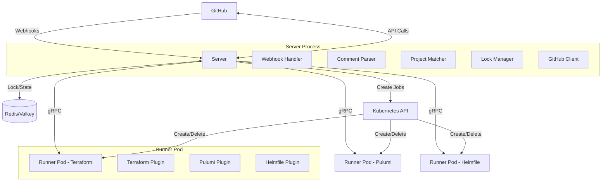

# Design Document: Multi-IaC Automation Platform

## Overview

The multi-IaC automation platform (turnip) is a GitHub-integrated system that automates infrastructure-as-code operations across Terraform, Pulumi, and Helmfile. The platform receives GitHub webhook events, evaluates which projects need execution based on file changes, and orchestrates IaC operations through ephemeral Kubernetes runner pods.

**Implementation Language**: Go is used for all components (Server and Runner) due to its excellent concurrency support, strong typing, extensive ecosystem for Kubernetes and gRPC, and performance characteristics suitable for infrastructure automation.

**Version Control Platform**: The initial implementation targets GitHub exclusively, using GitHub Apps for authentication and GitHub's webhook/API ecosystem. The design uses a GitHubClient interface to abstract VCS operations, allowing future extension to other platforms (GitLab, Bitbucket) by implementing alternative client interfaces.

### Core Design Principles

1. **Architectural Simplicity**: Single unified Plugin interface eliminates the confusion of overlapping abstractions (Plugin/Executor/Adapter/Workflow)
2. **Tool-Native Operations**: Plugins expose their tool's native operations (terraform: plan/apply, pulumi: preview/up, helmfile: diff/apply/sync) rather than forcing translation to standardized names
3. **Safety Through Locking**: Redis-based locking prevents concurrent operations on the same project, with plan results stored in locks for apply operations
4. **Ephemeral Execution**: Each operation runs in a fresh Kubernetes pod with clean state
5. **Developer Experience**: Automatic plans on PR events, comment-triggered operations, consolidated multi-project output

### Key Architectural Decisions

**Server/Runner Split**: The Server handles webhook processing, GitHub API interactions, and orchestration. Runners are ephemeral pods that execute IaC operations in isolated environments. This separation ensures the Server remains stateless and lightweight while Runners can be resource-intensive and tool-specific.

**gRPC Communication**: Server and Runner communicate via gRPC for type-safe, efficient operation execution with streaming log support. This enables real-time feedback and structured error handling.

**Redis Lock with Plan State**: Locks are acquired immediately when a plan operation starts, preventing concurrent modifications. The lock persists throughout the PR lifecycle, storing the plan result. When applying, the system uses exactly what was planned from the lock. The lock is only released when the PR is merged, closed, or manually unlocked. This prevents drift between plan and apply and ensures no conflicting changes can be made while a PR is in progress.

**Unified Plugin Interface**: Instead of multiple abstraction layers, a single Plugin interface handles all IaC tools. Each plugin exposes its tool's native operations (e.g., Helmfile provides diff/apply/sync, Terraform provides plan/apply, Pulumi provides preview/up). The platform doesn't force translation to standardized operation names.

**Project-Based Configuration**: The turnip.yaml file defines projects with directory, tool type, and whenModified rules. This enables selective triggering—only running operations for projects affected by PR changes.

**High Availability Design**: The Server is completely stateless, storing no operation state locally. All state (locks, plan data) lives in Redis/Valkey, enabling multiple Server instances to run concurrently without coordination. Any Server instance can process any webhook, and instance failures don't affect ongoing operations since Runners communicate directly with Redis for state.

**Tool Binaries via Per-Tool initContainers**: The Runner's own container image never bundles Terraform/Pulumi/Helmfile binaries. Instead, each Runner Job gets one initContainer per tool, using that tool vendor's own official, per-version-tagged image (e.g. `hashicorp/terraform:1.9.5`) to copy the CLI binary into a volume shared with the main container. Two alternatives were rejected: baking a single fixed version into the Runner image (no per-project version pinning), and bundling a version manager with several pre-installed versions the way Atlantis does (this makes turnip's own release/rebuild cadence the bottleneck for adopting a tool version the moment it ships upstream — the exact complaint users have about Atlantis lagging behind new Terraform/Pulumi releases). Delegating to vendor-published images means a new tool release is usable by turnip with zero turnip-side rebuild. See "Tool Binary Provisioning" below.

## Architecture

### System Components



### Component Responsibilities

**Server**:
- Receive and validate GitHub webhook events
- Parse turnip.yaml configuration from repositories
- Match modified files against project whenModified rules
- Acquire/release Redis locks for project operations
- Create Kubernetes Job resources for runner pods
- Manage GitHub check runs and PR comments
- Consolidate multi-project operation results
- Handle GitHub App authentication and authorization

**Runner**:
- Connect to Server via gRPC on startup
- Clone repository at specified commit SHA
- Load appropriate Plugin based on project tool type
- Execute IaC operations (Plan/Apply/Destroy) using the tool binary pre-staged onto its `PATH` by an initContainer (see "Tool Binary Provisioning" below) — the Runner's own image never bundles tool binaries
- Stream operation logs back to Server
- Return structured operation results

**Plugin** (Terraform/Pulumi/Helmfile):
- Implement unified Plugin interface
- Translate standardized operations to tool-specific commands
- Execute tool CLI commands in project directory
- Parse tool output to extract change summaries
- Return standardized result structure

**Lock Manager**:
- Acquire Redis locks using SET NX EX for atomicity
- Store plan results in lock data for apply operations
- Release locks on operation completion
- Handle lock timeout and cleanup

**GitHub Client**:
- Generate installation access tokens from GitHub App credentials
- Create and update check runs
- Post and update PR comments
- Fetch repository files and modified file lists
- Verify comment author permissions

### Tool Binary Provisioning

Each Runner Job gets one initContainer per IaC_Tool, using that tool
vendor's own official, per-version-tagged image — never a turnip-maintained
image — to copy the CLI binary onto a volume (`emptyDir`, mounted at
`/tools`) shared with the Runner's main container, which prepends `/tools`
to its `PATH`. This is what Requirement 14.2a describes.

Vendor images and binary paths (verified by pulling and inspecting each
real image; all three are shell-based, so a plain
`initContainer.command: ["sh", "-c", "cp <src> /tools/<tool>"]` works with
no extra extraction tooling):

| Tool | Vendor image | Base | Binary path |
|---|---|---|---|
| Terraform | `hashicorp/terraform:<version>` | Alpine | `/bin/terraform` |
| Pulumi | `pulumi/pulumi-base:<version>` (CLI-only variant, not the full `pulumi/pulumi` image with all language SDKs) | Debian | `/pulumi/bin/pulumi` |
| Helmfile | `ghcr.io/helmfile/helmfile:v<version>` | Alpine | `/usr/local/bin/helmfile` |

Re-verify these paths against whatever version is actually pinned at
implementation time — a vendor could restructure their image layout between
when this was checked and then.

**Version resolution** (Requirement 18.7-18.10): the Server reads
`config.version` from the matched Project. If present, it's validated
against a known-good list for that tool before the Job is created; if
invalid, the Server posts an error comment and creates no Job. If absent,
the Server uses a documented default version per tool (a value the Server
can be updated with independently of a full turnip release — not the
vendor's floating `:latest` tag, to keep operations reproducible).

**Images are pinned by tag, not digest**, for now. Vendor tags are
effectively immutable in practice for these three vendors; digest-pinning
can be added later purely as an internal resolution detail (version string
→ digest lookup) without changing the `turnip.yaml` schema.

**No custom caching infrastructure is needed**: kubelet's normal node-local
image-layer cache means a repeat pull of an already-used tool+version on a
given node is free after the first pull — this is the same caching benefit
Atlantis's version-manager approach would provide, without turnip having to
build or maintain any of it.

### Data Flow

**Automatic Plan Flow (PR Open/Sync)**:
1. GitHub sends webhook to Server
2. Server fetches turnip.yaml from repository
3. Server retrieves modified files from GitHub API
4. Server matches projects using whenModified rules
5. For each matched project:
   - Server attempts to acquire Redis lock (fails if lock already held by another PR)
   - If lock acquired, Server creates GitHub check run (in_progress)
   - Server creates Kubernetes Job for Runner
   - Runner clones repository and executes plan operation
   - Runner streams logs to Server via gRPC
   - Server stores plan result in Redis lock (lock remains held)
   - Server updates GitHub check run (success/failure)
6. Server posts consolidated comment with all project results
7. Locks remain held until PR is merged, closed, or manually unlocked

**Comment-Triggered Apply Flow**:
1. GitHub sends issue_comment webhook to Server
2. Server parses comment for trigger pattern (/turnip apply, /terraform apply)
3. Server verifies comment author is repository collaborator
4. Server identifies target projects (all or specific named project)
5. For each target project:
   - Server verifies lock exists and is held by this PR
   - Server retrieves plan data from the lock
   - Server creates GitHub check run (in_progress)
   - Server creates Kubernetes Job for Runner
   - Runner clones repository and executes apply using plan from lock
   - Runner streams logs to Server via gRPC
   - Server releases Redis lock on successful apply
   - Server updates GitHub check run (success/failure)
6. Server posts consolidated comment with apply results

**Manual Unlock Flow**:
1. User comments "/turnip unlock" or clicks unlock link in plan comment
2. Server verifies user is authorized to unlock
3. Server releases Redis lock for the project
4. Server posts comment confirming unlock
5. Plan must be re-run before apply can be executed

### Technology Stack

- **Language**: Go 1.26+ (Server and Runner)
  - Chosen for: Strong concurrency primitives, excellent Kubernetes/gRPC ecosystem, static typing, fast compilation, single binary deployment
- **Communication**: gRPC with Protocol Buffers
  - Chosen for: Type-safe RPC, efficient binary protocol, streaming support, code generation
- **Locking**: Redis/Valkey with SET NX
  - Chosen for: Atomic operations, high availability, persistence, simple data model
- **Orchestration**: Kubernetes Jobs API
  - Chosen for: Ephemeral pod management, resource isolation, automatic cleanup, scalability
- **GitHub Integration**: GitHub App with installation tokens
  - Chosen for: Fine-grained permissions, per-repository access, automatic token refresh
- **Configuration**: YAML (turnip.yaml)
  - Chosen for: Human-readable, widely adopted in IaC ecosystem, good Go library support
- **IaC Tools**: Terraform CLI, Pulumi CLI, Helmfile CLI
  - Executed as subprocesses within Runner pods

**Future Extensibility**: While GitHub is the initial target, the GitHubClient interface abstracts VCS operations (webhooks, comments, status checks, file fetching). Future implementations could add GitLabClient or BitbucketClient interfaces to support additional platforms without changing core orchestration logic.

### High Availability Architecture

**Stateless Server Design**: The Server maintains zero local state. All operation state, locks, and plan data are stored in Redis/Valkey. This enables horizontal scaling without coordination:

- **No Leader Election**: Multiple Server instances run independently without requiring leader election or consensus protocols
- **Shared State via Redis**: All Servers read/write to the same Redis instance, using atomic operations to prevent conflicts
- **Webhook Distribution**: Any Server instance can process any webhook event - load balancers distribute webhooks across instances
- **Graceful Failures**: If a Server instance crashes, other instances continue processing webhooks. Ongoing operations (Runners) are unaffected since they communicate with Redis directly

**Lock Coordination**: Redis atomic operations (SET NX EX) ensure only one operation can acquire a lock, even with multiple Server instances attempting simultaneously. Lock TTLs prevent indefinite locks if a Server crashes mid-operation.

**Runner Independence**: Runners are ephemeral and stateless. They receive all necessary context via environment variables and gRPC. If the Server that created a Runner crashes, the Runner completes its operation and reports results to Redis, where any Server instance can retrieve them.

**Deployment Strategy**: Servers can be deployed as a Kubernetes Deployment with multiple replicas behind a Service. Rolling updates cause zero downtime since each Server instance is independent.

## Components and Interfaces

### Plugin Interface

The unified Plugin interface allows each tool to expose its native operations without forced translation:

```go
// Plugin defines the unified interface for all IaC tools
type Plugin interface {
    // GetOperations returns the list of operations this plugin supports
    // e.g., Terraform: ["plan", "apply"], Helmfile: ["diff", "apply", "sync"]
    GetOperations() []string
    
    // Execute runs the specified operation for this tool
    // The operation name must be one returned by GetOperations()
    Execute(ctx context.Context, operation string, opts ExecuteOptions) (*ExecuteResult, error)
    
    // Name returns the tool name (terraform, pulumi, helmfile)
    Name() string
    
    // GetPlanOperation returns the operation name used for planning
    // e.g., "plan" for Terraform, "preview" for Pulumi, "diff" for Helmfile
    GetPlanOperation() string
    
    // GetApplyOperation returns the operation name used for applying
    // e.g., "apply" for Terraform/Helmfile, "up" for Pulumi
    GetApplyOperation() string
}

type ExecuteOptions struct {
    WorkingDir string
    Config     map[string]string // Tool-specific config (workspace, stack, environment)
    ExtraArgs  []string          // Additional CLI arguments
    PlanData   []byte            // Plan data from lock (for apply operations)
}

type ExecuteResult struct {
    Output        string
    ChangeSummary ChangeSummary
    PlanData      []byte // Serialized plan for locking (for plan operations)
    ExitCode      int
    Error         error
}

type ChangeSummary struct {
    Add     int
    Change  int
    Destroy int
}
```

### gRPC Service Definition

```protobuf
syntax = "proto3";

package turnip.v1;

service OperationService {
    // ExecuteOperation runs an IaC operation and streams logs
    rpc ExecuteOperation(OperationRequest) returns (stream OperationResponse);
}

message OperationRequest {
    string operation_id = 1;
    string project_name = 2;
    string project_dir = 3;
    string tool = 4; // terraform, pulumi, helmfile
    string operation = 5; // tool-native operation name (plan, apply, diff, sync, preview, up, etc.)
    string repo_url = 6;
    string commit_sha = 7;
    string github_token = 8;
    map<string, string> tool_config = 9;
    repeated string extra_args = 10;
    bytes plan_data = 11; // For apply operations
}

message OperationResponse {
    oneof message {
        LogLine log = 1;
        OperationResult result = 2;
    }
}

message LogLine {
    string timestamp = 1;
    string level = 2; // info, warn, error
    string message = 3;
}

message OperationResult {
    bool success = 1;
    string output = 2;
    int32 exit_code = 3;
    string error_message = 4;
    ChangeSummary changes = 5;
    bytes plan_data = 6;
}

message ChangeSummary {
    int32 add = 1;
    int32 change = 2;
    int32 destroy = 3;
}
```

### Configuration Structure (turnip.yaml)

```yaml
schemaVersion: v1alpha1
projects:
  - name: terraform-vpc
    directory: infrastructure/vpc
    tool: terraform
    whenModified:
      - "infrastructure/vpc/**/*.tf"
      - "infrastructure/vpc/**/*.tfvars"
    config:
      workspace: production
      version: "1.9.5"
      
  - name: pulumi-k8s
    directory: infrastructure/kubernetes
    tool: pulumi
    whenModified:
      - "infrastructure/kubernetes/**/*.ts"
      - "infrastructure/kubernetes/Pulumi.yaml"
    config:
      stack: prod
      
  - name: helmfile-apps
    directory: deployments/apps
    tool: helmfile
    whenModified:
      - "deployments/apps/**/*.yaml"
      - "deployments/apps/helmfile.yaml"
    config:
      environment: production
```

### Lock Manager Interface

```go
type LockManager interface {
    // AcquireLock attempts to acquire a lock for a project/PR combination
    // Returns true if lock acquired, false if already locked by another PR
    AcquireLock(ctx context.Context, projectKey string, prNumber int, pullRequestURL string) (bool, error)
    
    // StorePlan records a plan on the lock: its artifact (which may be
    // empty), the arguments it ran with, and its change summary
    // Lock must already be held by this PR
    StorePlan(ctx context.Context, projectKey string, prNumber int, plan PlanRecord) error
    
    // GetPlan retrieves the recorded plan from the lock
    // Returns error if lock not held, held by a different PR, or no plan
    // has been recorded (which is not the same as an empty artifact)
    GetPlan(ctx context.Context, projectKey string, prNumber int) (PlanRecord, error)
    
    // ReleaseLock releases the lock (called on successful apply, PR merge/close, or manual unlock)
    ReleaseLock(ctx context.Context, projectKey string, prNumber int) error
    
    // GetLockStatus checks if a project is locked and by which PR
    GetLockStatus(ctx context.Context, projectKey string) (*LockStatus, error)
    
    // IsLockedByPR checks if a project is locked by a specific PR
    IsLockedByPR(ctx context.Context, projectKey string, prNumber int) (bool, error)
}

type LockStatus struct {
    Locked         bool
    PRNumber       int
    PullRequestURL string
    LockedAt       time.Time
    LockedBy       string // Username who triggered the plan
    HasPlan        bool
    PlanSummary    ChangeSummary
}

// Redis implementation uses:
// - SET {project_key}:lock {lock_data_json} NX for lock acquisition
// - GET {project_key}:lock to check lock status
// - SET {project_key}:lock {updated_lock_data_json} XX to update with plan data
// - DEL {project_key}:lock for release
// - No TTL on locks - they persist until explicitly released
// 
// Lock data JSON structure:
// {
//   "pr_number": 123,
//   "pr_url": "https://github.com/owner/repo/pull/123",
//   "locked_at": "2024-01-01T00:00:00Z",
//   "locked_by": "username",
//   "plan_data": "base64_encoded_plan",
//   "plan_summary": {"add": 5, "change": 2, "destroy": 0}
// }
```

### GitHub Client Interface

```go
type GitHubClient interface {
    // GenerateInstallationToken creates an access token for the repository
    GenerateInstallationToken(ctx context.Context, installationID int64) (string, error)
    
    // GetFile fetches a file from the repository at a specific ref
    GetFile(ctx context.Context, owner, repo, path, ref string) ([]byte, error)
    
    // GetModifiedFiles returns the list of files changed in a PR
    GetModifiedFiles(ctx context.Context, owner, repo string, prNumber int) ([]string, error)
    
    // CreateCheckRun creates a new GitHub check run
    CreateCheckRun(ctx context.Context, owner, repo string, opts CheckRunOptions) (int64, error)
    
    // UpdateCheckRun updates an existing check run
    UpdateCheckRun(ctx context.Context, owner, repo string, checkRunID int64, opts CheckRunOptions) error
    
    // PostComment posts a comment on a PR
    PostComment(ctx context.Context, owner, repo string, prNumber int, body string) (int64, error)
    
    // UpdateComment updates an existing PR comment
    UpdateComment(ctx context.Context, owner, repo string, commentID int64, body string) error
    
    // IsCollaborator checks if a user is a repository collaborator
    IsCollaborator(ctx context.Context, owner, repo, username string) (bool, error)
    
    // GetCollaboratorPermission returns the user's permission level
    GetCollaboratorPermission(ctx context.Context, owner, repo, username string) (string, error)
}

type CheckRunOptions struct {
    Name       string
    HeadSHA    string
    Status     string // queued, in_progress, completed
    Conclusion string // success, failure, neutral, cancelled
    Title      string
    Summary    string
    Text       string
}
```

### Comment Parser

```go
type CommentParser interface {
    // ParseTrigger extracts operation trigger from comment body
    // Returns operation type, target projects, and extra args
    ParseTrigger(body string) (*TriggerCommand, error)
}

type TriggerCommand struct {
    Tool      string   // turnip, terraform, pulumi, helmfile (or empty for all)
    Operation string   // tool-native operation (plan, apply, diff, sync, preview, up, etc.)
    Projects  []string // Specific project names, or empty for all
    ExtraArgs []string // Arguments after -- delimiter
}

// Examples:
// "/turnip plan" -> {Tool: "turnip", Operation: "plan", Projects: [], ExtraArgs: []}
// "/terraform apply vpc-project" -> {Tool: "terraform", Operation: "apply", Projects: ["vpc-project"], ExtraArgs: []}
// "/helmfile sync" -> {Tool: "helmfile", Operation: "sync", Projects: [], ExtraArgs: []}
// "/pulumi preview" -> {Tool: "pulumi", Operation: "preview", Projects: [], ExtraArgs: []}
// "/turnip plan -- -destroy" -> {Tool: "turnip", Operation: "plan", Projects: [], ExtraArgs: ["-destroy"]}
```

### Project Matcher

```go
type ProjectMatcher interface {
    // MatchProjects returns projects that should be triggered based on modified files
    MatchProjects(projects []Project, modifiedFiles []string) []Project
}

type Project struct {
    Name         string
    Directory    string
    Tool         string
    WhenModified []string          // Glob patterns
    Config       map[string]string // Tool-specific config
}

// Implementation uses glob matching library (e.g., doublestar)
// to evaluate each project's whenModified patterns against modified files
```

## Data Models

### Webhook Event

```go
type WebhookEvent struct {
    Type         string // pull_request, issue_comment
    Action       string // opened, synchronize, created
    Repository   Repository
    PullRequest  *PullRequest
    Comment      *Comment
    Installation Installation
}

type Repository struct {
    Owner string
    Name  string
    URL   string
}

type PullRequest struct {
    Number  int
    HeadSHA string
    BaseRef string
    HeadRef string
}

type Comment struct {
    ID     int64
    Body   string
    Author string
}

type Installation struct {
    ID int64
}
```

### Operation Context

```go
type OperationContext struct {
    ID            string // Unique operation ID
    Operation     string // tool-native operation name
    Project       Project
    Repository    Repository
    PullRequest   PullRequest
    CommitSHA     string
    GitHubToken   string
    Triggered     time.Time
    TriggeredBy   string // "auto" or username
    ExtraArgs     []string
}
```

### Operation Result

```go
type OperationResult struct {
    OperationID   string
    ProjectName   string
    Success       bool
    Output        string
    ExitCode      int
    Error         string
    ChangeSummary ChangeSummary
    Duration      time.Duration
    StartedAt     time.Time
    CompletedAt   time.Time
}
```

### Consolidated Result

```go
type ConsolidatedResult struct {
    Operation      string // tool-native operation name
    Results        []OperationResult
    OverallSuccess bool
    TotalDuration  time.Duration
}

// Used to generate the consolidated PR comment with summary table
// and collapsible details sections for each project
```

### Lock Data

```go
type LockData struct {
    ProjectKey     string
    PRNumber       int
    PullRequestURL string
    LockedAt       time.Time
    LockedBy       string // Username who triggered the plan
    PlanData       []byte // Serialized plan output
    PlanSummary    ChangeSummary
}

// Stored in Redis as JSON without TTL
// Lock persists until PR is merged, closed, or manually unlocked
// Key format: {repo_owner}:{repo_name}:{project_name}:lock
```


## Correctness Properties

*A property is a characteristic or behavior that should hold true across all valid executions of a system—essentially, a formal statement about what the system should do. Properties serve as the bridge between human-readable specifications and machine-verifiable correctness guarantees.*

### Property 1: Configuration Round-Trip

*For any* valid turnip.yaml configuration, serializing it to YAML and then parsing it back should produce an equivalent configuration structure with all projects, directories, tools, and whenModified rules preserved.

**Validates: Requirements 1.2, 1.3**

### Property 2: Tool Validation Rejects Invalid Tools

*For any* project configuration with a tool field, if the tool is not one of "terraform", "pulumi", or "helmfile", then parsing should fail with a validation error.

**Validates: Requirements 1.5**

### Property 3: WhenModified Pattern Matching

*For any* project with whenModified glob patterns and any list of modified files, if at least one file matches at least one pattern, then the project should be marked for execution.

**Validates: Requirements 2.2, 2.3**

### Property 4: Plugin Result Structure Completeness

*For any* plugin operation (Plan, Apply, Destroy), the returned result structure should contain all required fields: output (string), exit code (integer), and error information.

**Validates: Requirements 3.4**

### Property 5: PR Event Triggers Plan Operations

*For any* PR opened or synchronized event with matching projects, the server should trigger plan operations for all matched projects.

**Validates: Requirements 4.1, 4.2**

### Property 6: Runner Creation Per Triggered Project

*For any* set of triggered projects, the server should create exactly one runner pod for each project.

**Validates: Requirements 4.3**

### Property 7: Comment Trigger Pattern Recognition

*For any* comment body containing a valid trigger pattern (/{tool} {operation}), the comment parser should correctly extract the tool name, operation type, and target projects.

**Validates: Requirements 5.1, 5.2, 6.2**

### Property 8: Selective Project Triggering from Comments

*For any* comment specifying a project name (e.g., "/turnip apply project-name"), only the named project should be triggered, not all projects.

**Validates: Requirements 5.4**

### Property 9: Lock Acquisition Prevents Concurrent Operations

*For any* project, if a lock is already held, then attempting to start another operation on the same project should be rejected with an "operation in progress" error.

**Validates: Requirements 7.2**

### Property 10: Lock Release After Operation Completion

*For any* operation (successful or failed), when the operation completes, the lock for that project should be released.

**Validates: Requirements 7.3**

### Property 11: Plan-Apply Lock Consistency

*For any* project, if a plan operation stores plan data in the lock, then a subsequent apply operation should use exactly that plan data from the lock.

**Validates: Requirements 7.5**

### Property 12: Check Run Creation Per Project

*For any* set of projects with plan operations, the server should create exactly one GitHub check run per project.

**Validates: Requirements 9.5**

### Property 13: Check Run Status Reflects Operation Status

*For any* completed operation, the associated GitHub check run should have status "completed" with conclusion "success" if the operation succeeded, or conclusion "failure" if it failed.

**Validates: Requirements 9.2, 9.3**

### Property 14: Check Run Contains Change Summary

*For any* plan operation result with a change summary (add/change/destroy counts), the GitHub check run output should include those counts.

**Validates: Requirements 9.4**

### Property 15: Consolidated Comment Per PR

*For any* set of completed operations on a PR, the server should post exactly one consolidated comment containing results from all projects, not one comment per project.

**Validates: Requirements 10.1**

### Property 16: Comment Update Not Duplication

*For any* PR with an existing operation result comment, when subsequent operations complete on the same PR, the existing comment should be updated rather than creating a new comment.

**Validates: Requirements 10.4**

### Property 17: Comment Contains All Project Results

*For any* consolidated comment, it should contain a summary entry for each project that was executed, with project name, operation type, and status.

**Validates: Requirements 10.2, 17.3**

### Property 18: Terraform Plugin Command Execution

*For any* Terraform plugin Plan operation, the plugin should execute "terraform init" followed by "terraform plan", and for Apply operations, should execute "terraform init" followed by "terraform apply" with the plan file from the lock.

**Validates: Requirements 11.2, 11.3**

### Property 19: Terraform Change Count Parsing

*For any* terraform plan output, the Terraform plugin should extract and return the resource change counts (add, change, destroy) in the result structure.

**Validates: Requirements 11.4**

### Property 20: Pulumi Plugin Command Execution

*For any* Pulumi plugin operation, Plan should execute "pulumi preview", Apply should execute "pulumi up --yes", and Destroy should execute "pulumi destroy --yes".

**Validates: Requirements 12.2, 12.3, 12.4**

### Property 21: Pulumi Change Count Parsing

*For any* pulumi preview output, the Pulumi plugin should extract and return the resource change counts (create, update, delete) in the result structure.

**Validates: Requirements 12.5**

### Property 22: Helmfile Plugin Command Execution

*For any* Helmfile plugin operation, Diff should execute "helmfile diff", Sync should execute "helmfile sync", and Apply should execute "helmfile apply".

**Validates: Requirements 13.2, 13.3, 13.4, 13.5**

### Property 23: Runner Job Environment Variables

*For any* created runner job, the job specification should include environment variables for repository URL, commit SHA, project directory, and operation type.

**Validates: Requirements 14.2**

### Property 23a: Runner Job Tool Provisioning

*For any* created runner job requesting tool version V for IaC_Tool T, the job specification should include an initContainer using T's vendor-published image tagged V, and the main container should mount the volume that initContainer populates.

**Validates: Requirements 14.2a, 18.7, 18.8**

### Property 24: Runner Clones Correct Commit

*For any* runner execution with a specified commit SHA, the runner should clone the repository and checkout exactly that commit SHA.

**Validates: Requirements 14.3**

### Property 25: Job Cleanup After Completion

*For any* completed operation, the associated Kubernetes job resource should be deleted by the server.

**Validates: Requirements 14.4**

### Property 26: Installation Token Generation Per Webhook

*For any* webhook event, the server should generate an installation access token for the repository before processing the event.

**Validates: Requirements 15.2**

### Property 27: Token Propagation to Runner

*For any* runner job created by the server, the installation access token should be passed to the runner for repository cloning.

**Validates: Requirements 15.4**

### Property 28: Comment Author Authorization Check

*For any* trigger comment, the server should verify the comment author is a repository collaborator before executing the triggered operation.

**Validates: Requirements 16.1**

### Property 29: Write Permission for Destructive Operations

*For any* apply or destroy operation triggered by comment, the comment author should have write permission level or higher, otherwise the operation should be rejected.

**Validates: Requirements 16.4**

### Property 30: Parallel Project Execution

*For any* set of multiple triggered projects, the server should execute operations for all projects in parallel, not sequentially.

**Validates: Requirements 17.1**

### Property 31: Synchronization Before Comment Posting

*For any* set of parallel project operations, the server should wait for all operations to complete before posting the consolidated comment.

**Validates: Requirements 17.2**

### Property 32: Failure Propagation in Consolidated Results

*For any* set of project operations where at least one fails, the overall GitHub check run should report failure status.

**Validates: Requirements 17.5**

### Property 33: Tool-Specific Config Propagation

*For any* project with tool-specific config (workspace for Terraform, stack for Pulumi, environment for Helmfile), the server should pass that config to the plugin when executing operations.

**Validates: Requirements 18.2, 18.3, 18.4, 18.5**

### Property 34: Stateless Server Operation

*For any* webhook event processed by a Server instance, the Server should not store any operation state locally that would be required by another Server instance to process subsequent events for the same project.

**Validates: Requirements 19.1, 19.7**

### Property 35: Multi-Instance Webhook Processing

*For any* webhook event, if multiple Server instances are running, any instance should be capable of processing the event with identical results.

**Validates: Requirements 19.2**

### Property 36: Lock Acquisition Across Instances

*For any* project lock acquisition attempt from multiple Server instances simultaneously, exactly one instance should successfully acquire the lock and all others should receive a lock-already-held response.

**Validates: Requirements 19.6**

### Property 37: Server Failure Resilience

*For any* ongoing operation, if the Server instance that initiated the operation fails, the operation should complete successfully and results should be accessible to any other Server instance.

**Validates: Requirements 19.5**

## Error Handling

### Configuration Errors

**Missing turnip.yaml**: When turnip.yaml is not found in the repository root, the server posts an error comment to the PR explaining that configuration is missing and linking to documentation.

**Invalid YAML Syntax**: When turnip.yaml contains invalid YAML syntax, the server posts an error comment with the parse error details and line number.

**Invalid Project Configuration**: When a project specifies an unsupported tool or missing required fields, the server posts an error comment identifying the problematic project and the validation error.

### Lock Contention

**Lock Held by Another PR**: When a plan operation is triggered for a project that already has a lock held by a different PR, the server immediately rejects the operation and posts a comment with:
- Message indicating the project is locked
- Link to the PR that holds the lock
- Instructions on how to proceed (wait for other PR or request unlock)

**Lock Verification for Apply**: When an apply operation is triggered, the server verifies:
1. A lock exists for the project
2. The lock is held by the current PR (not a different PR)
3. The lock contains plan data

If any verification fails, the server posts an error comment explaining the issue and requiring a new plan operation.

**Manual Unlock**: Users can manually unlock a project by commenting `/turnip unlock` on the PR. The server:
1. Verifies the user is authorized (PR author or repository admin)
2. Releases the lock
3. Posts a confirmation comment
4. Requires a new plan before apply can be executed

**Stale Locks**: Unlike Atlantis, locks do not have TTLs and persist indefinitely. However, the server provides:
- A web UI to view all active locks
- Admin API to force-unlock stale locks
- Automatic unlock on PR merge/close events

### GitHub API Errors

**Token Generation Failure**: When GitHub App token generation fails, the server logs the error with installation ID and returns HTTP 500 to GitHub, triggering webhook retry.

**API Rate Limiting**: When GitHub API rate limits are hit, the server implements exponential backoff with jitter for retries. If rate limits persist, operations are queued and retried when limits reset.

**Check Run Creation Failure**: When check run creation fails, the server logs the error but continues with operation execution, falling back to comment-only status reporting.

**Comment Posting Failure**: When comment posting fails, the server logs the error and retries up to 3 times with exponential backoff. If all retries fail, the error is logged but operation execution continues.

### Runner Execution Errors

**Job Creation Failure**: When Kubernetes job creation fails, the server logs the error, posts a failure comment to the PR, and updates the check run to failed status.

**Job Timeout**: If a runner job doesn't start within 5 minutes, the server reports timeout failure via comment and check run, then deletes the job resource.

**gRPC Connection Failure**: If the runner cannot connect to the server via gRPC within 2 minutes, the runner exits with error. The server detects the job failure and reports it via comment and check run.

**Repository Clone Failure**: When the runner fails to clone the repository (invalid token, network error, missing commit), the runner returns an error result via gRPC. The server posts the error to the PR and marks the check run as failed.

### Plugin Execution Errors

**Tool Not Installed**: When a plugin attempts to execute a tool that's not installed in the runner image, the plugin returns an error with exit code and stderr. The server includes this in the failure comment.

**Tool Execution Failure**: When a tool command exits with non-zero status (e.g., terraform plan fails), the plugin captures stdout/stderr and returns it in the result. The server posts the full output in the PR comment and marks the check run as failed.

**Output Parsing Failure**: When a plugin cannot parse tool output to extract change counts, the plugin logs a warning and returns zero counts. The operation continues, but the check run summary indicates parsing failed.

### Authorization Errors

**Non-Collaborator Trigger**: When a non-collaborator attempts to trigger an operation via comment, the server posts a reply comment indicating insufficient permissions and logs the attempt.

**Insufficient Permission Level**: When a user without write permission attempts to trigger apply or destroy, the server posts a reply comment explaining that write permission is required and logs the attempt.

### Resource Cleanup

**Orphaned Jobs**: The server runs a periodic cleanup task (every 10 minutes) that identifies and deletes Kubernetes jobs older than 1 hour that are in completed or failed state.

**Orphaned Locks**: The server runs a periodic cleanup task (every 5 minutes) that identifies locks older than their TTL and removes them from Redis.

## Testing Strategy

### Dual Testing Approach

The platform requires both unit testing and property-based testing for comprehensive coverage:

- **Unit tests** verify specific examples, edge cases, and error conditions
- **Property tests** verify universal properties across all inputs through randomization
- Both approaches are complementary and necessary

### Property-Based Testing

**Framework**: Use [pgregory.net/rapid](https://pkg.go.dev/pgregory.net/rapid)
for Go property-based testing. (Originally [gopter](https://github.com/leanovate/gopter);
replaced 2026-08 after it went stale — no release since April 2024. `internal/config`,
`internal/plugin`, and `internal/lock` were migrated at the same time; see each
slice's `tasks.md` for the amendment entry.)

**Configuration**: Each property test should run a minimum of 100 iterations to ensure adequate randomization coverage (`rapid.Check`'s default `checks` count already satisfies this).

**Tagging**: Each property test must include a comment tag referencing the design document property:
```go
// Feature: multi-iac-automation-platform, Property 1: Configuration Round-Trip
func TestConfigurationRoundTrip(t *testing.T) { ... }
```

**Property Test Coverage**:
- Configuration parsing and serialization (Properties 1, 2)
- Pattern matching and project selection (Property 3)
- Plugin result structures (Property 4)
- Lock acquisition and release (Properties 9, 10, 11)
- Comment parsing (Properties 7, 8)
- GitHub integration (Properties 12-17)
- Plugin command execution (Properties 18-22)
- Authorization checks (Properties 28, 29)
- Tool-specific config (Property 33)

### Unit Testing

**Unit Test Focus**:
- Specific examples demonstrating correct behavior
- Edge cases: empty configurations, missing files, invalid patterns
- Error conditions: lock contention, API failures, timeout scenarios
- Integration points: gRPC communication, Kubernetes API, GitHub API
- Mock-based testing for external dependencies

**Coverage Targets**:
- Server webhook handling: 80% coverage
- Plugin implementations: 90% coverage (critical path)
- Lock manager: 95% coverage (correctness-critical)
- Comment parser: 90% coverage
- Project matcher: 90% coverage

### Integration Testing

**Test Scenarios**:
1. End-to-end PR workflow: webhook → plan → comment → apply
2. Multi-project parallel execution with lock coordination
3. GitHub API integration with real API calls (using test repository)
4. Kubernetes job lifecycle with real cluster (using kind for CI)
5. Redis lock behavior under concurrent load

**Test Environment**:
- Use [kind](https://kind.sigs.k8s.io/) for local Kubernetes cluster
- Use [miniredis](https://github.com/alicebob/miniredis) for Redis testing
- Use GitHub API mocking library for unit tests, real API for integration tests

### Plugin Testing

Each plugin (Terraform, Pulumi, Helmfile) requires:

1. **Command Execution Tests**: Verify correct CLI commands are executed
2. **Output Parsing Tests**: Verify change counts are correctly extracted from tool output
3. **Error Handling Tests**: Verify plugin handles tool failures gracefully
4. **Property Tests**: Verify plugin results always contain required fields

### Performance Testing

**Load Testing**:
- Simulate 100 concurrent webhook events
- Measure lock contention and queue depth
- Verify no deadlocks or race conditions

**Resource Testing**:
- Monitor runner pod resource usage (CPU, memory)
- Verify job cleanup prevents resource leaks
- Test with large repositories (>10k files)

### Continuous Integration

**CI Pipeline**:
1. Run all unit tests on every commit
2. Run property tests with 100 iterations
3. Run integration tests on PR branches
4. Generate coverage reports and enforce minimums
5. Run linting and static analysis (golangci-lint)

**Pre-merge Requirements**:
- All tests passing
- Coverage targets met
- No linting errors
- Successful integration test run
