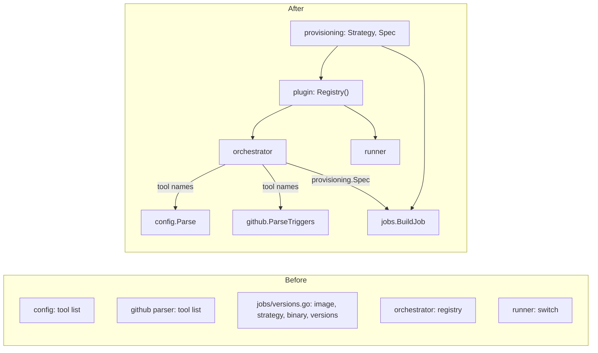

# Design: One Place to Add a Tool (Slice 45)

## Overview

Today every package that needs to know about tools keeps its own copy of
that knowledge. After this slice, one package holds it and the others are
handed what they need:



`internal/config` and `internal/github` stay free of any Plugin: they
receive names as data. `internal/jobs` stays free of any tool: it receives
a resolved `provisioning.Spec`.

## The registry

One file, `internal/plugin/registry.go`, lists every Plugin turnip ships:

```go
// Registry returns every Plugin turnip ships, keyed by Name(). Adding a
// tool means writing its Plugin and adding it here, nowhere else.
func Registry() map[string]Plugin
```

It returns a fresh map on each call, so a caller that holds one (the
Orchestrator) can be given a different map in tests — the
`PluginRegistry` the orchestrator already takes as a parameter keeps
working, and its tests keep injecting fakes. `orchestrator.NewPluginRegistry`
and the Runner's `selectPlugin` both become lookups in `Registry()`.

### Decision 1: An explicit list, not self-registration

*Alternative considered*: each Plugin registers itself from an `init()`
function, so adding a tool touches only the Plugin's own file.

*Rejected because*: which tools exist would then depend on which files
the build happens to link, with no one place to read the answer, and the
Server and Runner binaries could still end up with different sets. One
explicit list is the single line a new tool adds, and reading it answers
"what does this turnip support" directly.

## The provisioning spec

A new leaf package, `internal/provisioning`, holds the vocabulary both
sides share and nothing else:

```go
type Strategy int

const (
	CopyOut    Strategy = iota // copy the binary out of the tool's image into turnip's Runner image
	RunInImage                 // run turnip's runner binary inside the tool's image
)

// Spec is how one tool reaches a Runner Job.
type Spec struct {
	Strategy   Strategy
	Image      string // repository, fully qualified; the tag is the version from uses:
	BinaryPath string // CopyOut only: where the binary lives in Image
}
```

The Plugin interface gains one method:

```go
// Provisioning says how this tool reaches a Runner Job.
Provisioning() provisioning.Spec
```

The Helmfile Plugin returns `{RunInImage, "ghcr.io/helmfile/helmfile", ""}`.

**`Image` is a repository, not a template.** Today's `"…/helmfile:v%s"`
exists to add the `v`; with the version used verbatim (Requirement 4.4),
the image reference is simply `Image + ":" + version`, and a template has
nothing left to do.

**The strategies stay implemented in `internal/jobs`**, which already
builds them: `BuildJob` switches on `Spec.Strategy` exactly as it switches
on `toolImage.strategy` today. What changes is where the Spec comes from —
`OperationParams` gains a `Provisioning provisioning.Spec` field, filled by
the orchestrator from `p.Provisioning()` — and `internal/jobs/versions.go`
is deleted: its table, `resolveVersion`, and both of its error types. A
tool with no Plugin can no longer reach `BuildJob` (Requirement 3.3), and
the version shape is checked once, at parse time.

### Decision 2: A separate `provisioning` package

*Alternative considered*: declare `Strategy` in `internal/plugin`, which
`internal/jobs` would then import.

*Rejected because*: `internal/jobs` would depend on the Plugin package
only to read two constants and a struct, and the Plugin package would own
a vocabulary whose meaning (init containers, volumes) lives entirely in
`internal/jobs`. A leaf package both import keeps each dependency pointing
at what it actually uses, and a Plugin never imports anything that knows
about Kubernetes (Requirement 2.4).

## The tool vocabulary as input

```go
func Parse(data []byte, tools []string) (*Config, error)
func ParseTriggers(body string, tools []string) ([]*TriggerCommand, error)
```

The orchestrator passes the registered names (sorted, so error messages
list them stably) at the two call sites that exist today:
`fetchConfig` (`configfetch.go:55`) and `HandleIssueComment`
(`comment.go:41`). `config.ToolTerraform`, `ToolPulumi`, `ToolHelmfile` and
`isSupportedTool` are removed; so is `parser.go`'s `knownTools`, which
becomes `"turnip"` plus the names passed in.

A tool name nobody registered now fails validation with the registered
names listed (Requirement 3.3). That makes the orchestrator's
unsupported-tool path unreachable, and it is deleted (Requirement 3.5):

| Removed | Where |
|---|---|
| `planTargetsFor`'s second return, the skipped Projects | `target.go:54` |
| `recordUnsupported`, its notice, and the standalone-notice branch of `runTargetsAndPost` | `pullrequest.go:140–180` |
| `OutcomeUnsupported` | `prstatus.go:35` |
| the verdict's unsupported branch and summary line | `verdict.go:52`, `:81`, `:151` |
| `unsupportedTitle` | `titles.go:87` |
| `executeOne`'s "tool is not supported" refusal | `execute.go:111` |
| their tests, including `TestAutomaticPlan_UnsupportedToolFailsTheCheck` | |

`executeOne` still looks its Plugin up; a Target always has one now, since
Targets are built only from a validated `turnip.yaml` or from a comment
whose selection already checks (`target.go:142`), so a miss there is a
programming error, returned as one rather than refused as a user's.

**Kept** (Requirement 3.6): the lookups that start from an Operation
already dispatched, and tolerate its Plugin having been removed since:
`result.go:75`, `sweep.go:91`, `lockstate.go:16`, `comments.go:49`, and
the refusal closure's `execute.go:93`. Each falls back as it does today.

### Decision 3: Plain parameters, not an options struct

*Alternative considered*: `Parse(data, ParseOptions{Tools: …})`, leaving
room for later inputs.

*Rejected because*: there is one input today, and Slice 44 adds its
Aliases through the same Plugins, so they arrive by the same parameter's
source rather than a second one. A struct can replace the slice when a
genuinely different input appears.

## Versions

| Today | After |
|---|---|
| `uses: helmfile` runs the default version (`versions.go:132`) | validation error: name a version, e.g. `helmfile@v1.7.4` |
| `splitUses` strips a leading `v` for every tool (`parse.go:147`) | the version is kept as written |
| the Helmfile template adds `v` back | the tag is `Image:version`, verbatim |
| `IsWellFormedVersion`: `^[0-9]+\.[0-9]+\.[0-9]+…` | `^v?[0-9]+\.[0-9]+\.[0-9]+…`, still rejecting floating tags |

`IsWellFormedVersion`'s only caller outside `internal/config` is
`resolveVersion` (`versions.go:140`), which is deleted, so it becomes
unexported.

## The schema version

`config.SupportedSchemaVersion` becomes `"v1alpha3"`. The version-first
rejection already exists (`validateSchemaVersion`); nothing about it
changes except the constant and the fixtures and examples that name it.

## Testing

- **Registry**: every registered Plugin's `Provisioning()` has a known
  Strategy, a fully qualified Image, and a BinaryPath exactly when the
  strategy is CopyOut (Requirement 6.3). This is the test that stops a
  Plugin being registered half-declared.
- **Same Job as before, but one value**: `BuildJob` for `helmfile@v1.7.4`
  with the Helmfile Plugin's Spec produces the same Job (images, commands,
  volumes) as today's for `helmfile@1.7.4`, except that
  `TURNIP_TOOL_VERSION` carries `v1.7.4`, as written, where it carried the
  stripped `1.7.4`. That value also appears in the execution transcript's
  version line (Slice 33). Pinned by a comparison test written before the
  change, which names that one difference explicitly (Requirement 6.1).
- **Config**: unknown tool with the names listed; bare `uses:`; `v` kept;
  `v1alpha2` rejected on its own.
- **Parser**: a trigger for an unregistered tool is skipped as someone
  else's command, as an unknown `/word` is today.
- **Runner**: selecting an unregistered tool still fails fast, now through
  the registry.
- **Removed path**: the unsupported-tool tests are deleted with the code;
  their cases are covered by the config test for an unknown tool, and the
  kept lookups keep their existing tests (a result, a timeout and a Lock
  event for a tool no longer registered).

## Migration

None, by design: turnip is pre-1.0. A `v1alpha2` file is rejected with the
schema error, which is the one message the single repository using turnip
needs to update its three lines.
