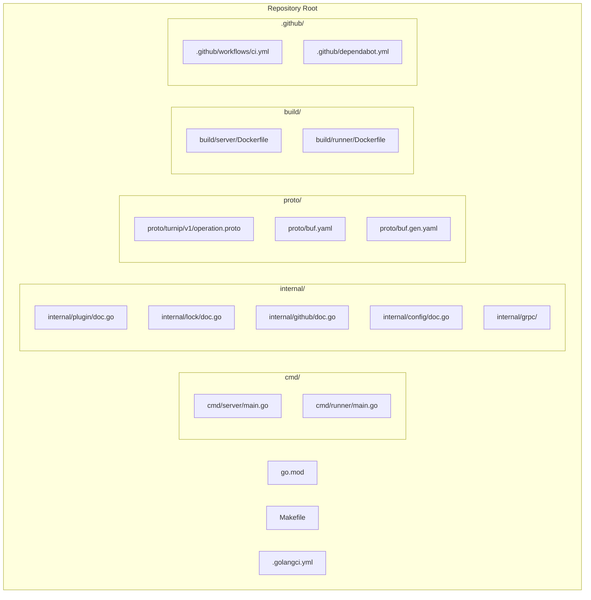

# Design Document: Project Scaffolding (Slice 0)

## Overview

This slice establishes the Go project skeleton for the turnip multi-IaC automation platform. It delivers directory structure, build tooling, containerization, protobuf code generation, CI pipeline, and placeholder entry points — with no business logic.

The goal is to provide a foundation that all subsequent slices (1–8) can build on without needing to make structural decisions. Every file created here is either a placeholder (to be filled in by later slices) or a configuration file that governs the development workflow.

**Key Design Decisions**:
- **buf** over protoc for protobuf tooling (simpler config, built-in linting, reproducible codegen)
- **Multi-stage Docker builds** with distroless/alpine runtime images
- **golangci-lint** with a curated linter set for consistency
- **Single Makefile** as the task runner (no external task tools)
- **GitHub Actions** with a single CI workflow covering build, test, lint, and proto freshness

## Architecture

This slice has no runtime architecture — it produces static project structure. The relationship between components is purely organizational:



### Relationship to Global Architecture

This slice implements the structural foundation described in the global design's "System Components" section. The directory layout maps directly to the component responsibilities:

| Global Component | Directory | Filled by Slice |
|-----------------|-----------|-----------------|
| Server Process | `cmd/server/` | Slice 4, 6 |
| Runner Pod | `cmd/runner/` | Slice 5 |
| Plugin Interface | `internal/plugin/` | Slice 2 |
| Lock Manager | `internal/lock/` | Slice 3 |
| GitHub Client | `internal/github/` | Slice 4 |
| Config Parser | `internal/config/` | Slice 1 |
| gRPC Service | `internal/grpc/` | Slice 5 |
| Protobuf Defs | `proto/` | Slice 0 (this slice) |

## Components and Interfaces

### Entry Points

**cmd/server/main.go** — Minimal placeholder that logs startup and exits:

```go
package main

import (
    "fmt"
    "os"
)

const version = "dev"

func main() {
    fmt.Fprintf(os.Stdout, "turnip-server version=%s\n", version)
}
```

**cmd/runner/main.go** — Minimal placeholder that logs startup and exits:

```go
package main

import (
    "fmt"
    "os"
)

const version = "dev"

func main() {
    fmt.Fprintf(os.Stdout, "runner version=%s\n", version)
}
```

Both binaries exit immediately with code 0. Later slices will add flag parsing, HTTP/gRPC listeners, and actual logic.

### Package Placeholders

Each `internal/` package gets a single `doc.go` file with a package declaration and a doc comment explaining its future purpose. No interfaces or types are defined yet — those belong to their respective slices.

- `internal/plugin/doc.go` — `package plugin` (Slice 2: Plugin interface + implementations)
- `internal/lock/doc.go` — `package lock` (Slice 3: Redis lock manager)
- `internal/github/doc.go` — `package github` (Slice 4: GitHub client + webhook handler)
- `internal/config/doc.go` — `package config` (Slice 1: turnip.yaml parsing)
- `internal/grpc/` — Generated code lives here (Slice 5: gRPC server/client)

### Protobuf Setup

**Tooling Choice: buf**

Rationale for buf over protoc:
1. **Declarative configuration** — `buf.yaml` + `buf.gen.yaml` replace complex protoc invocation scripts
2. **Built-in linting** — catches proto style issues before code review
3. **Reproducible codegen** — pinned plugin versions in `buf.gen.yaml`
4. **No manual plugin installation** — buf manages `protoc-gen-go` and `protoc-gen-go-grpc` via remote plugins
5. **Breaking change detection** — useful as the proto evolves across slices

**Directory layout**:
```
proto/
├── buf.yaml           # Module configuration + lint rules
├── buf.gen.yaml       # Code generation configuration
└── turnip/
    └── v1/
        └── operation.proto   # OperationService definition
```

**buf.yaml**:
```yaml
version: v2
modules:
  - path: .
    name: buf.build/ivanvc/turnip
lint:
  use:
    - STANDARD
breaking:
  use:
    - FILE
```

**buf.gen.yaml**:
```yaml
version: v2
plugins:
  - remote: buf.build/protocolbuffers/go
    out: ../internal/grpc
    opt: paths=source_relative
  - remote: buf.build/grpc/go
    out: ../internal/grpc
    opt: paths=source_relative
```

**operation.proto** — Minimal skeleton matching the global design's gRPC service definition:

```protobuf
syntax = "proto3";

package turnip.v1;

option go_package = "github.com/ivanvc/turnip/internal/grpc/turnip/v1";

service OperationService {
  rpc ExecuteOperation(OperationRequest) returns (stream OperationResponse);
}

message OperationRequest {}

message OperationResponse {}
```

The messages are intentionally empty — Slice 5 will populate them with the full field set from the global design. This slice only needs the proto to compile and generate valid Go stubs.

### Dockerfiles

**build/server/Dockerfile** — Multi-stage, distroless runtime:

```dockerfile
FROM golang:1.26 AS builder
WORKDIR /src
COPY go.mod go.sum ./
RUN go mod download
COPY . .
RUN CGO_ENABLED=0 GOOS=linux go build -ldflags="-s -w" -o /server ./cmd/server

FROM gcr.io/distroless/static-debian12:nonroot
COPY --from=builder /server /server
ENTRYPOINT ["/server"]
```

Design decisions:
- `golang:1.26` builder matches the Go_Module directive (Go 1.26, the latest version)
- `CGO_ENABLED=0` produces a static binary (no libc dependency)
- `-ldflags="-s -w"` strips debug info for smaller image
- `distroless/static` includes CA certificates but no shell (minimal attack surface)
- `nonroot` tag runs as non-root user by default

**build/runner/Dockerfile** — Multi-stage, alpine runtime (needs git):

```dockerfile
FROM golang:1.26 AS builder
WORKDIR /src
COPY go.mod go.sum ./
RUN go mod download
COPY . .
RUN CGO_ENABLED=0 GOOS=linux go build -ldflags="-s -w" -o /runner ./cmd/runner

FROM alpine:3.23
RUN apk add --no-cache git ca-certificates
COPY --from=builder /runner /runner
ENTRYPOINT ["/runner"]
```

Design decisions:
- Alpine instead of distroless because the Runner needs `git` for repository cloning
- Later slices will add IaC tool binaries (terraform, pulumi, helmfile) to this image
- `ca-certificates` for HTTPS git clones and API calls

### Makefile

The Makefile provides a single entry point for all development operations:

```makefile
.PHONY: build test lint fmt proto-gen clean

BIN_DIR := bin
SERVER_BIN := $(BIN_DIR)/server
RUNNER_BIN := $(BIN_DIR)/runner

build: $(SERVER_BIN) $(RUNNER_BIN)

$(SERVER_BIN):
	go build -o $(SERVER_BIN) ./cmd/server

$(RUNNER_BIN):
	go build -o $(RUNNER_BIN) ./cmd/runner

test:
	go test -race ./...

lint:
	golangci-lint run ./...

fmt:
	gofmt -w .

proto-gen:
	cd proto && buf generate

clean:
	rm -rf $(BIN_DIR)
```

Design decisions:
- `bin/` output directory keeps built artifacts out of source tree
- `proto-gen` uses `cd proto && buf generate` since buf.yaml is in the proto/ directory
- Race detection enabled by default in test target
- No `go install` for tools — CI installs them explicitly, developers use `go install` or brew

### Linting Configuration

**.golangci.yml**:

```yaml
run:
  timeout: 5m

linters:
  enable:
    - errcheck
    - govet
    - staticcheck
    - gofmt
    - ineffassign
    - unused
    - misspell
    - gosimple

issues:
  exclude-files:
    - ".*\\.pb\\.go$"
    - ".*_grpc\\.pb\\.go$"
```

Design decisions:
- 5-minute timeout accommodates CI environments with cold caches
- Linter set is practical: catches real bugs (errcheck, govet, staticcheck) without being noisy
- `gofmt` enforces formatting consistency
- Generated protobuf files excluded via regex patterns
- No `golint` (deprecated) — `staticcheck` covers its useful checks

### CI Pipeline

**.github/workflows/ci.yml**:

```yaml
name: CI

on:
  push:
    branches: [main]
  pull_request:
    branches: [main]
    types: [opened, synchronize, reopened]

jobs:
  ci:
    runs-on: ubuntu-latest
    steps:
      - uses: actions/checkout@11bd71901bbe5b1630ceea73d27597364c9af683 # v4.2.2

      - uses: actions/setup-go@d35c59abb061a4a6fb18e82ac0862c26744d6ab5 # v5.5.0
        with:
          go-version-file: go.mod

      - name: Install buf
        uses: bufbuild/buf-setup-action@a47c93e0b1648459dbbba6647e3805c88e28e855 # v1.50.0

      - name: Build
        run: go build ./...

      - name: Test
        run: go test -race ./...

      - name: Lint
        uses: golangci/golangci-lint-action@4afd733a84b1f43292c63897423277bb7f4313a9 # v6.5.0
        with:
          version: latest

      - name: Proto freshness
        run: |
          cd proto && buf generate
          git diff --exit-code
```

Design decisions:
- **Pinned commit SHAs** for all GitHub Actions dependencies with version comments (e.g., `actions/checkout@11bd71901bbe5b1630ceea73d27597364c9af683 # v4.2.2`) — prevents supply-chain attacks from tag mutation. Dependabot's `github-actions` ecosystem will automatically propose SHA bumps when new versions are released.
- `go-version-file: go.mod` ensures CI uses the same Go version as the project (satisfying Requirement 9.8)
- `buf-setup-action` installs buf without manual version pinning
- `golangci-lint-action` handles caching and version management
- Proto freshness check regenerates and diffs — fails if generated code is stale
- Single job (not matrix) since there's only one Go version target
- `types: [opened, synchronize, reopened]` matches the requirements exactly

### Dependabot Configuration

**.github/dependabot.yml**:

```yaml
version: 2
updates:
  - package-ecosystem: "gomod"
    directory: "/"
    target-branch: "main"
    schedule:
      interval: "weekly"
    open-pull-requests-limit: 10
    groups:
      go-dependencies:
        update-types:
          - "minor"
          - "patch"
    cooldown:
      default-days: 3

  - package-ecosystem: "docker"
    directory: "/build/server"
    target-branch: "main"
    schedule:
      interval: "weekly"
    cooldown:
      default-days: 3

  - package-ecosystem: "docker"
    directory: "/build/runner"
    target-branch: "main"
    schedule:
      interval: "weekly"
    cooldown:
      default-days: 3

  - package-ecosystem: "github-actions"
    directory: "/"
    target-branch: "main"
    schedule:
      interval: "weekly"
    cooldown:
      default-days: 3
```

Design decisions:
- Three ecosystems monitored: `gomod`, `docker`, and `github-actions`
- Weekly schedule balances staying current without PR noise
- Separate Docker entries for server and runner Dockerfiles (Dependabot requires per-directory config)
- `github-actions` ecosystem will bump pinned commit SHAs automatically
- Go minor/patch updates grouped to reduce PR count
- Explicit `cooldown` with `default-days: 3` per ecosystem — after a new version is released, Dependabot waits 3 days before proposing an update PR, allowing time for community bug reports on broken releases
- `target-branch: "main"` explicitly set on all entries to ensure update PRs target the correct branch

## Data Models

This slice has no runtime data models. The only "data" is the project structure itself, which is static configuration.

The protobuf messages (`OperationRequest`, `OperationResponse`) are defined as empty placeholders. Their full field definitions are specified in the global design and will be implemented in Slice 5.

## Error Handling

This slice has minimal error handling since the entry points only log and exit:

- **Server main.go**: Prints startup message to stdout, exits 0. No error paths.
- **Runner main.go**: Prints startup message to stdout, exits 0. No error paths.
- **Build failures**: Handled by Go compiler and reported via Makefile exit codes.
- **Lint failures**: golangci-lint exits non-zero, CI reports failure.
- **Proto generation failures**: buf exits non-zero, Makefile target fails.

Later slices will introduce proper error handling patterns (structured errors, error wrapping, sentinel errors) as business logic is added.

## Correctness Properties

This slice is purely structural — it delivers configuration files, Dockerfiles, a Makefile, CI pipeline, and placeholder Go files. There are no pure functions, data transformations, parsers, or business logic. Property-based testing requires universal properties over varying inputs; configuration and scaffolding have no such properties.

No correctness properties are defined for this slice. Subsequent slices (1–8) will define properties as business logic is introduced.

## Testing Strategy

### Why Property-Based Testing Does Not Apply

This slice is purely structural — it delivers configuration files, Dockerfiles, a Makefile, CI pipeline, and placeholder Go files. There are:
- No pure functions to test
- No data transformations
- No parsers or serializers
- No business logic
- No input/output behavior that varies meaningfully

PBT requires universal properties over varying inputs. Configuration and scaffolding have no such properties.

### Applicable Testing Approaches

**Compilation verification** (automated via CI):
- `go build ./...` confirms all packages compile
- `go vet ./...` catches structural issues

**Lint verification** (automated via CI):
- golangci-lint validates code style and catches common errors

**Proto generation verification** (automated via CI):
- `buf generate` + `git diff --exit-code` ensures generated code is fresh

**Docker build verification** (manual or separate CI job):
- `docker build -f build/server/Dockerfile .` confirms server image builds
- `docker build -f build/runner/Dockerfile .` confirms runner image builds

**Smoke tests** (manual verification):
- Run `bin/server` → expect startup log line containing "turnip-server" and "version"
- Run `bin/runner` → expect startup log line containing "runner" and "version"
- Both should exit 0 within 1 second

**Makefile target verification**:
- `make build` produces binaries in `bin/`
- `make test` runs with exit 0 (no tests yet, but no failures)
- `make lint` runs without errors on clean scaffolding
- `make proto-gen` regenerates proto without diff
- `make fmt` produces no changes on already-formatted code

These are all example-based smoke tests — single execution confirms correctness. No randomized input testing is needed.
