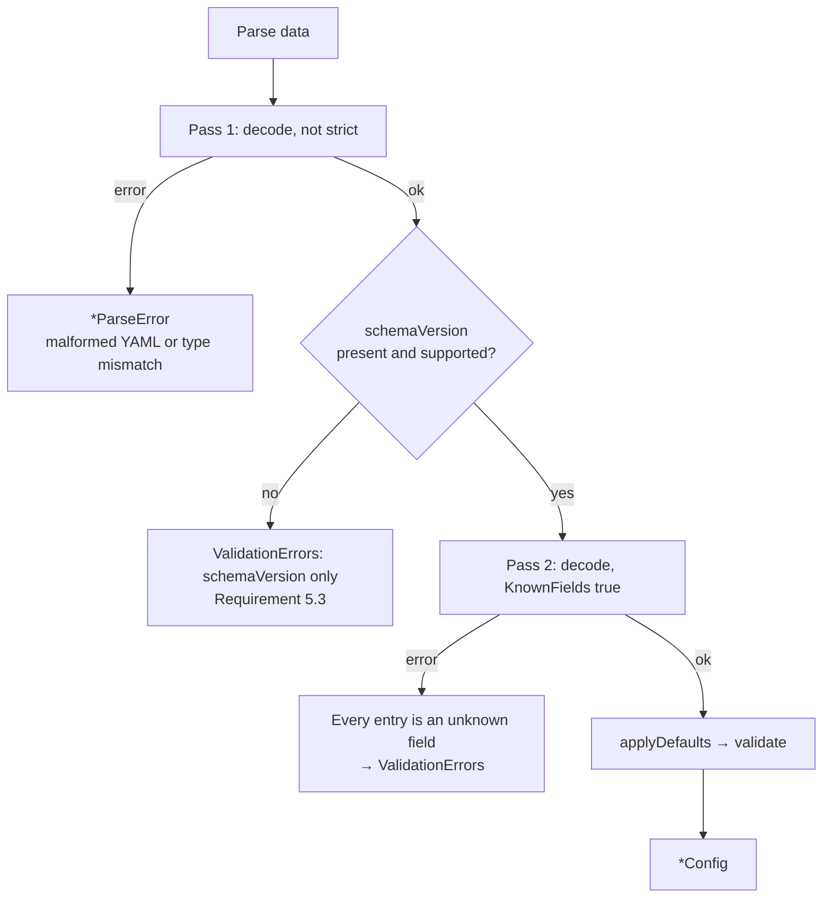

# Design: Project Schema v1alpha2 (Slice 13)

## Overview

A Project is reshaped around the three questions its settings answer:

| Key | Question | Replaces |
|---|---|---|
| `uses` | what to run | `tool` + `config.version` |
| `with` | how to call it | `config` (minus the two keys turnip read) |
| `runner` | where it runs | `config.serviceAccount` + Project-level `env` |

Three changes ride along: unrecognized keys become errors, the override
boolean becomes a list, and the file moves to `.turnip/config.yaml` with
root `turnip.yaml` as fallback.

The work concentrates in `internal/config` (parsing, validation) and
`internal/orchestrator` (discovery, overrides). `internal/runner` is
untouched — see Decision 1.

## Decision 1: `uses` is decomposed at parse time

`Project` gains `Uses` bound to YAML, plus `Tool` and `ToolVersion`
derived from it and bound to nothing:

```go
type Project struct {
	Name         string            `yaml:"name"`
	Directory    string            `yaml:"directory"`
	Uses         string            `yaml:"uses"`
	With         map[string]string `yaml:"with,omitempty"`
	Runner       RunnerSpec        `yaml:"runner,omitempty"`
	WhenModified []string          `yaml:"whenModified"`

	// Derived from Uses by applyDefaults; never unmarshaled or
	// marshaled. Everything downstream reads these, not Uses.
	Tool        string `yaml:"-"`
	ToolVersion string `yaml:"-"`
}

type RunnerSpec struct {
	ServiceAccount string            `yaml:"serviceAccount,omitempty"`
	Env            map[string]string `yaml:"env,omitempty"`
}
```

`applyDefaults` already exists for exactly this kind of work — it derives
`Name` from `Directory` today — so decomposition has a home and needs no
new stage in the pipeline.

The consequence is that **the ~23 sites reading `project.Tool` do not
change at all**, `TURNIP_TOOL` stays a scalar on the wire, and the Runner
never learns the schema moved. The blast radius is the parser, `BuildJob`'s
two reads, and `serviceaccount.go`.

The round-trip property still holds: marshaling emits `uses`, parsing
re-derives `Tool`/`ToolVersion`, and the structs compare equal.

**Alternative considered**: nested `tool: {kind, version, config}`.
*Rejected because* it changes `project.Tool` to `project.Tool.Name` at ~23
call sites for no behavioral gain, while `uses: <tool>@<version>` maps
directly onto the vendor image tag turnip already forms
(`ghcr.io/helmfile/helmfile:v1.7.4`).

## Decision 2: three decode passes, not one strict decode

This is the load-bearing decision. `yaml.v3`'s `KnownFields(true)`
accumulates every unknown field into a single `*yaml.TypeError` — verified,
four unknown fields produced four entries with line numbers. But the same
type is what a genuine type mismatch produces, and the two must surface
differently: Requirement 5.2 wants unknown keys in the accumulating
`ValidationErrors`, while `Parse` must keep returning `*ParseError` for
malformed YAML.

Separating them by matching the library's error prose would mean depending
on strings like `field X not found in type Y` that are not a stable API.
Passes separate them structurally instead:



Pass 1 succeeding is what makes pass 2's errors unambiguous: anything the
strict decoder objects to that the lenient one accepted is, by
construction, an unrecognized key.

Reporting `schemaVersion` *before* the strict pass is what stops a
`v1alpha1` file producing a cascade. Verified: a file containing
`version: 1` reports only the missing `schemaVersion`.

Decoder messages are never surfaced verbatim — they name Go types
(`config.Project`), which is an implementation detail. Each entry is
rewritten into a `ValidationError` with the key and its line.

| Input | Reported as |
|---|---|
| Malformed YAML, type mismatch | `*ParseError` with line |
| `schemaVersion` absent or unsupported | `ValidationErrors`, that error alone |
| Unrecognized key(s) | `ValidationErrors`, one per key, with line |
| Bad `uses`, reserved `env` name, bad glob | `ValidationErrors`, accumulated together |

**Alternative considered**: one strict decode, partitioning
`TypeError.Errors` by regex. *Rejected because* it couples turnip's error
classification to another project's message wording, and a yaml.v3 phrasing
change would silently reclassify real parse errors as validation errors.

## Decision 3: YAML merge keys need no handling

Verified experimentally: `KnownFields(true)` accepts `<<: *anchor` and the
merged keys are matched against struct fields normally — yaml.v3 expands
merge keys before field matching.

Requirement 5.5 is therefore satisfied by doing nothing. This is recorded
because the natural instinct on reading "reject unknown keys" is to add a
special case for `<<`, and that code would be dead at best.

## Decision 4: version shape validation moves into `internal/config`

`internal/jobs` imports `internal/config`, and config is a leaf package by
design, so the version regex in `jobs/versions.go` cannot be borrowed —
the dependency only runs one way.

The shape check therefore moves into `config`, which also improves *when*
the error appears: a malformed version becomes a `ValidationError` on the
PR at parse time rather than an `UnrecognizedVersionError` at Job-build
time. Global Requirement 18.9 asks for rejection "without creating a Runner
Job", which parse-time satisfies more directly.

`resolveVersion` keeps what genuinely belongs to `jobs`: selecting the
documented default when no version was given, and formatting the vendor
image tag. Its malformed-version branch becomes defensive rather than
load-bearing.

Normalization (Requirement 1.5) happens once, during decomposition: a
leading `v` is stripped into `ToolVersion`, and `jobs` re-adds whatever
prefix the vendor's tag convention needs — which it already does today.

## Decision 5: `with` maps to `ExecuteOptions.Config` unchanged

The schema key is `with`, the Go field is `Project.With`, and it is passed
to Plugins as the existing `ExecuteOptions.Config`.

**Alternative considered**: renaming `ExecuteOptions.Config` to `With`.
*Rejected because* `ExecuteOptions` is the Plugin contract committed in the
global design and mirrored by Slice 2's Helmfile Plugin; renaming it
crosses a slice boundary for cosmetic consistency. "Config" is also the
right word on that side of the seam — it is the tool's configuration, which
is precisely what `with` now exclusively contains.

The one behavioral change is that `TURNIP_TOOL_CONFIG` stops carrying
`version` and `serviceAccount`, because they are no longer in the map. The
Runner needs no change to benefit; the payload simply gets smaller and
honest.

## Decision 6: overrides are enforced where `serviceAccount` is today

`TURNIP_ALLOWED_OVERRIDES` is parsed once at startup into a set of paths.
Enforcement stays exactly where `resolveServiceAccount` runs — before any
Lock is acquired, so a refused Project never takes a lock it can't use.

| Override path | In default | Rationale |
|---|---|---|
| `runner.serviceAccount` | no | identity selection from a PR-editable file is the risk the gate exists for |

That is the whole list, and the default permits nothing.

**Alternative considered**: also gating `uses`, so an operator could forbid
a repository pinning its own tool version. *Rejected because* an override
is a repository replacing a value the Server also supplies, and turnip has
no Server-side tool to fall back to — what a Project runs can only come
from the repository. Gating the one field every Project must set has no
coherent meaning, and defining it to gate only that field's optional half
meant reinterpreting the word "override" until it fit. Atlantis reaches the
same conclusion by leaving `terraform_version` out of `allowed_overrides`
entirely.

`ServiceAccountNotPermittedError` generalizes to name the path and the
variable that would permit it, replacing its reference to the boolean.

## Decision 7: one source for the accepted locations

Discovery tries `.turnip/config.yaml`, then `turnip.yaml`. The order lets a
repository migrate by adding the new file, with no second step to remove
the old one.

Three places name the accepted locations today — `ErrConfigMissing`'s
message, the "not found" PR comment, and `docs/troubleshooting.md` — and a
test asserts the comment body byte-for-byte. The two Go sites derive their
text from one exported slice of paths so they cannot drift apart; the doc
is prose and stays hand-maintained.

Cost is unchanged at two content requests for a repository with no
configuration, which matters because that path runs on every PR open and
synchronize in every installed repository (Requirement 8.6).

## Edge cases

| Case | Behavior |
|---|---|
| `uses` absent | ValidationError on the Project |
| `uses: helmfile@` (empty version) | ValidationError — not treated as "no version" |
| `uses: helmfile@v1.7.4` | accepted, normalized to `1.7.4` |
| `uses: unknown@1.0.0` | ValidationError naming the supported tools |
| `with` present, tool ignores its keys | accepted; Plugins read only what they understand |
| `runner: {}` | accepted, same as absent |
| `runner.env` with `TURNIP_`/`PATH` name | ValidationError per offending name, sorted |
| Both config locations present | `.turnip/config.yaml` wins; the other is not read |
| Unknown key inside `with` | accepted — `with` is a free map, not a struct |
| Unknown key inside `runner` | ValidationError — `runner` is a struct |

The last two are worth stating plainly: strictness applies to keys turnip
defines, not to the tool-configuration map whose whole purpose is to carry
keys turnip does not know.

## Migration

No compatibility machinery (Requirement 6.3). A `v1alpha1` file reports one
error naming both versions.

Unlike the `v1alpha1` migration, **no file value is accepted by both the
deployed Server and the new one** — the old Server rejects `v1alpha2` as
unsupported, and the new one rejects `v1alpha1`. The file and the Server
move together, with a brief window where operations fail with a clear
"unsupported version" message. This is the first migration where staging
the file first does not work, and the tasks must say so.

## Testing approach

Consistent with prior slices: no real cluster, no network. `internal/config`
is a pure library, so its tests are table-driven over YAML documents. Two
additions worth naming:

- A test asserting a document using anchors and merge keys parses under
  strict decoding, pinning Decision 3 against a future refactor.
- A test asserting a `v1alpha1` document reports exactly one error, pinning
  Requirement 5.3's suppression of the unknown-key cascade.

The existing round-trip property test extends to `uses`/`with`/`runner`
unchanged in structure, since derived fields carry `yaml:"-"` and are
re-derived on parse.
