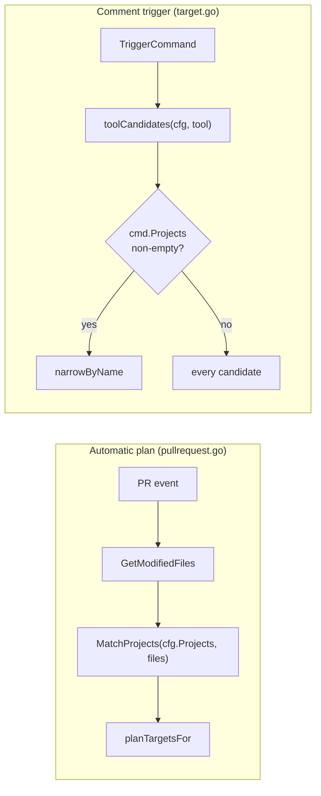
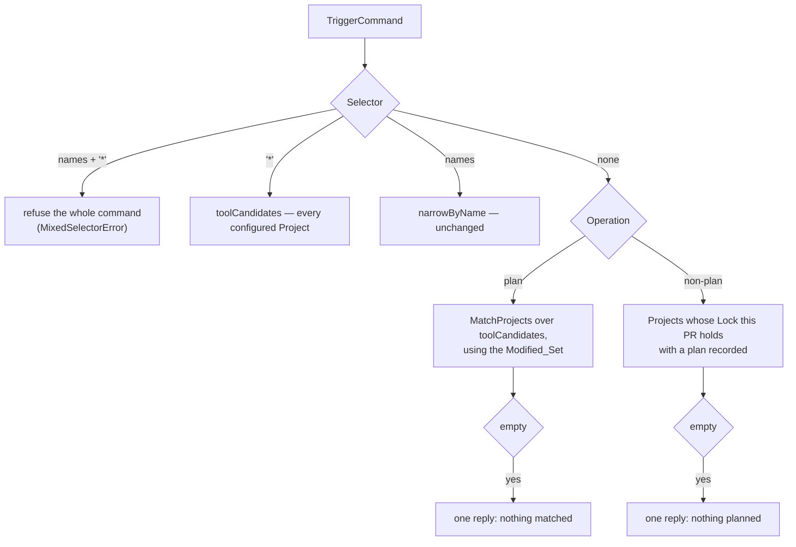

# Design: What a Bare Command Targets (Slice 21)

## Introduction

turnip resolves "which Projects does this Operation run for?" twice, and
the two answers disagree. The automatic plan filters by `whenModified`;
a comment trigger does not. This slice makes the comment path agree with
the automatic one, adds `*` for the deliberate everything case, and stops
a Project from being named something no trigger could ever address.

The encouraging part of the investigation: almost nothing new has to be
built. `GetModifiedFiles` already exists on the client interface
(`internal/github/client.go:18`) and `pullrequest.go:76` already uses it;
`config.MatchProjects` is already the matcher. Requirement 1.2's "the same
matching, not a parallel implementation of it" is therefore reuse rather
than construction. `*` likewise needs no parser change — `indexOfArgStart`
stops only at `-`-prefixed tokens, so `*` already arrives intact in
`cmd.Projects`.

What this slice actually changes is *selection*: which candidates
`resolveTargets` starts from, and what it reports when that set is empty.

## Selection today



`B5` is the defect. It is the branch that makes `/turnip plan` mean every
Project in the repository.

## Selection after this slice



## What each trigger targets

The normative table. Every row is a test case.

| Trigger | Selector | Targets |
|---|---|---|
| `/turnip plan` | none | Modified_Set, all tools (Req 1.1) |
| `/helmfile plan` | none | Modified_Set ∩ Helmfile Projects (Req 1.1) |
| `/turnip plan web` | `web` | Project `web` — unchanged (global Requirement 5.4) |
| `/turnip plan *` | `*` | every configured Project (Req 2.1) |
| `/helmfile plan *` | `*` | every Helmfile Project (Req 2.1, tool filter still applies) |
| `/turnip apply` | none | Projects this PR holds a plan for (Req 4.1) |
| `/turnip apply web` | `web` | Project `web`, existing no-plan refusal if it holds none (Req 4.3) |
| `/turnip apply *` | `*` | every configured Project, with today's per-Project refusals |
| `/turnip plan gcp/*` | pattern | Projects whose name matches `gcp/*` (Req 2.4) |
| `/turnip plan gcp/* aws/*` | patterns | the union of both (Req 2.6) |
| `/turnip plan web gcp/*` | name + pattern | `web` plus the pattern's matches (Req 2.6) |
| `/helmfile plan gcp/*` | pattern | Helmfile Projects matching `gcp/*` — the tool filter applies first (Req 2.4) |
| `/turnip plan web *` | mixed with `*` | refused, whole command (Req 2.3) |

Two rows deserve emphasis. `/turnip apply *` deliberately keeps the noisy
behaviour — asking for everything explicitly is a request to be told about
everything, including the Projects holding no plan. And `/turnip plan web`
is untouched: naming a Project reaches it whether or not the pull request
modified it, because a developer naming a Project has said something the
glob cannot contradict.

## Decision 1: selection gets a struct, not four more parameters

`resolveTargets` already takes eight parameters. Requirement 1 needs a PR
number and a way to fetch modified files; Requirement 4 needs to ask the
lock manager a question. Threading those positionally would make eleven.

Selection becomes a value assembled once per `issue_comment` event, with
resolution as a method on it:

```go
// selection carries everything target resolution needs beyond the command
// itself. Assembled once per issue_comment event, then asked about each
// TriggerCommand in turn.
type selection struct {
	cfg        *config.Config
	plugins    PluginRegistry
	owner      string
	repo       string
	author     string
	prNumber   int
	authorizer *github.Authorizer
	locks      lock.LockManager

	// modifiedSet returns the pull request's changed files, fetching at
	// most once per event. See Decision 2.
	modifiedSet func(context.Context) ([]string, error)
}

func (s *selection) resolve(ctx context.Context, cmd *github.TriggerCommand) (
	targets []Target,
	rejected []github.ProjectResult,
	wholeCommandErr error,
)
```

`locks` is the existing `lock.LockManager`, not a narrower interface
invented for this call site. A one-method querier would read as tidier and
would add a second abstraction over the same thing, which is the split
this repository has already declined once for Plugins.

*Alternative considered*: keep the free function and pass a small
`selectionInput` struct as one parameter. *Rejected because* it is the
same struct with an extra indirection, and `resolveUnlockCandidates`
already shows that the free-function shape stops paying once a caller
needs more than the config.

## Decision 2: the Modified_Set is fetched lazily, at most once

`HandleIssueComment` loops over every command in one comment. Fetching
inside `resolve` would mean a comment containing three bare plans costs
three API calls for one unchanging answer. Fetching eagerly in the handler
would mean every triggering comment pays for a file listing even when it
is `/turnip apply web`, which never consults it.

So `modifiedSet` is a closure that fetches on first use and caches the
result — including the error, so a failure is not retried three times
inside one event. The handler's command loop is sequential, so this needs
no mutex; the design records that dependency deliberately, because adding
concurrency across commands later would turn a plain closure into a race.

| Comment | API calls for modified files |
|---|---|
| `/turnip apply web` | 0 |
| `/turnip plan` | 1 |
| `/turnip plan` ×3 in one comment | 1 |
| `/turnip plan` + `/turnip apply` | 1 |

## Decision 3: `*` is refused at resolution, not at parse

`*` already reaches `cmd.Projects` unchanged, so the parser stays as it is.
Requirement 2.3's "not combinable with names" is enforced during
resolution and reported as a whole-command condition:

```go
// MixedSelectorError reports a trigger that combined "*" with Project
// names, which asks two incompatible questions at once (Requirement 2.3).
type MixedSelectorError struct {
	Names []string
}
```

*Alternative considered*: reject in `ParseTriggers` as a
`MalformedTriggerError`. *Rejected because* that path tells the reader the
line "couldn't be parsed", which is false and unhelpful — the line parsed
fine and means something specific that turnip declines to act on. The
existing `UnmatchedProjectError` already establishes the right shape for
"understood, refused", including its reply path in the handler.

## Decision 4: a bare apply asks the Lock, one Project at a time

Requirement 4.1 selects "Projects for which this pull request holds a Lock
with plan data" — which is exactly `GetLockStatus`'s existing return:
`Locked`, `PRNumber`, and `HasPlan` together answer it with no new lock
method and no schema change.

The cost is one round trip per configured Project. At the pilot's scale
that is a handful of Redis GETs on a human-triggered action, and it is not
worth pre-optimising: the roadmap already tracks turnip's `1+N` lock
round-trip patterns as deferred until more than one Project exists.

When that day comes the fix is shared, not local. Slice 28 needs to
enumerate every Lock for its listing page, which means a `SCAN`-based
`ListLocks` on the same interface. This slice should *not* build it
speculatively, but should be written so that swapping the per-Project
query for a bulk one touches one function.

**This gives `LockStatus.HasPlan` its first production reader.** The doc
comment on `LockStatus` (`internal/lock/lock.go`) currently records that
`HasPlan` and `PlanSummary` have no consumer and explains why they were
kept anyway. Half of that becomes false when this slice lands, so
amending that comment is part of the work — a stale "nothing reads this"
note is exactly the sort of thing a later sweep acts on.

## Decision 5: an empty selection replies once

Today a bare apply against eight Projects produces eight rejections from
`execute.go:142` — `"no lock (or a different PR's lock) is held; a new
plan is required"` — one per Project that was never planned. Requirements
1.3 and 4.2 replace that with a single answer, which means the emptiness
has to be detected during selection, before any Target exists.

Two typed conditions, handled by the same handler branch that already
renders `UnmatchedProjectError`:

```go
// NoModifiedProjectsError reports a bare plan whose Modified_Set was
// empty: the command was understood and nothing matched (Requirement 1.3).
type NoModifiedProjectsError struct {
	Tool string
}

// NoPlannedProjectsError reports a bare mutating Operation when this pull
// request holds no plan for any candidate Project (Requirement 4.2).
type NoPlannedProjectsError struct {
	Tool      string
	Operation string
}
```

Both replies must name the way out, since the reader typed a command and
got nothing: the first points at `*`, the second at running a plan first.

*Alternative considered*: return a reply string rather than a typed error.
*Rejected because* the handler would then have two sources of user-facing
prose for one command, and message rendering is currently the handler's
job in one place. Typed errors keep the wording next to the other replies
rather than scattered into resolution.

Note what does **not** change: naming a Project explicitly still produces
the per-Project refusal from `execute.go`. Requirement 4.3 keeps that
deliberately — a refusal is the correct answer to a specific request, and
only becomes noise when nobody asked for those Projects by name.

## Decision 6: reserved names are rejected at parse time

Requirement 3's checks belong in `validate`'s existing per-Project loop,
beside the duplicate-name check, as ordinary `ValidationError` values so
they accumulate with everything else rather than short-circuiting.

| Name | Rejected because |
|---|---|
| `*` | it selects every Project in a trigger, so a Project of that name could never be addressed individually |
| begins with `-` | `indexOfArgStart` reads the first `-`-prefixed token as the start of tool arguments, so the name would be parsed as a flag |

The ordering that makes this work is worth stating, because it is easy to
get backwards: `applyDefaults` runs at `parse.go:53`, **before**
`validate` at `:55`. By validation time a Project with no `name` has
already inherited its `directory`, so checking `p.Name` catches a
directory-derived name too. Validating before defaulting would let a
directory named `-infra` through and produce a Project nobody could ever
select.

A related gap this deliberately does not close: a name containing
whitespace is equally unaddressable, since trigger lines are split on
spaces. Requirement 3 names two specific reservations with concrete
mechanics behind them; widening it to "names turnip can tokenise" invites
a general naming policy that this slice has no basis to set.

## Decision 7: a Selector containing `*` is a name pattern — but bare `*` is not

Requirement 2.4 adds globbing over Project names, which is what lets a
repository laid out as `env/<provider>/<project>` name its Projects
`gcp/project` and address them as `gcp/*`. Patterns match with
`doublestar.Match` against `Project.Name`, the same call `projectMatches`
already makes for `whenModified` — one glob dialect per configuration
file, not two.

**Bare `*` is deliberately not evaluated as a pattern.** Measured against
the pinned doublestar v4.10.0:

| Pattern | Name | Matches |
|---|---|---|
| `*` | `web` | yes |
| `*` | `gcp/project` | **no** |
| `**` | `gcp/project` | yes |
| `gcp/*` | `gcp/project` | yes |
| `gcp/*` | `gcp/team/project` | no |
| `gcp/**` | `gcp/team/project` | yes |

`*` matches within a path segment and stops at `/`. So implementing the
everything-selector as a glob would break Requirement 2.1 exactly when a
repository adopts path-shaped names — the naming convention that motivates
patterns in the first place would silently remove Projects from `*`. The
failure would be invisible: a smaller set of Projects plans successfully
and nothing reports the omission.

`*` therefore stays a reserved word handled before any pattern matching,
which is also why Requirement 3.1 rejects a Project name *containing* `*`
rather than only a name that is exactly `*`. With that reservation, "does
this token contain `*`?" is a total and unambiguous test: pattern if yes,
exact name if no.

Segment semantics are inherited rather than invented: `gcp/*` reaches
`gcp/project` but not `gcp/team/project`, and `gcp/**` reaches both.
That is what `whenModified` already means by the same syntax, so a reader
who has written one has already learned the other.

**An unmatched pattern is not an unmatched name.** `narrowByName` fails
the whole command when a named Project does not exist, which is right — a
typo'd name is a mistake worth stopping for. A pattern matching nothing is
more often a live question ("did anything under gcp change?"), so
Requirement 2.7 gives it the single reply from Decision 5 instead of an
error.

That asymmetry has an obvious objection: `gpc/*` is as plausible a typo as
a misspelled name, and it now gets the gentle answer. The reply therefore
**quotes the pattern back** (Requirement 2.8). "No project matched
`gpc/*`" makes a transposition visible at a glance without turning a
legitimate empty question into a failure — the reader diagnoses their own
typo from the echo, which is what the hard error was doing for them and
the only part of it worth keeping.

## Known limit: the Modified_Set can be incomplete

GitHub's pull-request files endpoint returns **at most 3000 files**, with
no flag indicating truncation. `GetModifiedFiles` requests 100 per page
and follows `NextPage` to exhaustion, so turnip is already as complete as
the API allows — but on a pull request touching more than 3000 files the
Modified_Set is a prefix of the truth.

This matters more after this slice than before it. Today that cap can only
cause the *automatic* plan to under-select. Afterwards it also governs
what a bare `/turnip plan` targets, so a reader could type a plan, watch
it run, and never learn that a Project was silently left out — a failure
that looks like success, which is the worse kind.

The design does not paper over it — inventing a fallback would trade a
rare silent gap for a common wrong answer — but it does refuse to let it
stay silent, which is the part that matters. Requirement 1.4 makes turnip
say so.

Detection needs nothing new. `GetModifiedFiles` stops paginating when
GitHub stops, so a listing that comes back holding exactly the maximum
(3000 at the time of writing) is the signal, and the reply gains a line:
the plan ran, the file listing may be incomplete, and `*` targets every
Project regardless.

It is a heuristic — a pull request with exactly 3000 changed files warns
when nothing was lost. That is the right direction to be wrong in: the
cost is one unnecessary sentence on an enormous pull request, against a
plan that silently skipped Projects and looked like it simply had less to
do.

## Amendments that fall out

| Where | Change |
|---|---|
| Global `requirements.md` 5.3 | Rewritten in place: a bare apply targets Projects this pull request holds a plan for, not "all Projects configured in turnip.yaml". Recorded in the roadmap's Slice 21 details, per the convention that the global spec carries no amendment markers |
| `internal/lock/lock.go` | `LockStatus`'s doc comment no longer claims `HasPlan` has no reader |
| `docs/usage.md:55` | "omit it to target every matching project" is false *today* — it targets every Project, matching or not |
| `docs/usage.md:51` | "`/turnip ...` considers every project in `turnip.yaml`" is accurate today and becomes false with this slice |
| `docs/usage.md` | Document `*` and name patterns, the 3000-file limit as the reason to reach for `*`, and that a trigger carrying two `*`s should be written in backticks |
| `docs/usage.md` | State that a Project name must be typeable as one trigger token — a name with whitespace parses as two selectors and can never be addressed, though the parser accepts it (Req 5.4). Documented rather than rejected: rejecting it would break configurations that already parse |

Both `usage.md` sentences are wrong by the end, but for opposite reasons
and at opposite times — worth doing in one pass so the corrected text is
coherent rather than two half-fixes.

## Testing strategy

- **The trigger table above, row by row.** It is written to be executable
  as a table-driven test; a row without a test is a row that will drift.
- **Equivalence with the automatic plan**, which is how Requirement 1.2 is
  actually enforced. For the same Project set and file list, bare-plan
  selection and `planTargetsFor(MatchProjects(...))` must select the same
  Projects. A property test over generated Projects and paths states this
  directly, tagged per the repository's convention
  (`// Feature: project-selection, Property: bare plan equals autoplan
  selection`). A parallel implementation cannot pass it, which is a
  stronger guarantee than reviewing that the same function was called.
- **Memoisation**, via a counting fake client: a comment with three bare
  plans performs exactly one `GetModifiedFiles`, and a comment naming
  Projects performs none.
- **Single reply on empty selection**: a bare apply against several
  configured Projects produces one reply and zero `ProjectResult`s — the
  regression this slice exists to prevent is that count creeping back up.
- **Validation**, including the case that motivated Decision 6: a Project
  with no `name` whose `directory` is `-infra` must be rejected.
- **Mutation check**: restore `B5` (start from every candidate) and
  confirm the equivalence property fails. If it still passes, the property
  is not testing what it claims.

## Out of scope

- **Matching against `Project.Directory`.** Decision 7 globs over names,
  which covers the path-shaped-naming case without a second addressing
  mechanism. A repository that names Projects something other than their
  directory still cannot select them by location — recorded in the
  roadmap's Backlog rather than scheduled, since naming a Project for its
  path is the cheaper answer and needs no code.
- **Changing the automatic plan.** It already filters correctly. This
  slice brings the comment path into line with it, not the reverse.
- **Lock lifecycle.** Slice 18 decides which outcomes release a Lock. This
  slice reduces how many Locks a careless command takes in the first
  place; the two compound, neither depends on the other.
- **Bulk lock enumeration.** Deliberately left to Slice 28, which needs it
  for a different reason and will serve both.
