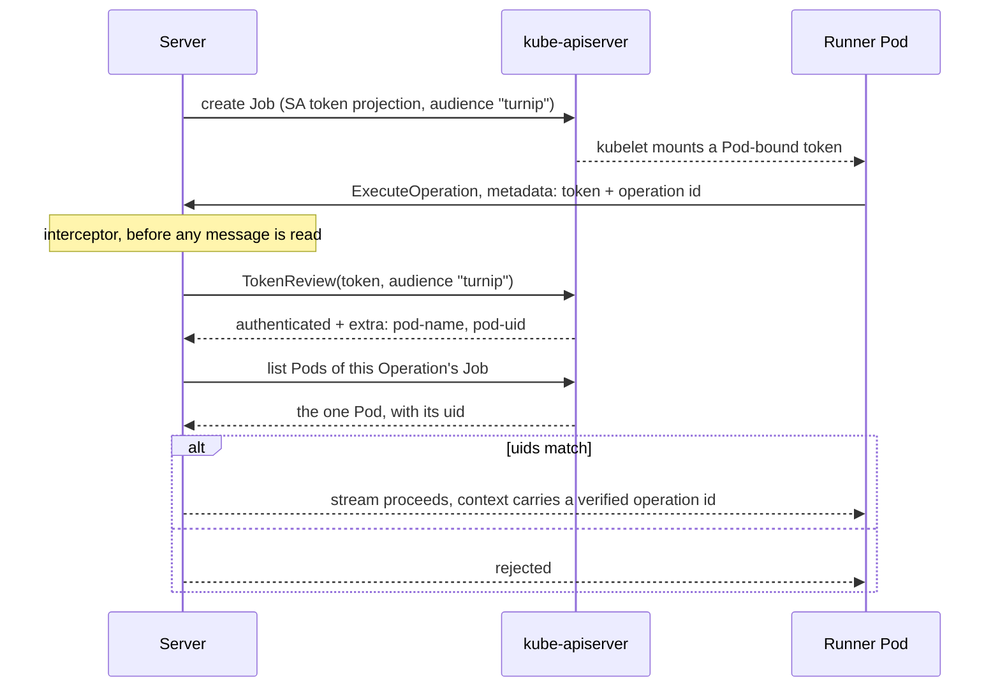

# Design: Authenticating the Runner to the Server (Slice 25)

## Overview

The Server learns who is calling from a credential Kubernetes issues and
Kubernetes validates. turnip mints nothing, stores nothing, and rotates
nothing.

A projected ServiceAccount token is a field of the Pod spec turnip already
writes — not of the ServiceAccount object — so no operator has to change a
ServiceAccount, and the `runner.serviceAccount` override stays orthogonal.

## The flow

## Decision 1: The identity is the Pod, and the audience is turnip

The projection names an audience turnip owns and a short expiry. Two
properties follow, and both matter:

**The audience makes the token useless elsewhere.** Every Pod already
automounts a token at
`/var/run/secrets/kubernetes.io/serviceaccount/token` whose audience is
the API server. Presenting *that* to turnip would let turnip replay it and
act as the Runner's ServiceAccount against the cluster. An audience-scoped
token authenticates to turnip and to nothing else.

**The Pod binding is what carries identity.** `TokenReview` returns
`authentication.kubernetes.io/pod-name` and `.../pod-uid` in
`UserInfo.Extra` for a Pod-bound token. The API server verifies the bound
object still exists, by uid, when the token is used.

**Alternative considered**: require a particular ServiceAccount name.

**Rejected because** turnip lets an operator — and where
`TURNIP_ALLOWED_OVERRIDES` permits, a repository — choose
`runner.serviceAccount`. Keying on the name breaks the moment anyone uses
that feature, and where a repository chooses it, the repository would be
influencing which identities the Server accepts.

**Not derived from the node claims.** `node-name` and `node-uid` also
appear in the extras and are documented as **not verified** by the API
server. Nothing security-relevant may be read from them.

## Decision 2: The interceptor both authenticates and binds, so the operation id travels in metadata

A `grpc.StreamInterceptor` runs *before* any message is read, so it cannot
see `OperationStart`. That leaves two shapes:

- authenticate in the interceptor, bind to the Operation in the handler
- carry the operation id in metadata alongside the token, and do both in
  the interceptor

**The second.** Requirement 5 asks for a check every RPC passes through,
and binding in the handler protects the one RPC that exists today while
silently not protecting the next one — the same hazard Slice 18 designed
around when it put the argument refusal on `!isPlan` rather than on a list
of operation names.

It also closes a gap the first shape leaves open: a caller could
authenticate as the Pod of Operation A and then stream results naming
Operation B. Binding at the interceptor means the pair is checked once,
together, before anything is read.

## Decision 3: The authenticated operation id supersedes the message's

`server.go:83` currently does `operationID = payload.Start.GetOperationId()`.
After this slice the id comes from the interceptor's context and that line
goes.

The consequence is worth stating: `OperationStart.operation_id` becomes
decorative. It is **not** removed here — Slice 24 already notes that the
Server reads one field of twelve, and pruning the message is a protocol
question rather than a security one. What this slice must do is make the
site say so, or a later reader will restore the assignment as a
simplification and reopen the gap.

## Decision 4: Compare uids, and refuse when the cluster cannot supply one

The Server resolves the Operation's Pod through machinery it already has:
the `turnip.ivan.vc/operation-id` label on the Job, the
`batch.kubernetes.io/job-name` selector on its Pods, and `BackoffLimit: 0`
guaranteeing exactly one. It needs no new Kubernetes permission for this —
`pods` get/list is already in the Server's Role.

Names are compared only if a uid is unavailable on both sides, and a Pod
name can be reused after deletion where a uid cannot.

**When `pod-uid` is absent from the extras, the Server refuses.** turnip
requires **Kubernetes v1.32 or later**, where those extras are stable and
enabled by default. They first appeared in v1.29 but are feature-gated
until v1.32, and a gate turnip cannot detect is not a version it can
claim to support — so v1.32 is the minimum rather than v1.29. The refusal names
the version requirement, because the alternative — falling back to
trusting the `operation_id` — would leave an operator believing in a
control that is not there. A visible failure at deployment beats a silent
one in production.

## Decision 4b: `TokenReview`, not local signature validation

The requirements left this to the design. Validating the token locally
against the API server's JWKS would avoid the cluster-scoped grant
Requirement 7 describes, and it is rejected on correctness rather than on
effort.

A local verifier can check the signature, the audience and the expiry. It
**cannot** check that the bound Pod still exists — the API server performs
that check by uid when the token is presented, and it is the whole reason
a Pod-bound token means more than a ServiceAccount-scoped one. Without it,
a token captured from a Pod that has since been deleted would still
validate, and the binding this slice is built on would be advisory.

Implementing JWT verification also has more ways to be subtly wrong than
calling an API that does it, and the failure is silent in the direction
that matters.

**The cost is accepted, not dismissed**: `TokenReview` is cluster-scoped,
so turnip asks for its first ClusterRole. Requirement 7 exists to make an
operator's acceptance of that deliberate.

## Decision 5: Encryption is a separate axis, and has its own slice

An earlier version of this design made TLS Requirement 4 here, arguing
that a bearer token on a plaintext channel makes the authentication
decorative. That argument is real but it proved too much: it treats "the
credential could be stolen by an attacker with network position" as
equivalent to "the credential is readable by anything with pod-read",
and those are not the same exposure.

Everything in this design holds over an unencrypted transport. The
`TokenReview` is a call from the Server to the API server, over the API
server's own TLS. Pod-uid resolution is the same. The only hop this
slice leaves in the clear is the Runner presenting its token — and the
interceptor's entire test suite runs over `insecure.NewCredentials()`,
which is the demonstration rather than the claim.

What deferring costs, stated so it is not discovered later:

| | with this slice, without TLS | before this slice |
|---|---|---|
| who can forge a result | someone who can capture pod-to-pod traffic | anything with pod-read in the namespace |
| what they must capture | a token that expires in minutes and authorizes one Operation | an env value that lasts the Job's life |
| where it lives at rest | nowhere | the Pod spec, and etcd |

The one thing TLS adds beyond "harder to steal" is *server*
authentication — a Runner knowing it reached the real Server rather than
whoever answered. That matters little for reporting results and a great
deal for Slice 24's option B, where the Runner would hand its credential
over in exchange for a GitHub token. So `runner-server-tls` is a genuine
prerequisite for that slice, and not for this one.

**Alternative considered**: keep TLS here, with the Server generating its
own certificate into a Secret on first boot.

**Rejected because** it attaches an unresolved question — where the
certificate comes from, and who renews it — to work that does not depend
on the answer. The generation design was written and implemented before
this split; it moves to `runner-server-tls` intact, along with the survey
of how comparable projects solve it.

## Decision 6: Validate once per stream, not per message

`TokenReview` is called when a stream opens. A stream carries many log
lines and one result; revalidating each would multiply API-server calls by
output volume for no gain, since the binding cannot change mid-stream —
the Pod that opened it is the Pod that holds it.

The Runner re-reads the token file on every `openStream`, because kubelet
rotates a projected token in place and a reconnect after rotation must
present the current one. `reporter.go`'s `openStream` is the single place
this happens, which is also where the metadata is attached.

**Not cached across streams.** A reconnect is rare, `TokenReview` is
cheap, and a cache keyed on a bearer token is a place for a revoked
credential to keep working.

## What changes where

| File | Change |
|---|---|
| `internal/jobs/build.go` | a `ServiceAccountToken` projection with turnip's audience and a short expiry |
| `internal/runner/reporter.go` | read the token per `openStream`; attach token and operation id as metadata |
| `internal/rpc/server.go` | `NewServer` gains options; a stream interceptor; `operationID` comes from the context |
| `internal/orchestrator` | resolve an Operation's Pod uid for the interceptor to compare |
| `deploy/` | a ClusterRole for `create` on `tokenreviews`, and its binding |
| `docs/deployment.md` | the cluster-scoped grant, the minimum Kubernetes version, and that the channel is not encrypted |

## Interaction with other slices

**Slice 24 is the consumer.** Once the Server can tell which Pod is
calling, the Runner can *fetch* its GitHub token rather than receive it in
the Pod spec — which is why 24 waits for this and why no Kubernetes Secret
is being built.

**Slice 5 (`grpc-runner`) gains an amendment**: the service acquires an
interceptor and a metadata contract, and `NewServer`'s signature changes.

**`runner-server-tls` is the other half**, and Slice 24's option B should
wait for it rather than for this slice alone — handing a credential to an
unverified peer is a different proposition from reporting results to
one.

**Slice 13's `runner.serviceAccount` override stays orthogonal**, by
Decision 1. That is the property to protect in review: any rule that
mentions a ServiceAccount name has reintroduced the coupling.

**Slice 26 (real-time output)** inherits an authenticated stream for free;
nothing there needs to know.

## Testing strategy

**The forgery is the test.** A caller presenting a valid token for one
Operation's Pod, naming a *different* Operation, must be rejected. That is
the attack this slice exists to stop — a third party writing to a pull
request's record — and it is the case an implementation that authenticates
but does not bind would pass.

**Refusal when the extras are absent.** A `TokenReview` response without
`pod-uid` must reject, not degrade. Simulated with a fake reviewer, since
it depends on the cluster's version rather than on anything turnip
controls.

**The interceptor is structural.** A test that an RPC added later is
covered — exercised by registering a second method against the same server
and asserting it is authenticated without its own check.

**The wrong audience is refused**, including the Pod's default API-server
token, which is the specific mistake that would hand turnip the ability to
act as the Runner's ServiceAccount.

**Rotation.** Two consecutive `openStream` calls read the token file
twice, so a token replaced between them is presented as replaced. Asserted
on reads of the file rather than on timing.

**Authentication does not depend on encryption.** The whole interceptor
suite dials with `insecure.NewCredentials()` and passes. That is the
assertion behind Decision 5's split: if any of it had quietly required
TLS, these tests could not run.
