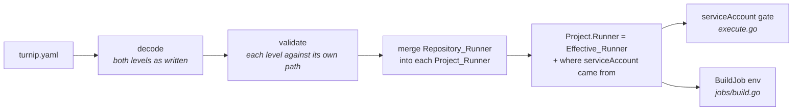

# Design: Runner Settings Shared Across Projects (Slice 43)

## Overview

One new top-level key, merged into every Project inside `config.Parse`,
so everything downstream keeps reading `Project.Runner` and sees the
Effective_Runner without knowing a merge happened.



The Server's `TURNIP_RUNNER_SERVICE_ACCOUNT` is not merged in here. It
stays where it is today, as the gate's fallback when the file sets no
`serviceAccount` at either level (Requirement 2.3), since `internal/config`
knows nothing of the Server.

## The schema

`Config` gains `Runner RunnerSpec` under the key `runner`, beside `clone`.
It is the same `RunnerSpec` a Project carries, so both levels accept the
same fields with the same meaning by construction (Requirement 1.2).

```yaml
schemaVersion: v1alpha3
runner:
  env:
    KUBECONFIG: /turnip/src/.turnip/kubeconfig
projects:
  - directory: infra/web
    uses: helmfile@v1.7.4
  - directory: infra/api
    uses: helmfile@v1.7.4
    runner:
      env:
        AWS_REGION: us-west-2   # added to KUBECONFIG, not replacing it
```

The key is optional and additive, so the schema version stays
`v1alpha3` and a file without it parses exactly as today (Requirement
1.3).

## Where the merge happens

`Parse` already runs decode, schema check, strict decode, defaults, then
validation. The merge is a new last step, **after validation**:

| Step | Sees | Why here |
|---|---|---|
| validate | both levels as written | a bad name in the top-level `env` is reported once, at `runner.env["X"]` against the file, not once per Project that inherited it (Requirement 4.2) |
| merge | validated levels | nothing downstream needs the levels apart, except the gate's provenance, which the merge records |

Validation accumulates across both levels in the one pass it already
makes (Requirement 4.3). A top-level violation uses the file-level
reference `clone:` already uses (`configFileRef`); a Project's keeps its
own.

### Decision 1: Merge in `config.Parse`, not where the settings are read

*Alternative considered*: keep the levels apart on `Config` and merge in
each reader: the gate in `execute.go` and the env in `BuildJob`.

*Rejected because*: Requirement 7.2 asks that every reader see the
Effective_Runner, and the way to guarantee it is to leave nothing else to
read. A merge per reader is one forgotten call away from a Job running
one identity while the gate checked another. Merging once in `Parse`
makes a reader that sees the unmerged Project impossible, including
readers added later.

## Merge rules

| Field | Rule | Effective value |
|---|---|---|
| `serviceAccount` | replaced | the Project's if set, else the top level's, else unset (the gate then applies the Server's default) |
| `env` | merged per key | every top-level variable, then every Project variable over it; a Project variable set to `""` is set to `""` |

A variable present with an empty value is kept as present: YAML's
`X: ""` and `X:` both decode to a present key with an empty value, and
both override the top level's (Requirement 3.4). There is no way to
remove an inherited variable.

**The rules are a table the merge reads**, keyed by `RunnerSpec` field,
each field marked *replaced* or *merged per key*. A test walks
`RunnerSpec`'s fields and fails for any with no entry (Requirement 6.2),
so Slice 31's tolerations or Slice 39's resources cannot land without
someone choosing.

### Decision 2: The merge is driven by the table

*Alternative considered*: a hand-written merge, one line per field, plus
a test that checks every field appears in a separate list of rules.

*Rejected because*: the list and the code can disagree. A field added to
the list as "merged per key" but never added to the merge would pass the
test and be silently dropped at the top level. Driving the merge from the
table makes the declared rule the rule that runs; the two rule kinds are
the only code, and each is a few lines.

## The gate follows the value

The merge records where the Effective_Runner's `serviceAccount` came
from on the Project, beside the value: the Project's own `runner:`, the
top-level `runner:`, or neither. It is not part of the YAML
(`yaml:"-"`), and only the gate reads it.

`resolveServiceAccount` is unchanged in shape: it reads the Effective
`serviceAccount`, which may now come from the top level, and refuses it
unless `runner.serviceAccount` is in `TURNIP_ALLOWED_OVERRIDES`
(Requirement 5.1). The refusal message names the source (Requirement 5.2):

| Source | The refusal says |
|---|---|
| the Project's `runner:` | Project `web` requested `runner.serviceAccount` `deployer`, … (today's wording) |
| the top-level `runner:` | Project `web` inherits `runner.serviceAccount` `deployer` from the top-level `runner:` block, … |

The rest of the message, the fix naming `TURNIP_ALLOWED_OVERRIDES`, is
unchanged.

It stays a Configuration_Refusal with the setting `runner.serviceAccount`,
so the Project_Check Title is still `runner.serviceAccount is not
permitted` (Requirement 5.4). The source is in the check's summary and
the comment, which carry the message.

**A consequence worth knowing**: a top-level `serviceAccount` the Server
does not permit refuses every Project's plan, and the aggregate `turnip`
check's Title names the first (`not permitted: web sets
runner.serviceAccount, and 12 more`). "Sets" is true of the Effective
value; the summary says it is inherited. Not worth a second Title for.

`env` stays ungated at both levels (Requirement 5.3).

## Documentation

| File | What |
|---|---|
| `docs/configuration.md` | the top-level `runner:` block in the schema table and example; each field's rule; that a Project cannot remove a shared variable, only override it; that a relative path in a shared `env` value resolves in each Project's own directory; that the `runner.serviceAccount` gate applies at either level |
| `docs/configuration.md`, EKS recipe | `KUBECONFIG` set once at the top level as `/turnip/src/.turnip/kubeconfig`, replacing the per-Project relative path |
| `SECURITY.md` | the `runner.serviceAccount` opt-in covers the top-level block too |

## Testing

- **Parsing**: a file without the key parses as today; the top-level
  block with each field; an unknown key inside it is rejected by the
  strict pass like any other.
- **Merge**, table-driven: `serviceAccount` at neither, either and both
  levels, with the recorded source; `env` at either and both levels,
  including a Project overriding one variable and keeping the rest, a
  variable set to `""`, and `X:` with no value.
- **Rules**: the table test over `RunnerSpec`'s fields. The field walk
  takes a type, so the test also runs it over a test-only struct with
  one unlisted field and asserts that it reports it; otherwise the test
  could pass by checking nothing.
- **Validation**: a reserved name at the top level reported once, at
  `runner.env["X"]` against the file, alongside a Project's own violation
  in the same pass.
- **The gate**: a top-level `serviceAccount` refused when not permitted,
  with the message naming the top-level block and the Configuration
  Title unchanged; permitted, it reaches the Job; a Project's own value
  wins over the top level's.
- **The Job**: an inherited `env` variable reaches the tool container,
  through `Parse` rather than a hand-built Project, so the test fails if
  a reader ever sees the unmerged value.
- **Property test**: the configuration round-trip compares a parsed
  Project's `Runner` against the merge of what was generated, rather than
  against the Project as generated.
