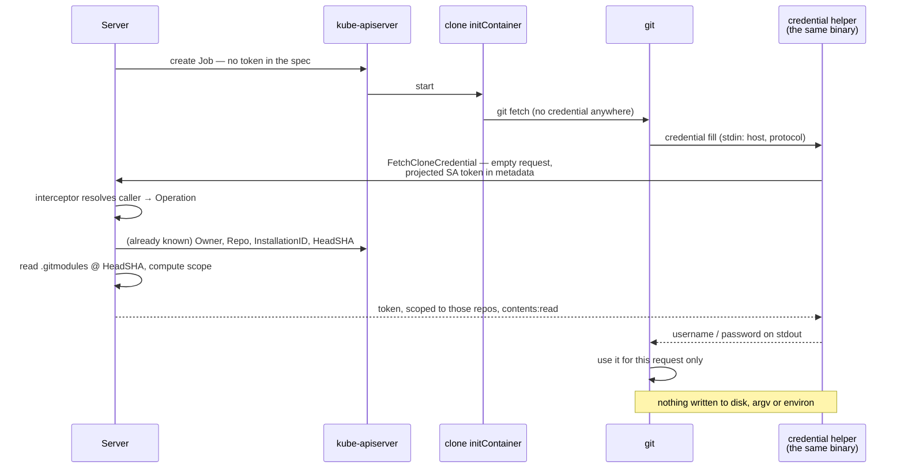
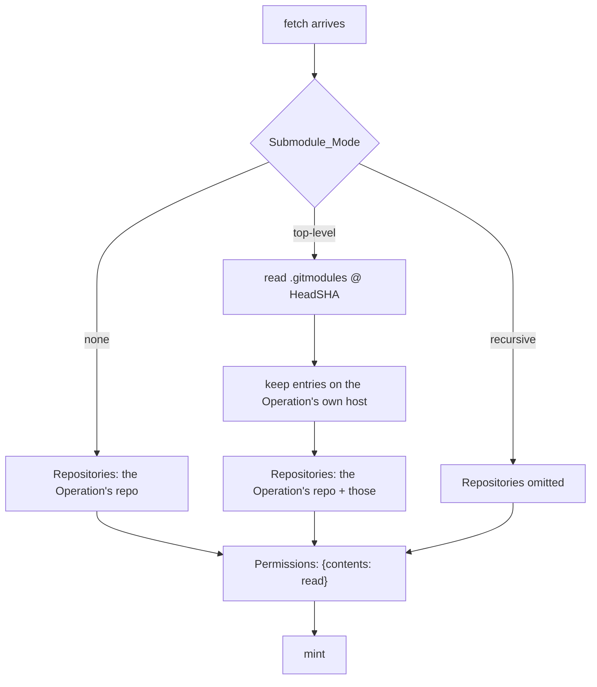

# Design: How the Runner Receives Its GitHub Token (Slice 24)

## Overview

The token stops being something the Server **delivers** and becomes
something the Runner **asks for**, at the moment git needs it, over a
channel that already knows who is calling.

That single change removes three of the four surfaces by construction
rather than by cleanup: there is no token in the Pod spec because none is
put there, none in `.git/config` because git is never given a URL
containing one, and none in `OperationStart` because the field is gone.
The fourth — reported output — is the one that was already defended, and
this design's job there is to keep it defended once the code it guards is
rewritten.

The enabling piece landed in Slice 25: the Server can tell which Pod is
calling, so a request for "this Operation's credential" needs no argument
identifying the Operation.

## The flow



## Decision 1: A credential helper, not a URL

git already has a protocol for "ask someone for a credential when you
need one": `credential.helper`. turnip's own runner binary becomes that
helper, re-invoked by git as `/runner credential get` — the same
single-binary, dispatch-on-`os.Args[1]` pattern `clone` already uses
(`cmd/runner/main.go`), and the binary is at `/runner` in the Runner
image (`build/runner/Dockerfile`).

The token is then a value that exists in the helper's memory and on a
pipe to git. It is never assembled into a URL, never passed as an
argument, and never written to a file.

Requirement 3.4 rules out most of the obvious alternatives, because it
asks for the token *not to be persisted*, not merely moved somewhere less
obvious:

| Mechanism | Where the token lands | Verdict |
|---|---|---|
| authenticated remote URL (`embedToken`, today) | `.git/config`, and any argv naming the remote | fails 3.1, 3.2 |
| `-c http.extraHeader=…` | the git process's argv, readable through `/proc` | fails 3.4 |
| a git config file turnip writes | a file outside the Workspace | fails 3.4 — moved, not removed |
| `GIT_ASKPASS` program plus the token in its environment | the child's environ, readable through `/proc` | fails 3.4 |
| `GIT_CONFIG_VALUE_n` rewrites (today, for submodules) | the git process's environ | fails 3.4 |
| **credential helper that fetches on demand** | **the helper's memory, and a pipe** | **satisfies 3.1–3.5** |

**This replaces two call sites, not one.** `clone.go`'s `embedToken`
builds the authenticated remote, and `submodules.go`'s
`submoduleConfigEnv` builds `url.<authenticated>.insteadOf` entries
carrying the same token in `GIT_CONFIG_VALUE_n`. Both are token
placements and both go. The `insteadOf` rewrites themselves stay — they
still do the useful half of their job, turning `ssh://` and `git@` forms
into `https://` — they simply stop carrying a credential, because the
helper supplies it per host.

**Alternative considered**: keep the URL and scrub `.git/config` after the
clone.

**Rejected because** it fails 3.3 on the path that matters. A clone that
fails part-way has usually already written the remote, and the runs
someone goes back to examine are exactly the failed ones. A cleanup step
is also a step that can be skipped by an early return; not writing the
credential cannot be.

## Decision 2: The fetch is a unary RPC, and that obliges an amendment to Slice 25

**`NewServer` installs `grpc.StreamInterceptor` and nothing else**
(`internal/rpc/server.go`). A unary method registered on that server
today would be reached with **no authentication at all**.

That contradicts Slice 25's own Requirement 4.2 — *"AN RPC added later
SHALL be authenticated without its author having to remember"* — and its
test does not catch it, because
`TestInterceptor_CoversAnRPCItWasNotWrittenFor` registers a *streaming*
probe. The claim is true for the half of gRPC that was exercised.

The gap exists whether or not this slice is built, so it is fixed rather
than side-stepped:

| Option | Consequence |
|---|---|
| add `grpc.UnaryInterceptor` sharing the same `Authenticator` | the claim becomes true for both kinds; one more line in `NewServer` |
| make the fetch a streaming RPC so it falls inside the existing interceptor | this slice is safe and the next unary RPC is not |

The first. **Slice 25 gains an amendment task** for the unary interceptor
and for a unary probe alongside its streaming one, so the assertion
matches the claim.

## Decision 3: The request carries nothing

Requirement 2.3 says the credential returned is determined by the
caller's authenticated binding and never by a value in the request. The
strongest way to satisfy that is to leave nothing in the request to be
tempted by:

```protobuf
rpc FetchCloneCredential(FetchCloneCredentialRequest) returns (FetchCloneCredentialResponse);

message FetchCloneCredentialRequest {}

message FetchCloneCredentialResponse {
  string token = 1;
  // Advisory only: the helper does not enforce it, and git does not read
  // it. It exists so an expired credential produces a legible failure
  // rather than a puzzling 401 from GitHub.
  int64 expires_at_unix = 2;
}
```

An empty request is the load-bearing part. An implementation cannot read
an operation id that is not there, so the cross-repository theft
Requirement 2.3 describes is unreachable rather than merely forbidden.

**Alternative considered**: carry the operation id for symmetry with
`OperationStart`, and have the Server compare it to the authenticated
binding.

**Rejected because** a comparison is a thing that can be written the
wrong way round, or relaxed later by someone who reads it as redundant.
The Server already knows the answer; asking the caller for it and then
checking the answer is ceremony that can rot.

## Decision 4: Minting happens on the fetch, and needs no new state

`OperationRecord` already carries everything required:

| Field | Used for |
|---|---|
| `InstallationID` | which installation to mint against |
| `Owner`, `Repo` | the repository the Operation acts on |
| `HeadSHA` | the ref `.gitmodules` is read at |
| `Project` | the resolved Submodule_Mode for this Operation |

So Requirement 2.4 costs a move, not a mechanism. What it buys:

| | minted at dispatch (today) | minted on fetch |
|---|---|---|
| credential is live from | before the Job exists | the moment git asks |
| through | queueing, scheduling, image pulls, tool provisioning, the clone's own startup | the clone's fetches |
| typical window | minutes, mostly idle | seconds |

The Introduction's "what does not help" note observes that expiry cannot
shrink that window. This is what can.

## Decision 5: Scoping, and the point where enumeration stops

The Server computes the repository set when the fetch arrives:



Reading `.gitmodules` needs no new capability: the Server already fetches
a file from the repository at a commit — that is how `turnip.yaml`
arrives — so this is the same call with a different path. A repository
with no `.gitmodules` yields the single-repository set.

**`recursive` omits `Repositories` and still narrows `Permissions`.** A
submodule's own submodules are declared in a `.gitmodules` that does not
exist until that submodule is cloned, so the set is unknowable before
minting, and Requirement 1.4 forbids narrowing in a way that would fail a
fetch turnip would otherwise have performed. Dropping repository scope
while keeping `contents: read` is the widest thing 1.4 permits and the
narrowest thing correctness allows.

**Alternative considered**: fail the Operation under `recursive` rather
than widen, on the grounds that an unscoped token is what this slice
exists to remove.

**Rejected because** Requirement 1.4 decides it, and the reasoning behind
1.4 is that narrowing is a defense rather than a feature: a repository
that used `recursive` and worked yesterday would stop working, and the
operator would be told that a security improvement broke their clone.
Recorded in the documentation (Requirement 5.2) instead, so the width is
visible rather than surprising.

**This is also why 1.3 and 1.4 are not in conflict.** 1.3 refuses a
*fallback* — scoping was attempted, failed, and something broader was
used instead. 1.4 describes a *deliberate width* chosen up front for a
case where the narrow set is not knowable. The distinguishing question is
whether turnip ever believed it had the narrow set.

## Decision 6: Redaction stays, and is now a test rather than a guard

`clone.go`'s `redact`/`redactArgs` exist because the token was in the
remote URL and therefore in git's output. After this slice it is in
neither, so they should have nothing to find.

They are kept anyway, and Requirement 3.5 is asserted directly: the
Operation's reported output, on the success path and the failure path,
contains no substring of the credential. The point is that *"the new path
does not need redaction"* becomes something a test says rather than
something the design asserts — a surface defended by one helper is a
surface an edit can reopen, and this slice is that edit.

## What changes where

| File | Change |
|---|---|
| `proto/turnip/v1/operation.proto` | `FetchCloneCredential`; `github_token` removed from `OperationStart` and its field number reserved |
| `internal/rpc/server.go` | a unary interceptor beside the stream one; the new handler |
| `internal/orchestrator` | serve the fetch: resolve the record, compute scope, mint |
| `internal/github/client.go` | `GenerateInstallationToken` takes options — repositories and permissions |
| `internal/runner/credential.go` (new) | the helper: read the projected token, fetch, write git's credential format to stdout |
| `cmd/runner/main.go` | dispatch `credential` alongside `clone` |
| `internal/runner/clone.go` | `embedToken` goes; git is configured with the helper |
| `internal/runner/submodules.go` | `insteadOf` rewrites keep their scheme-rewriting half and lose the credential |
| `internal/jobs/build.go` | `TURNIP_GITHUB_TOKEN` goes from the clone container |
| `docs/configuration.md`, `docs/deployment.md` | Requirement 5 |

## Interaction with other slices

**Slice 25 gains an amendment** (Decision 2): a unary interceptor, and a
unary probe in its test, so "an RPC added later is authenticated" is true
for both kinds of RPC rather than one.

**Slice 38 (`runner-server-tls`) is a preference, not a dependency**, and
the reason is sharper here than it was for Slice 25. Reporting a result to
an unverified peer risks a forged result; *fetching a credential* from one
hands a repository token to whoever answered. Requirement 1 bounds what
that is worth — one repository, `contents: read`, minted seconds ago — but
it does not close it. If 38 is scheduled when this slice starts, do it
first.

**Slice 2's `clone-submodules` work is directly touched**, not merely
adjacent: `submoduleConfigEnv` is one of the two token placements this
design removes. Its host-mismatch error and its `accessHint` stay as they
are — they describe what the installation can reach, which scoping makes
*more* likely to be hit and no less accurate.

## Testing strategy

**The workspace is scanned, on both paths.** After a successful clone and
after a failed one, no file under the Workspace contains the credential.
3.3 is the one that catches a cleanup-based implementation, so the failure
case is not optional.

**Nothing carries it but the pipe.** The git subprocess's argv and
environment are asserted to contain no substring of the token — the
assertion that distinguishes "not persisted" from "moved somewhere less
obvious", and the one that fails for four of the five rejected mechanisms
in Decision 1.

**The scope is what `.gitmodules` says.** A fixture with a sibling private
submodule mints for both repositories; one with none mints for one;
`recursive` omits `Repositories` and still sets `contents: read`.

**The unary path is authenticated.** A unary call with no credential is
refused — which fails today, before Decision 2's amendment, and is the
reason the amendment is in this slice's plan rather than left to Slice 25
to notice.

**Reported output is clean** on both paths (Requirement 3.5), asserted
against the Operation's output rather than against `redact` in isolation.
