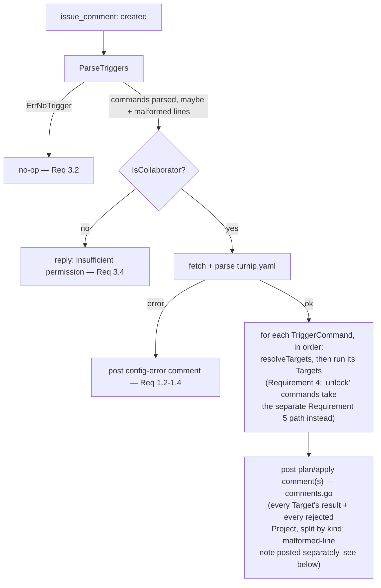
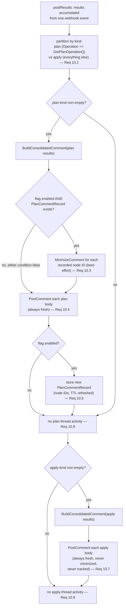
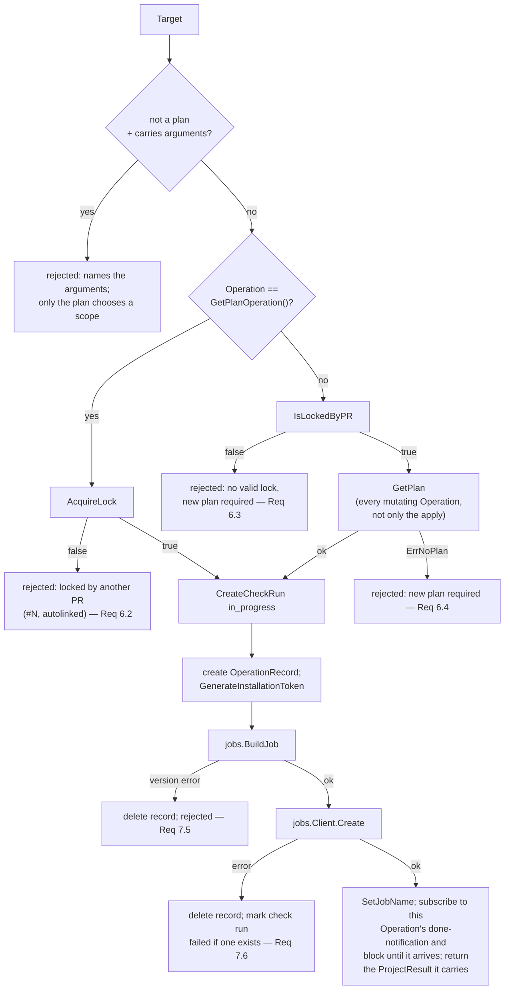
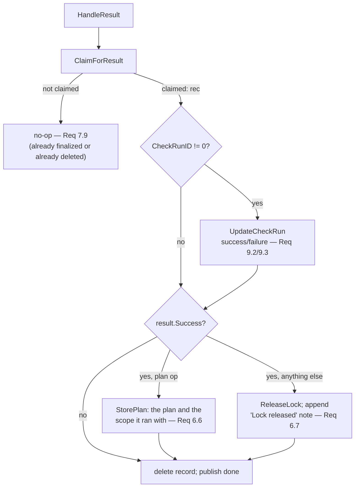
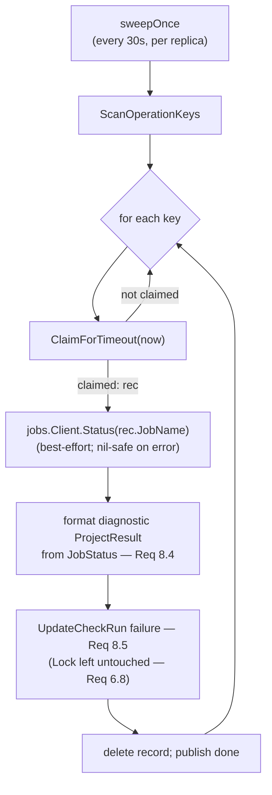

# Design Document: Server Orchestration (Slice 6)

## Overview

This slice delivers `cmd/server` and a new `internal/orchestrator` package
that wires Slices 1-5 into the complete webhook-to-operation flow. It is
the largest slice by requirement count (12) but adds comparatively little
new mechanism of its own — most of what it does is *decide when* to call
primitives that already exist. Two things are genuinely new: the
**Operation Record**, a Redis-backed record (with a Lua-script CAS scheme)
that makes the Server's gRPC callback handling stateless across replicas;
and the **plan-comment minimize-then-repost mechanism** (Decision 4), a
small Redis record plus one GraphQL mutation that keeps a long-lived PR's
comment thread from becoming the kind of unreviewable flood Atlantis-style
tools are known for.

Four decisions shape everything below:

### Decision 1: one `recordStore`, two claim scripts, no separate "timeout" bookkeeping

Requirements 7 and 8 each describe atomic Redis operations informally
("compare-and-mutate," "mirroring `internal/lock`'s Lua-script CAS
pattern") without pinning down a concrete scheme. A naive reading might
reach for two independent mechanisms — a "started" flag for Requirement
8.2 and a separate "timed out" flag for Requirement 8.3 — but that invites
a real race: `HandleResult` (Requirement 7.8) and the sweep's timeout claim
(Requirement 8.3) could both observe the same Operation Record as
not-yet-finalized and both attempt to process it — one via the Lock/
check-run/comment actions for a genuine result, the other reporting a
timeout — double-reporting a single Target.

**Resolution**: a single `finalized` boolean, set exactly once, by
whichever of `HandleResult` or the sweep gets there first — implemented as
one Lua script (`claimForFinalization`, below) both call. A separate,
independent `started` boolean (set by a second, simpler script,
`markStarted`, called from `HandleLog`) exists only to tell the sweep
"don't bother claiming this one" — it never itself finalizes anything.
Redis executes each Lua script atomically with respect to every other
client, including other scripts, so there is no window where two callers
both believe they own the same Operation Record's outcome.

### Decision 2: `jobs.Client` gains a `Status` method, not a new package

Requirement 8.4 needs Job/Pod status. `internal/jobs` (Slice 5) already
wraps a `kubernetes.Interface` and already has the exact label
(`turnip.ivan.vc/operation-id`) and Job-name convention needed to look one
up;
building a second client wrapper elsewhere would duplicate that wiring for
no benefit. `Client.Status` is a new method alongside the existing
`Create`/`Delete` (see "`internal/jobs/status.go` (Slice 5 amendment)"
below) — nothing about it changes how either of those two behaves.

### Decision 3: comment/check-run failures never block Job creation; Job/Lock failures always produce a comment

Every failure branch in this slice's requirements resolves to one of two
shapes, and it's worth naming them once instead of re-deriving the
distinction in every requirement: a **soft failure** (check run creation
or update fails, per Requirement 9.5) is logged and *noted*, never
silently ignored — the user's requested operation still runs, and the
result comment carries a line naming what couldn't be recorded and why
(`appendCheckRunNote`). Soft means "doesn't stop the operation", not
"invisible to the user": a PR showing a result comment and no check run,
with the reason only in the Server's log, is a worse outcome than the
failure itself. A **hard failure** (config missing, lock conflict,
`BuildJob` rejects a version, `jobs.Client.Create` errors) always produces
a comment and always stops that Target before a Runner Job exists for it.
Nothing in this slice has a third shape; keeping to these two is what
keeps the Lock→check-run→Job flow (below) linear instead of a matrix of
special cases.

### Decision 4: plan comments are minimized-then-reposted; apply comments are always fresh and untouched

Editing a comment in place (the literal reading of global Requirement
10.4) has no good answer for a later plan needing more or fewer parts than
what's already posted (Requirement 10.6's size-based split) — a newly
added part can only land at the current bottom of the PR thread, tearing
it apart from its own earlier parts across however much conversation
happened in between. Atlantis has already solved this same problem for
the same kind of tool, via its `--hide-prev-plan-comments` feature: mark
the superseded comment "outdated" (GitHub collapses it, expandable on
click) through the `minimizeComment` GraphQL mutation, then post an
entirely new comment. Verified directly against GitHub's docs and
Atlantis's own implementation (not just recalled): this is GraphQL-only —
there is no REST equivalent — and `subjectId` must be the comment's
GraphQL **node ID**, not the numeric REST `id` `PostComment` returns
today. There's also a long-standing (open since 2022), unresolved GitHub
bug where the `classifier` argument gets lower-cased server-side, so the
UI shows a generic "This comment was minimized" instead of the specific
reason — cosmetically wrong, but the actual collapse behavior works
correctly regardless.

Given that bug and the GraphQL-only surface, this is shipped behind a
Server-level flag defaulting to **disabled** — operators opt in once
comfortable, rather than every deployment getting new, less-battle-tested
behavior for free.

Apply comments deliberately don't get any of this: always posted fresh,
never minimized, never looked up again. A plan is a prediction a later
plan can invalidate; an apply is a fact about what happened to real
infrastructure. Nothing about "what did we actually apply" should ever
collapse out of view the way a stale prediction should.

*Alternative considered*: keep a small Redis record mapping PR → the
comment(s) to minimize, but fall back to scanning the PR's full comment
history (via a body marker) when that record is missing or expired.
*Rejected* — the record can only go missing after 90 days with zero plan
activity on that PR (its TTL is refreshed on every plan, see "Redis Key
Format"), at which point the one comment that fails to get minimized is
already three months stale on an otherwise-dormant PR — arguably fine to
leave expanded for context rather than auto-collapsed. Building a
full-history rescan (pagination, marker matching) to cover a failure mode
that's both rare and low-severity when it happens isn't worth the added
surface area; see "Edge Cases."

### Decision 5: the Runner's ServiceAccount is Server configuration, with an opt-in escape hatch

A Runner Pod needs an identity: cloud providers map a ServiceAccount to
an IAM role (EKS Pod Identity/IRSA), and in-cluster API calls
authenticate as it. Before this, `BuildJob` set no `serviceAccountName`
at all, so every Runner ran as its namespace's `default` account — which
normally has neither cloud credentials nor RBAC permissions.

The name comes from the Server's `TURNIP_RUNNER_SERVICE_ACCOUNT`. A
Project may request a different one via `config.serviceAccount` in
turnip.yaml, but **only** when the Server sets
`TURNIP_RUNNER_SERVICE_ACCOUNT_ALLOW_FROM_CONFIG=true` (default false).
Refusal is loud: the Target is rejected with a comment naming the Project
and the requested account, and no Job is created.

The gate is not decoration. turnip reads turnip.yaml from the *pull
request's own head commit* (`configfetch.go`), and a plan requires only
collaborator access, not write access (`target.go`). Without the gate,
anyone who can open a PR could name any ServiceAccount in the Runner
namespace and borrow its permissions. This mirrors Woodpecker CI's
`WOODPECKER_BACKEND_K8S_SERVICE_ACCOUNT_NAME_ALLOW_FROM_STEP`, which is
default-false for exactly this reason.

*Alternative considered*: a comma-separated allow-list of permitted
ServiceAccount names (the shape of `WOODPECKER_PLUGINS_PRIVILEGED`).
Rejected for now as more configuration surface than the single boolean
buys: an operator running one trusted repository gains nothing from it,
and one running many untrusted ones should leave the override off
entirely. The boolean can become a list later without changing
turnip.yaml's side of the contract.

*Residual risk, deliberately accepted*: even with the override off, a PR
can change the IaC code itself and have a plan execute it (helmfile
templates can shell out). Whatever ServiceAccount is attached should
therefore carry only the permissions a plan genuinely needs. Atlantis
has the same exposure; this is inherent to running plans on PR content.

## Package Layout

```
cmd/server/
  main.go            // env config, wiring, HTTP+gRPC+sweep lifecycle

internal/github/                  // Slice 4, amended (Decision 4)
  client.go          // + MinimizeComment; PostComment returns a node ID too
  graphql.go         // NEW: minimal hand-rolled GraphQL POST helper

internal/jobs/                    // Slice 5, amended (Decision 2)
  status.go          // NEW: Client.Status(ctx, jobName) (*JobStatus, error)
  client.go          // + pods corev1client.PodInterface field

internal/orchestrator/            // NEW
  orchestrator.go     // Orchestrator struct, New(...), Run(ctx) (sweep loop)
  config.go           // ConfigFromEnv — App ID/key, webhook secret, Redis addr, namespace, addrs
  registry.go         // PluginRegistry: tool name -> plugin.Plugin
  record.go           // OperationRecord type + recordStore (Lua scripts live here)
  plancommentrecord.go // PlanCommentRecord type + recordStore methods (Decision 4)
  pullrequest.go       // HandlePullRequest (opened/synchronize/closed)
  comment.go          // HandleIssueComment (parse, authorize, dispatch)
  target.go           // Target type + resolveTargets (Requirement 4)
  execute.go          // executeTarget: Lock -> check run -> Job (Requirements 6, 7, 9)
  result.go           // HandleLog / HandleResult (rpc.OperationHandler)
  sweep.go            // periodic timeout sweep (Requirement 8)
  comments.go         // plan/apply comment posting (Requirement 10, Decision 4)
```

## Dependencies

No new third-party dependencies. `github.com/google/uuid` is already an
*indirect* dependency (pulled in transitively); this slice is what
promotes it to direct, for Operation ID generation. Everything else this
slice needs — `github.com/redis/go-redis/v9`, `k8s.io/client-go`,
`google.golang.org/grpc` — is already a direct dependency from Slices 3/5.

## Data Model

```go
// internal/orchestrator/record.go

// OperationRecord is the per-Operation context persisted in Redis so any
// Server replica's gRPC handler or sweep tick can act on an Operation ID
// it did not itself create the Job for.
type OperationRecord struct {
    OperationID    string
    ProjectKey     string
    Project        config.Project
    Owner, Repo    string
    InstallationID int64  // needed to reconstruct a GitHubClient in result.go/sweep.go
    PRNumber       int
    PRURL          string
    HeadSHA        string
    Operation      string  // tool-native operation name
    ExtraArgs      []string
    TriggeredBy    string  // "auto" or a GitHub username
    CheckRunID     int64
    JobName        string
    StartDeadline  int64   // unix seconds
    Started        bool
    Finalized      bool
    CreatedAt      time.Time
}
```

`Project`, `Owner`/`Repo`/`InstallationID`, `PRNumber`/`PRURL`/`HeadSHA`
are carried in full (not by reference) because the record must be
self-sufficient — the replica handling `HandleResult` may never have seen
the originating webhook at all.

```go
// internal/orchestrator/plancommentrecord.go
type PlanCommentRecord struct {
    NodeIDs []string // GraphQL node IDs, not the numeric REST comment IDs
}
```

```go
// internal/jobs/status.go
type JobStatus struct {
    JobFound   bool
    Active     int32
    Succeeded  int32
    Failed     int32
    PodPhase   corev1.PodPhase // "" if no Pod found yet
    PodReason  string          // e.g. "ImagePullBackOff", "" if none
    PodMessage string
}
```

## Redis Key Format

| Key | Value | Written by | Deleted by |
|---|---|---|---|
| `lock:{owner}/{repo}/{project}` | `lock.LockData` JSON | `internal/lock` (Slice 3, unchanged) | `internal/lock` |
| `operation:{operationID}` | `OperationRecord` JSON | `execute.go`, before `jobs.Client.Create` | `result.go`/`sweep.go`, after finalizing |
| `plan-comment:{owner}/{repo}#{prNumber}` | `PlanCommentRecord` JSON | `comments.go`, after posting a plan comment (only when Decision 4's flag is enabled) | `pullrequest.go`'s close handler (Requirement 11.7), primarily; 90-day `EX` TTL as the safety net |

`operation:{operationID}` keys carry a 24-hour Redis `EX` TTL as a
leak-prevention safety net — *not* a correctness mechanism. Unlike a Lock
(Requirement 7.4's no-TTL is load-bearing: a Lock modeling real
plan/apply state must never silently vanish), an Operation Record is
purely internal bookkeeping for one Runner Job's lifecycle; if a Server
crashes between finalizing an Operation and deleting its record, the TTL
is what prevents that one record from being an unbounded Redis leak. 24
hours is generously longer than the longest path through this slice's
logic (a 5-minute start deadline plus whatever a real `terraform apply`
takes), so the TTL is never expected to fire before an explicit delete
does.

`plan-comment:{owner}/{repo}#{prNumber}` carries a 90-day `EX` TTL,
**reset on every write** (each new plan re-sets it, not just the first) —
long enough that an actively-worked PR's record never approaches expiry,
short enough that an abandoned PR's record doesn't sit in Redis
indefinitely if Requirement 11.7's close-triggered delete is ever missed
(e.g. the close webhook itself never arrives). Unlike `operation:*`'s TTL,
this one is sized in days, not hours, because this record's legitimate
lifetime is "as long as the PR stays open" — potentially months — not one
Job's few-minute-to-hour execution window.

## Atomicity via Lua Scripts

Mirrors `internal/lock/scripts.go`'s pattern exactly: GET, `cjson.decode`,
check, mutate, `SET ... KEEPTTL`, all inside one script so Redis's
single-threaded script execution is what provides atomicity — no
`WATCH`/`MULTI` needed.

```lua
-- markStarted (HandleLog, Requirement 8.2)
-- KEYS[1] = operation:{id}
local existing = redis.call('GET', KEYS[1])
if not existing then
    return -1  -- record already gone (finalized+deleted); nothing to mark
end
local data = cjson.decode(existing)
if data.finalized then
    return -1  -- already finalized; ignore a late log line
end
if not data.started then
    data.started = true
    redis.call('SET', KEYS[1], cjson.encode(data), 'KEEPTTL')
end
return 1
```

```lua
-- claimForFinalization (HandleResult AND the sweep both call this — Decision 1)
-- KEYS[1] = operation:{id}
-- ARGV[1] = mode: "result" | "timeout"
-- ARGV[2] = now (unix seconds; only read when mode == "timeout")
local existing = redis.call('GET', KEYS[1])
if not existing then
    return false  -- already gone: caller no-ops (Requirement 7.9)
end
local data = cjson.decode(existing)
if data.finalized then
    return false  -- someone else already claimed it: caller no-ops
end
if ARGV[1] == 'timeout' then
    if data.started then
        return false  -- started since the sweep last looked; not a timeout
    end
    if tonumber(ARGV[2]) < data.start_deadline then
        return false  -- deadline not reached yet
    end
end
data.finalized = true
redis.call('SET', KEYS[1], cjson.encode(data), 'KEEPTTL')
return cjson.encode(data)  -- hand the full record to the caller to act on
```

`recordStore`'s Go-level API wraps these two scripts plus plain
GET/SET/DEL for the non-contended fields (`JobName`, `CheckRunID` — both
written once, by the single goroutine that created the record, before any
concurrent reader could exist):

```go
// internal/orchestrator/record.go
type recordStore struct {
    client *redis.Client
    ttl    time.Duration // 24h; injectable for tests
}

func (s *recordStore) Create(ctx context.Context, rec *OperationRecord) error
func (s *recordStore) SetJobName(ctx context.Context, operationID, jobName string) error
func (s *recordStore) SetCheckRunID(ctx context.Context, operationID string, checkRunID int64) error
func (s *recordStore) MarkStarted(ctx context.Context, operationID string) error
func (s *recordStore) ClaimForResult(ctx context.Context, operationID string) (*OperationRecord, bool, error)
func (s *recordStore) ClaimForTimeout(ctx context.Context, operationID string, now time.Time) (*OperationRecord, bool, error)
func (s *recordStore) Delete(ctx context.Context, operationID string) error
func (s *recordStore) ScanOperationKeys(ctx context.Context) ([]string, error) // SCAN operation:*, for the sweep
```

`ClaimForResult`/`ClaimForTimeout`'s `bool` return is "claimed" — `false`
means the caller should silently return without touching Lock/check-run/
comment state (Requirement 7.9, Requirement 8.3's "deadline not reached
yet"/"started since" cases).

## API Surface

### `registry.go` — Plugin Registry

A plain `map[string]plugin.Plugin`, keyed by tool name (`config.ToolHelmfile`
→ `plugin.NewHelmfilePlugin()` today; Slice 7 adds the Terraform/Pulumi
entries) — not an interface, since nothing in this slice needs to fake it
in tests (tests construct a registry literal with a stub `Plugin` directly).

### `orchestrator.go` — top-level wiring

```go
type Orchestrator struct {
    appAuth                      *github.AppAuth
    locks                        lock.LockManager
    jobs                         *jobs.Client
    plugins                      PluginRegistry
    records                      *recordStore
    redis                        *redis.Client // for plancommentrecord.go, notify.go
    minimizeOutdatedPlanComments bool          // Decision 4's flag
    startTimeout                 time.Duration // 5m (Requirement 8.1)
    sweepInterval                time.Duration // 30s (see below)
}

func New(appAuth *github.AppAuth, locks lock.LockManager, jobsClient *jobs.Client, plugins PluginRegistry, redisClient *redis.Client, minimizeOutdatedPlanComments bool) *Orchestrator

var _ github.EventHandler = (*Orchestrator)(nil)
var _ rpc.OperationHandler = (*Orchestrator)(nil)

// Run starts the periodic timeout sweep (Requirement 8.3) and blocks until
// ctx is canceled.
func (o *Orchestrator) Run(ctx context.Context) error
```

**Sweep interval: 30 seconds.** Requirement 8.3 left the exact figure to
this document. 30s bounds a stuck Job's reported delay to at most 30s
past its 5-minute deadline — small relative to that deadline — while
keeping the `SCAN operation:*` sweep cheap: at this platform's expected
scale (a handful to low hundreds of concurrently in-flight Operations per
cluster), a full scan every 30s is negligible Redis load, and the
`claimForFinalization` script called per key is a single GET+maybe-SET,
not a network round trip per field.

### `pullrequest.go` — `HandlePullRequest`

```go
func (o *Orchestrator) HandlePullRequest(ctx context.Context, event *github.WebhookEvent) error
```

Dispatches on `event.Action`: `"opened"`/`"synchronize"` → the auto-plan
path (Requirement 1: fetch+parse turnip.yaml, trying repo root then
`.github/turnip.yaml`; Requirement 2: `GetModifiedFiles` +
`config.MatchProjects`, one Target per matched Project at that Project's
`GetPlanOperation()`, `TriggeredBy: "auto"`, then the Lock→check-run→Job
flow below and the consolidated comment). `"closed"` → Requirement 11:
fetch/parse turnip.yaml at `event.PullRequest.HeadSHA` (falling back to
whatever `Config` was last successfully parsed earlier in this same call,
if the final fetch fails — held only for this one call, not persisted,
since 11.4 only asks for a best-effort attempt), construct every
configured Project's `projectKey`, call `IsLockedByPR` then `ReleaseLock`
for each, and post one comment naming whichever Projects were actually
unlocked (no comment if none were). Every other action is a no-op.

### `comment.go` — `HandleIssueComment`

```go
func (o *Orchestrator) HandleIssueComment(ctx context.Context, event *github.WebhookEvent) error
```



Processing every `TriggerCommand` sequentially (not concurrently) inside
one call is what makes two commands in the same comment that target the
same Project (e.g. `plan project-a` then `apply project-a`) behave
predictably — the plan's Lock/plan-data write always completes before the
apply's Lock check runs (see "Edge Cases").

The `issue_comment` payload carries only the PR's `Number` (per
`internal/github/webhook.go`'s `issueCommentWebhookEvent`) — `HeadSHA` is
not populated on `event.PullRequest` for this event type, unlike
`pull_request` events. So step E above calls `GetPullRequest` first, for
`issue_comment` events specifically, purely to obtain `HeadSHA` before
`GetFile` can run.

### `comments.go` — plan/apply comment posting (Requirement 10, Decision 4)

```go
func (o *Orchestrator) postResults(ctx context.Context, client github.GitHubClient, repo github.Repository, prNumber int, results []github.ProjectResult)
```



A rejected Target (Requirement 10.8) is just another `ProjectResult` with
`Success: false` by the time it reaches `postResults` — it was already
tagged with the Operation that determines which side of the partition
(`B`) it lands on when `target.go`/`execute.go` produced it, so no special
casing is needed here.

### `target.go` — Target resolution

```go
type Target struct {
    Project     config.Project
    Operation   string
    ExtraArgs   []string
    TriggeredBy string
}

func resolveTargets(cfg *config.Config, plugins PluginRegistry, cmd *github.TriggerCommand, author string, authorizer *github.Authorizer) (targets []Target, rejected []github.ProjectResult, wholeCommandErr error)
```

Implements Requirement 4.1-4.7 in order: filter by `cmd.Tool` (4.1/4.2) →
narrow by `cmd.Projects` if non-empty, returning `wholeCommandErr` on an
unmatched name (4.3) → for each surviving candidate, validate
`cmd.Operation` against `plugins[candidate.Tool].GetOperations()`,
routing a miss into `rejected` rather than dropping the whole command
(4.5) → for each still-surviving candidate whose Operation isn't that
tool's `GetPlanOperation()`, check `authorizer.HasWritePermission`,
routing a failure into `rejected` (4.6) → build a `Target` for everything
left, with `ExtraArgs: cmd.ExtraArgs` (4.7).

`wholeCommandErr` (4.3 only) is reported as a standalone reply comment by
the caller (`comment.go`), never folded into `rejected`/the consolidated
comment — matching Requirement 10.6's split between per-Project and
whole-comment rejections.

### `execute.go` — Lock → check run → Job (Requirements 6, 7, 9)

```go
func (o *Orchestrator) executeTargets(ctx context.Context, client github.GitHubClient, repo github.Repository, pr github.PullRequest, targets []Target) []github.ProjectResult
func (o *Orchestrator) executeOne(ctx context.Context, client github.GitHubClient, repo github.Repository, pr github.PullRequest, t Target) github.ProjectResult
```

`executeTargets` runs one goroutine per Target (Requirement 2.4/17.1's
concurrency requirement) and waits for all of them before returning.
`executeOne` is where Requirements 6/7/9 interleave:



A `CreateCheckRun` failure (Decision 3, soft failure) is logged and
ignored rather than shown as a branch above — it never changes which path
this flow takes; only `checkRunID` stays `0`, so later `UpdateCheckRun`
calls for this Target are skipped.

**Installation Token Timing.** Requirement 15.2's "WHEN processing a
Webhook_Event, THE Server SHALL generate an installation access token" is
refined here: `GenerateInstallationToken` is called once per Target,
immediately before `jobs.BuildJob` (the `REC` step above), not once per
webhook — a webhook that resolves to zero Targets (Requirement 2.2/10.7)
never needs a token at all, and every other GitHub API call in this slice
goes through `client` (a `*github.Client` whose transport already
attaches a fresh token to every request automatically), so a
separately-generated token string is only ever needed for the one purpose
Requirement 15.4 names: handing it to the Runner for `git clone`.

**Result Delivery Is a Redis Pub/Sub Wait, Not an In-Process Channel.** The
`DONE` step blocks — but on what? It can't be an in-process Go channel
that `HandleResult` sends to directly, because per Requirement 12 the
replica that finalizes a given Operation may not be the replica whose
`executeOne` goroutine is waiting — an in-process channel is only visible
within the one replica that created it. Instead, immediately after
`SetJobName`, `executeOne`'s own goroutine subscribes to a Redis Pub/Sub
channel keyed `operation-done:{operationID}` and blocks (bounded by the
event's overall context) until a message arrives; `result.go`/`sweep.go`
publish the finalized `ProjectResult` to that exact channel as their very
last step, after deleting the Operation Record — on whichever replica
happens to process it. `executeOne` returns whatever `ProjectResult` that
publish carried, directly to `executeTargets`' `sync.WaitGroup`. This is
what keeps Requirement 10.1's "wait for every Target" correct regardless
of which replica created a Target and which replica finalizes it. A
replica that crashes while one of its `executeOne` goroutines is still
subscribed simply never contributes that Target's result to its own
event's consolidated comment; Lock and check-run state are already
correct by the time any publish happens (whichever replica *did* process
the result already updated them before publishing), so the only
user-visible cost is one incomplete comment for that one event —
acceptable given GitHub's webhook retry already covers webhook-level
failures, and Requirement 12 only promises correctness survives an
instance crash, not that every in-flight response does too.

### `result.go` — `HandleLog` / `HandleResult`

```go
func (o *Orchestrator) HandleLog(ctx context.Context, operationID string, line rpc.LogLine) error
func (o *Orchestrator) HandleResult(ctx context.Context, operationID string, result rpc.OperationResult) error
```

`HandleLog` is a single call: `o.records.MarkStarted(ctx, operationID)`
(Requirement 7.7/8.2) — nothing else reacts to a log line at this layer.



Reconstructing a `github.GitHubClient` inside `HandleResult` (needed for
`UpdateCheckRun`) uses `o.appAuth.InstallationClient(rec.InstallationID)`
— which is why `OperationRecord` carries `InstallationID` (see "Data
Model").

### `sweep.go` — periodic timeout sweep (Requirement 8)

```go
func (o *Orchestrator) sweepOnce(ctx context.Context)
```



`Run(ctx)` drives `sweepOnce` on a `time.Ticker`, exiting when `ctx` is
canceled — the same shape `cmd/server/main.go` uses for the HTTP and gRPC
servers, so all three run under one `errgroup.Group`.

`JobStatus` renders into text along these lines: an init-container or
container `Waiting` reason present → `"Job <name>: <container> stuck
(<reason>)"`; Pod exists but no container status yet → `"Job <name>: Pod
still Pending after 5 minutes"`; no Job/Pod found at all → `"No Job/Pod
found for this Operation — it may have been deleted or never
successfully scheduled"`.

### `internal/github` amendment (Slice 4) — `MinimizeComment`, `PostComment`'s node ID

```go
// internal/github/client.go
type PostedComment struct {
    ID     int64  // numeric REST id — unchanged use (e.g. logging)
    NodeID string // GraphQL node id — what MinimizeComment needs
}

// PostComment's signature changes from (int64, error) to (*PostedComment, error).
// go-github's create-comment response already carries GetNodeID() —
// this is a zero-extra-API-call change, just reading a field that was
// already there and previously discarded.
func (c *Client) PostComment(ctx context.Context, owner, repo string, prNumber int, body string) (*PostedComment, error)

// MinimizeComment marks nodeID outdated (Requirement 10.3). Hardcodes the
// OUTDATED classifier — this slice has no other use for the mutation (see
// requirements.md's Out of Scope).
func (c *Client) MinimizeComment(ctx context.Context, nodeID string) error
```

`MinimizeComment` is a hand-rolled GraphQL POST, not a new client library
dependency — the mutation body is one short, fixed string
(`mutation($id: ID!) { minimizeComment(input: {subjectId: $id, classifier: OUTDATED}) { minimizedComment { isMinimized } } }`),
sent as JSON to `https://api.github.com/graphql` via `&http.Client{Transport:
c.itr}` — reusing the exact same installation-authenticated
`ghinstallation.Transport` the REST client (`c.gh`) already uses, so no
separate credential handling is needed. `internal/github/graphql.go` holds
this one helper; it is not a general-purpose GraphQL client and isn't
meant to grow into one — if a second mutation/query is ever needed, that's
the point to reconsider reaching for `githubv4` instead.

`PostComment`'s signature change has no existing caller to break: nothing
in this codebase calls it yet (Slice 6 is its first consumer). Every
`ListComments`/`UpdateComment`/`DeleteComment` idea from earlier drafts of
this design was dropped — the final mechanism (Decision 4) never needs to
look up or edit an existing comment by scanning; it only ever needs the
node ID of a comment *this same call* just posted, which the `PostComment`
response already carries. `UpdateComment`/`DeleteComment` (already shipped
by Slice 4) remain in `github.GitHubClient` unused by this slice — neither
is removed, since a later slice may still have use for them.

### `internal/jobs/status.go` (Slice 5 amendment)

```go
func (c *Client) Status(ctx context.Context, jobName string) (*JobStatus, error)
```

Looks up the Job by name (`c.jobs.Get`); a not-found result is not an
error, just `JobStatus{JobFound: false}`. If the Job exists, lists its
Pods via the `batch.kubernetes.io/job-name={jobName}` label selector —
the namespaced label (added in Kubernetes 1.27, itself long out of
support by now) rather than the legacy unqualified `job-name`, since this
platform has no reason to target anything older and the namespaced form
is the form Kubernetes itself now documents as correct, avoiding any
theoretical collision with an unrelated controller's own unqualified
label in the same namespace. At most one Pod is expected
(Slice 5's `BackoffLimit: 0`). Within that Pod, init-container `Waiting`
statuses are checked before regular container statuses — the
tool-provisioning initContainer (Requirement 8.1, Slice 5) is the more
likely place for an `ImagePullBackOff` than the Runner's own,
already-published image.

`NewClient` gains one field — `pods: clientset.CoreV1().Pods(namespace)`
— with no signature change, since `clientset kubernetes.Interface`
already exposes `CoreV1()`.

### `cmd/server/main.go`

Parses `orchestrator.ConfigFromEnv(os.Getenv)` (mirroring
`internal/runner.ConfigFromEnv`'s established testability convention:
GitHub App ID/private key, webhook secret, Redis address, Kubernetes
namespace — in-cluster config auto-detected via `rest.InClusterConfig()`,
falling back to `KUBECONFIG`/`~/.kube/config` for local development — HTTP
and gRPC listen addresses, and `TURNIP_MINIMIZE_OUTDATED_PLAN_COMMENTS`
(bool, default `false` — Decision 4's flag)), constructs the Redis client, `AppAuth`,
`RedisLockManager`, Kubernetes clientset/`jobs.Client`, `PluginRegistry`,
and `Orchestrator`, then runs the HTTP webhook server
(`github.NewWebhookHandler`), the gRPC server (`rpc.NewServer`), and
`Orchestrator.Run` (the sweep loop) concurrently under one
`errgroup.Group`, shutting each down gracefully when the process receives
a termination signal.

## Errors

New error values, following this repo's `errors.New`/wrapped-`%w`
convention (`internal/lock/errors.go`, `internal/github/errors.go`):

```go
// internal/orchestrator/errors.go
var (
    ErrUnmatchedProject            = errors.New("orchestrator: named project not found in turnip.yaml")
    ErrUnrecognizedOperation       = errors.New("orchestrator: operation not recognized for tool")
    ErrInsufficientWritePermission = errors.New("orchestrator: write permission required")
)
```

`recordStore` methods return `redis.Nil`-derived errors identically to
`internal/lock/redis.go`'s own pattern (unwrap `redis.Nil` into a nil,
non-error "not found" result rather than propagating the Redis client's
own sentinel outward).

## Edge Cases

- **Two `TriggerCommand`s in one comment target overlapping Projects with
  conflicting operations** (e.g. `/turnip plan project-a` and `/turnip
  apply project-a` in the same comment). Requirement 3's sequential
  processing (per-`TriggerCommand`, in `ParseTriggers`' returned order)
  means the plan's `AcquireLock`/`StorePlan` fully completes (or
  fails) before the apply's `IsLockedByPR`/`GetPlan` runs — no
  additional synchronization is needed beyond `HandleIssueComment`
  processing `TriggerCommand`s one at a time, as its flowchart above
  already shows.
- **A late `HandleLog` or `HandleResult` after the sweep has already
  claimed and reported a timeout.** `markStarted` and `claimForFinalization`
  both check `data.finalized` first and return "no-op" once it's true —
  by the time the sweep has deleted the record, both scripts see "record
  gone" and return the same no-op signal. Either way, nothing after the
  sweep's claim ever touches Lock/check-run/comment state a second time.
- **`PlanCommentRecord` write race** (two plan events for the same PR
  finish close together, both racing to overwrite the record). Left as a
  plain GET/SET, not CAS-protected — worst case, one event's record
  overwrites the other's, so a future plan minimizes a different (but
  still valid, still superseded) set of node IDs than it might have.
  Since every plan-kind Target for one PR is already serialized through
  the same Lock (Requirement 6), two *genuinely* concurrent plan-posting
  events for the same PR practically can't happen — this race is
  theoretical, not something the design leans on being safe in practice.
- **`MinimizeComment` failing for a node ID the `PlanCommentRecord` still
  lists** (a human manually deleted that old comment, or the mutation
  errors for any other reason). Treated as the soft failure Decision 3
  describes: logged, ignored, and posting the new plan comment proceeds
  regardless — a comment that fails to collapse is a readability
  regression, not a correctness one.
- **A missing or expired `PlanCommentRecord` when the flag is enabled**
  (Requirement 10.6). The Server skips the minimize step entirely and
  posts fresh — no fallback scan across the PR's comment history is
  attempted (Decision 4's "Alternative considered").
- **`GetPullRequest` failing inside the config-fetch step for an
  `issue_comment` event** (rate limit, deleted PR). Treated as a
  configuration-fetch failure (Requirement 1.3's `<details>`-wrapped
  error), since there is no `HeadSHA` to fetch turnip.yaml at without it.

## Testing Strategy

- **Unit tests**: `recordStore` against `miniredis` (already a dependency,
  used by `internal/lock`'s own tests) — both Lua scripts are exercised
  directly for their claimed/not-claimed branches, including concurrent
  goroutines racing `ClaimForResult`/`ClaimForTimeout` on the same key to
  assert exactly one wins. `target.go`'s `resolveTargets` is tested purely
  as a function of `(*config.Config, PluginRegistry, *TriggerCommand)` —
  no network, no Redis. `execute.go`/`result.go`/`sweep.go` are tested
  against fakes of `lock.LockManager`, `github.GitHubClient`, and a fake
  `*jobs.Client`-shaped interface (introduced as a small interface seam in
  this slice purely for testability, matching `internal/lock`'s own
  `LockManager` interface convention — `jobs.Client` itself stays a
  concrete struct, per Slice 5, but `execute.go` depends on a
  locally-defined `jobCreator` interface it satisfies). `comments.go`'s
  kind-partitioning and flag-gated minimize/record behavior (both on and
  off) are tested against a fake `github.GitHubClient` and `miniredis`,
  asserting `MinimizeComment` is called exactly for the flag-enabled,
  record-present case and never otherwise. `internal/github.MinimizeComment`
  itself is tested against an `httptest.Server` standing in for
  `api.github.com/graphql`, asserting the request body's shape
  (`subjectId`, `classifier: OUTDATED`) rather than hitting the real API.
- **Property tests**: this slice maps onto the global design's Properties
  5 (PR Event Triggers Plan Operations), 6 (Runner Creation Per Triggered
  Project), 7/8 (Comment Trigger Recognition/Selective Triggering), 9-11
  (Lock Acquisition/Release/Plan-Apply Consistency), 15-17 (Consolidated
  Comment), 26 (Installation Token Generation Per Webhook), 30-32
  (Parallel Execution/Synchronization/Failure Propagation) — each tagged
  per this repo's convention and driven via `pgregory.net/rapid` against
  `resolveTargets` and the `recordStore` claim scripts, ≥100 iterations.
- **Integration-style tests**: an in-process `bufconn` gRPC server (same
  pattern grpc-runner's own tests use) plus `miniredis` plus a fake
  `jobs.Client`-shaped seam, driving a full webhook-in / gRPC-callbacks-in
  / comment-out flow without a real Kubernetes cluster or GitHub API —
  the closest this slice gets to end-to-end coverage without Slice 11's
  real `kind` cluster.
