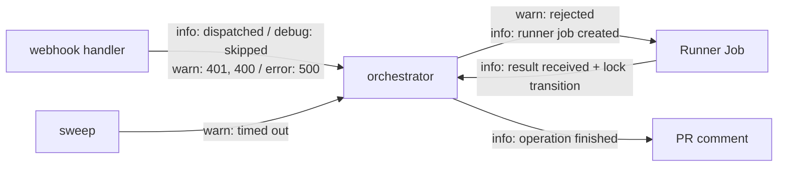

# Design Document: Structured Logging (Slice 8)

## Overview

One new leaf package (`internal/logging`), wired into `cmd/server` and
`cmd/runner`; every existing `log.Printf`/`fmt.Fprintf` call site in
`internal/orchestrator` and both `cmd/*/main.go` files is rewritten to
use `log/slog`. No other package changes.

## Decision 0: `log/slog`, not `go.uber.org/zap`

*Alternative considered*: `go.uber.org/zap`, on the strength of its lower
per-call allocation cost versus `slog`'s `any`-based `Handler` path.
*Rejected* — neither `cmd/server` nor `cmd/runner` is logging-throughput-
bound (the Server's per-request cost is dominated by GitHub API calls and
Redis locking; the Runner logs a handful of lines per ephemeral pod
lifetime), so zap's main advantage doesn't apply here, while its cost — a
new third-party dependency to vendor, pin, and update — is exactly what
this slice's requirements rule out (`requirements.md:42`: "no new
third-party logging dependency"). `log/slog` also already ships the
`*Context` variants (`InfoContext`, `ErrorContext`, ...) this design relies
on (see Decision 1), with no wrapper type needed to get them.

## Decision 1: `log/slog`'s package-level default logger, not constructor-injected

24 `log.Printf` call sites need replacing
(`internal/orchestrator`: `comment.go`, `comments.go`, `execute.go`,
`pullrequest.go`, `result.go`, `sweep.go`).

*Alternative considered*: add a `*slog.Logger` field to `Orchestrator`,
injected via `New(...)`. *Rejected* — nothing in this codebase's test
suite asserts on log output today, and no call site needs a *different*
logger than the process-wide one (there's no per-tenant or per-request
logging requirement). Threading a logger parameter through `New(...)`
would touch every one of `execute_test.go`'s ~15 `testOrchestrator(...)`
call sites for a capability nothing needs yet — exactly the kind of
premature plumbing this codebase's `CLAUDE.md` says to avoid.

**Resolution**: `cmd/server/main.go` and `cmd/runner/main.go` each call
`slog.SetDefault(logging.New(os.Stderr, level))` once at startup (`log/slog`
is designed for exactly this "configure a process-wide default, then call
the package-level `slog.Info`/`slog.Error`/etc. functions anywhere"
pattern). Every `log.Printf("orchestrator: doing X for %q: %v", id, err)`
call site becomes `slog.ErrorContext(ctx, "doing X", "operation_id", id,
"error", err)` — dropping the `"orchestrator: "` prefix (now redundant;
`log/slog`'s JSON output can carry a `source` field instead if needed) and
the format string's positional interpolation in favor of structured
key/value pairs. `ctx` is already a parameter (or trivially threadable —
every one of these 24 sites is inside a method that already receives one)
at every existing call site, so every replacement uses the `*Context`
variant.

```go
// internal/logging/logging.go

// ParseLevel maps a TURNIP_LOG_LEVEL value ("debug"|"info"|"warn"|"error",
// case-insensitive) to a slog.Level, defaulting to slog.LevelInfo for an
// empty or unrecognized value rather than erroring — a typo'd log level
// should degrade to a sane default, not stop the process from starting.
func ParseLevel(raw string) slog.Level

// New returns a JSON-handler slog.Logger writing to w at the given level.
func New(w io.Writer, level slog.Level) *slog.Logger
```

`TURNIP_LOG_LEVEL` is read once, in each `cmd/*/main.go`, before any other
setup — `logging.ParseLevel` never errors, so a startup failure can never
originate from a log-level typo.

## Decision 2: Lifecycle events at the boundaries, not at every step (Requirement 2)

Requirement 1.5 left the Server logging only on error paths, so a
healthy Server at `info` was silent. Requirement 2 adds a fixed set of
events, placed where a unit of work enters or leaves a component:



| Where | Event | Level |
|---|---|---|
| `cmd/server` | server starting (addresses, level) / stopped | info |
| `internal/github` webhook handler | delivery dispatched | info |
| | delivery skipped (event type or action turnip ignores) | debug |
| | signature invalid (401), payload unparseable (400) | warn |
| | handler error (500) | error |
| `executeOne` | Operation rejected, with its reason | warn |
| | Runner Job created | info |
| | Operation finished, with outcome | info |
| `HandleResult` | result received, with the Lock transition | info |
| sweep | Operation timed out | warn |
| comment trigger | permission check errored | error |
| | trigger refused for lack of permission | info |
| unlock / PR close | Lock released | info |

The webhook handler is the one place that sees every delivery and every
status it answers, so it owns the "why was this a 500" line: the
orchestrator returns the error, and logging it again at every level it
passes through would multiply the same failure.

Rejections are logged at `warn` uniformly, whether a policy refusal
("locked by PR #12") or an infrastructure one ("acquiring lock: dial
tcp …"). *Alternative considered*: classify each rejection site as
`info` or `error`. *Rejected because* `executeOne` has around fifteen
rejection sites and the distinction lives in the reason text, which the
record carries; one level with the reason attached is enough to find
either kind, and a misclassified site would hide an error at `info`.

`executeOne` builds one `*slog.Logger` carrying owner, repo, PR number,
project and operation, so each of its events is one short call and the
fields cannot drift between them. This is a local derived from the
process default, not an injected logger — Decision 1 still holds.

No record includes tool output (Requirement 2.9): outcomes, IDs and
change counts only.

## Package Layout

```
internal/logging/
  logging.go        // ParseLevel, New
  logging_test.go

internal/orchestrator/      // amended
  comment.go, comments.go, execute.go, pullrequest.go, result.go, sweep.go   // log.Printf -> slog

cmd/server/main.go   // amended: slog.SetDefault(logging.New(...)) before run(cfg)
cmd/runner/main.go   // amended: slog.SetDefault(logging.New(...)) before runner.Run(...)
```

## Dependencies

None new — `log/slog` is standard library (Go 1.21+; this repo targets
1.26 per `go.mod`).

## Testing Strategy

- **Unit tests**: `internal/logging/logging_test.go` — a table test over
  `ParseLevel`'s valid/invalid/case-insensitive/empty inputs, and a smoke
  test that `New` produces a `*slog.Logger` writing well-formed JSON to a
  `bytes.Buffer` at the configured level (a `debug`-level message is
  absent from an `info`-level logger's output, present at `debug`).
- No property tests — this is a pure input→output mapping (`ParseLevel`)
  and I/O wiring, not the kind of input-space behavior property-based
  testing in this codebase targets.
- No behavioral test changes anywhere else: `internal/orchestrator`'s
  existing tests don't assert on log output, so this rewrite doesn't
  touch any existing assertion.
- Coverage target: 90% for `internal/logging` (small, pure-function
  package — matches `internal/config`'s precedent for a similarly-shaped
  leaf package, not the 80% this repo reserves for packages with
  external-system integration points).

## Backward Compatibility

Purely additive from any external caller's point of view: nothing
consumes turnip's log output as a stable, versioned API today (it's
free-form text either way), so changing its format has no compatibility
surface to preserve. `internal/orchestrator`'s exported API (`New`,
`Orchestrator`'s methods) is unchanged.
