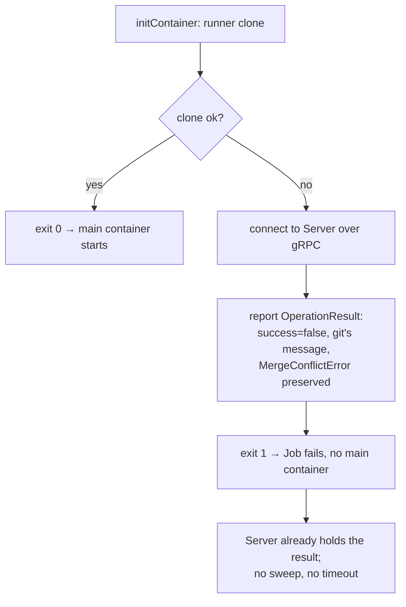

# Design: Per-Tool Provisioning (Slice 14)

## Overview

Provisioning becomes a property of the tool rather than of turnip:

| Strategy | Main container | Tool comes from | Used by |
|---|---|---|---|
| **copy-out** | turnip's runner image | an initContainer copying one binary onto a shared volume | Terraform |
| **run-in-image** | the **vendor's** image | the image itself — binaries, plugins, environment, `HOME` | Helmfile |

Cloning moves out of the Runner into an initContainer for both, which is
what lets one runner binary serve either shape.

The enabler is already true and now verified: `build/runner/Dockerfile`
builds with `CGO_ENABLED=0`, so the runner is a statically linked binary
that executes in any image regardless of libc — including `scratch`.

## Decision 1: the strategy is declared per tool

`toolImage` gains a strategy, and `BuildJob` branches on it:

```go
type provisioningStrategy int

const (
	// copyOut copies the tool's binary out of the vendor image onto a
	// shared volume; the Runner's own image executes it.
	copyOut provisioningStrategy = iota
	// runInImage makes the vendor image the Job's main container and
	// supplies turnip's runner binary to it instead.
	runInImage
)

type toolImage struct {
	image      string   // fmt.Sprintf template, one %s for the version
	binaryPath string   // copyOut only: what to copy out
	strategy   provisioningStrategy
	versions   []string
}
```

`binaryPath` is meaningless under `runInImage` and is left empty there,
which is the field's own documentation.

**Alternative considered**: keep one global strategy and extend it to copy
every path a tool needs — helm, sops, kubectl, the plugin directory, plus
the `HELM_*` variables that make helm find plugins. *Rejected because* it
makes turnip's provisioning table a mirror of a vendor's Dockerfile.
The helmfile image ships seven binaries and four plugins today; when the
vendor reorganises, turnip breaks, and adopting a tool release waits on a
turnip change — exactly the bottleneck the vendor-image design exists to
avoid, re-created one layer up.

## Decision 2: the two Job shapes

| | copy-out | run-in-image |
|---|---|---|
| initContainer 1 | vendor image: `cp <binaryPath> /turnip/tools/<tool>` | turnip image: `cp /runner /turnip/bin/runner` |
| initContainer 2 | turnip image: `runner clone` | turnip image: `runner clone` |
| main container | turnip image (entrypoint `/runner`) | **vendor image**, `command: ["/turnip/bin/runner"]` |
| volumes | `workspace`, `tools` | `workspace`, `bin` |
| `TURNIP_TOOLS_DIR` | set to `/turnip/tools` | **unset** |

The tool copy runs before the clone so a bad tool version fails before
turnip spends time fetching a repository. Under run-in-image the vendor
image is the *main* container, so an unpullable version surfaces after the
init phase instead; `jobs.Client.Status` already reports image-pull
failures for both.

`/turnip/bin` is a separate volume from `/turnip/tools` deliberately: under
run-in-image the copied binary is turnip's own, not the tool's, and naming
it `tools` would make the Pod lie about what it contains.

**The Runner needs no branch for any of this.** Slice 12 made
`TURNIP_TOOLS_DIR` optional — `pathWithToolsDir` returns `PATH` untouched
when it is empty — so run-in-image simply does not set it, and the tool is
found on the vendor image's own `PATH`. A decision made for testability
pays for itself here.

**Alternative considered**: a sidecar running turnip's image beside the
tool container, so that something is always up to notice and report a main
container that never starts. *Rejected because* it duplicates a mechanism
that already exists. When the Runner never reports, the Server's sweep
claims the Operation Record and queries `jobs.Client.Status`, which names
the actual cause — an image-pull failure is reported as one, not as a bare
timeout. The sidecar would buy latency on that path (seconds rather than
the five-minute start deadline) in exchange for an extra container in every
Runner Pod, a second gRPC path, and either RBAC or a shared-volume
signalling protocol. If that latency ever matters, the cheaper fix is
server-side — shorten the deadline, or watch Job status where turnip
already holds `pods get/list` — rather than adding a container to every
Pod.

## Decision 3: cloning is a mode of the same binary

`cmd/runner` gains a `clone` mode, selected by argument, and the
initContainer runs turnip's image with `args: ["clone"]`.

**Alternative considered**: a shell script of `git` commands in the
initContainer. *Rejected because* `clone.go` is not a `git clone`. It is a
bounded-depth fetch of two refs into named local refs, a checkout, an
Atlantis-style `--no-ff` merge, a single unshallow-and-retry fallback when
the shallow fetch finds no common ancestor, and `MergeConflictError`
distinguished from every other failure — plus token redaction on every
argument and every line of output. Reimplementing that in shell would
duplicate the one piece of this codebase where a mistake leaks an
installation token into a PR comment.

Reusing the binary keeps a single implementation, its tests, and its
redaction.

## Decision 4: the clone reports its own failure

Moving the clone into an initContainer would otherwise cost the thing that
makes a clone failure useful today. Currently the Runner catches it and
returns an `OperationResult`, so the PR gets git's own message
immediately. If the initContainer simply exits non-zero, the main
container never starts, nothing reports, and the pull request waits for
the start-timeout sweep to call it a generic timeout minutes later.

So the clone mode reports before exiting:



This reuses `internal/runner`'s existing reporter, and the connection is
plaintext (`reporter.go` dials with insecure credentials), so the clone
container needs no CA certificates.

## Decision 5: the GitHub token leaves the main container

Once cloning moves out, the token is needed only by the clone
initContainer. `BuildJob` stops setting `TURNIP_GITHUB_TOKEN` on the main
container.

That is worth calling out as an outcome rather than a side effect: today
the IaC tool's process inherits a GitHub installation token it has no use
for, and under run-in-image that environment belongs to a vendor image
running arbitrary tool plugins. Removing it shrinks what a compromised or
merely careless plugin can reach. The token still appears in the Job spec
for the init container — narrowing that further is a separate concern.

## Decision 6: what stays untouched

- **Terraform keeps copy-out.** It is one static binary; the existing
  mechanism is correct for it and is not disturbed.
- **`internal/plugin` is unchanged.** It execs the tool by name and finds
  it on `PATH`, which is true under both strategies.
- **The workspace contract is unchanged.** `/turnip/src` is written by an
  initContainer instead of the Runner; nothing downstream can tell.

## Edge cases

| Case | Behaviour |
|---|---|
| Clone fails (auth, missing ref, network) | reported immediately with git's redacted message; Job fails without starting the tool |
| Merge conflict | reported as today, distinguished from other clone failures |
| Vendor image unpullable, copy-out | initContainer `ImagePullBackOff`, diagnosed by the existing status check |
| Vendor image unpullable, run-in-image | main container `ImagePullBackOff`, same diagnosis, after the init phase |
| Vendor image lacks a shell | fine — the main container's command is the runner binary directly, never `sh -c` |
| Vendor image runs as non-root | **not handled**; see below |
| A Project's `runner.env` | applied to the main container under both strategies, on top of the vendor image's own environment |

## Known limits, recorded rather than solved

**Non-root vendor images.** The clone initContainer runs as turnip's image
(root) and writes the workspace; a main container running as a different
UID may not be able to read it. Every image turnip uses today runs as root,
so this does not bite — but `pulumi/pulumi:*-nonroot` runs as UID 1000, and
pinning such a tag would need `fsGroup` on the Pod. Out of scope here
because no supported tool uses such an image; recorded so the next person
meets a note rather than a puzzle.

**Scratch vendor images.** `ghcr.io/opentofu/opentofu:*-minimal` is
`FROM scratch`. Run-in-image survives it — a static binary needs no loader,
and the gRPC dial needs no certificates — but nothing else in such an image
would work, and OpenTofu is a copy-out tool anyway.

## Testing approach

No real cluster, consistent with every prior slice: `BuildJob` is a pure
function over a `config.Project`, so both Job shapes are asserted directly
from the generated spec.

- Both strategies produce the expected container images, commands, volumes
  and mounts, and copy-out sets `TURNIP_TOOLS_DIR` where run-in-image does
  not.
- `TURNIP_GITHUB_TOKEN` appears on the clone initContainer and **not** on
  the main container — the assertion that pins Decision 5.
- The clone mode's failure path reports before exiting, using the existing
  fake reporter rather than a real gRPC server.
- `clone.go` itself needs no new tests: it is unchanged, and its existing
  coverage moves with it.
