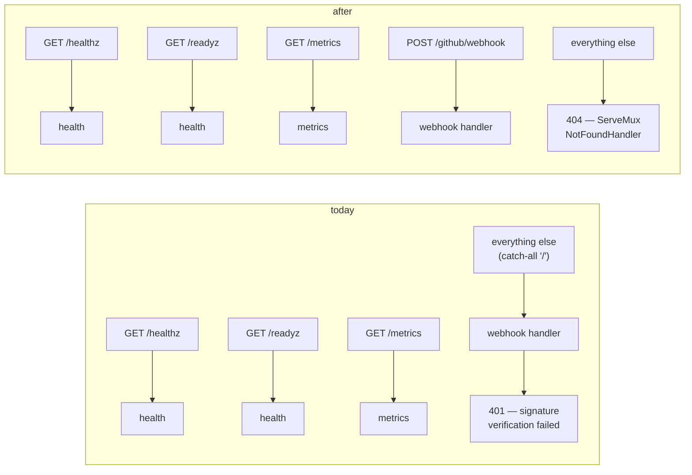

# Design: Move the Webhook Off the Root Path (Slice 29)

## Introduction

The whole behavioral change is one line of routing. What makes this a
slice rather than a commit is that the routing change is *published* — it
lives in a GitHub App's settings, not only in this repository — and that
the property Requirement 2 asks for has never been testable, because
nothing exercises the Server's mux.

So the design has three parts: the route itself, how the 404 arises, and
where a test can stand.

## Routing today, and after



The misleading part of today's picture is `D2`. A stray scan, a typo'd
probe, or a browser visiting the Server's hostname all reach the webhook
handler and come back **401 Unauthorized**, because `ServeHTTP` calls
`gh.ValidatePayload` before looking at anything else
(`internal/github/webhook.go:33`). Nothing in the logs distinguishes "a
real delivery with a bad secret" from "a request for a path that does not
exist" — which is exactly the distinction someone needs while debugging
deliveries.

## Decision 1: the 404 comes from deleting a route, not adding one

Requirement 2 reads like new behavior. It is not: Go's `ServeMux` already
responds 404 when no pattern matches. The catch-all is the only reason it
does not do so today, so removing `mux.Handle("/", …)` satisfies
Requirements 2.1, 2.2 and 2.3 at once — including 2.3's "must not invoke
signature verification", which holds *structurally* because the handler is
never reached rather than because anything checks.

*Alternative considered*: register an explicit `mux.Handle("/", notFound)`
to make the intent visible. *Rejected because* it reintroduces the
catch-all in order to document the absence of one, and a future reader
would have to check whether that handler does anything else. A route that
does not exist is the clearest statement that nothing serves it.

## Decision 2: the pattern is method-scoped

`POST /github/webhook`, not `/github/webhook`.

This does real work rather than being stylistic, because **the webhook
handler performs no method check of its own**. `ServeHTTP` goes straight
to signature validation, so today a `GET` to the webhook path would be
answered 401. With the method in the pattern, Go's mux answers **405
Method Not Allowed** before the handler runs — the honest answer, and
consistent with Requirement 2.3's principle that a request which was never
going to be processed should not produce an authentication error.

It also matches the three routes already registered (`GET /healthz`,
`GET /readyz`, `GET /metrics`), so the mux reads uniformly.

*Note on shape*: the pattern has no trailing slash, so it matches that
exact path only. `/github/webhook/` and `/github/webhook/anything` are 404
— deliberate, since GitHub posts to exactly one URL and a subtree match
would quietly re-create a smaller catch-all.

## Decision 3: the path is a constant in `internal/github`

```go
// WebhookPath is where the Server serves GitHub webhook deliveries. It is
// published — an operator enters it in the GitHub App's settings — so it
// is defined once and referenced, never spelled out at a call site.
const WebhookPath = "/github/webhook"
```

One definition, referenced by `cmd/server` when registering the route and
by the routing test when exercising it. A published constant that a test
and a caller agree on cannot drift apart silently, which matters more here
than for an internal path, because the cost of drift is landed on
operators rather than caught by a compiler.

*Alternative considered*: a literal in `main.go`, since it appears once.
*Rejected because* the routing test needs the same string, and two
literals that must match are exactly what a constant is for.

## Decision 4: extract a mux builder so routing can be tested

Today `run()` constructs the mux inline (`cmd/server/main.go:81-85`) and
`cmd/server` has **no test files**. Requirement 2 is entirely about
routing behavior, so it cannot be verified without a seam.

```go
// newMux builds the Server's HTTP routes. Separated from run so that
// routing is testable without starting a server or dialing Redis,
// Kubernetes or GitHub.
func newMux(webhook http.Handler, ready func(context.Context) error) *http.ServeMux
```

The parameters are deliberately narrow: a constructed `http.Handler` and
the readiness probe's dependency. `newMux` therefore needs no Config, no
Orchestrator, and no clients — a test can pass a stub handler that records
whether it was called, which is what makes "an unmatched path does not
reach the webhook handler" directly assertable rather than inferred.

*Alternative considered*: test through `httptest.NewServer` against the
real `run()`. *Rejected because* `run()` dials Redis and Kubernetes and
blocks; testing routing should not require either.

## What changes

| File | Change |
|---|---|
| `internal/github/webhook.go` | add the `WebhookPath` constant |
| `cmd/server/main.go` | extract `newMux`; register `"POST " + github.WebhookPath`; drop the `/` catch-all |
| `cmd/server/main_test.go` | new — the routing table below |
| `docs/configuration.md` | rewrite the Webhook URL section (Req 4.1, 4.2) |
| `docs/deployment.md` | the Webhook URL at both mentions (Req 4.3), plus the upgrade note (Req 4.4) |

Nothing else. The eight webhook tests in `internal/github` construct the
handler directly and never route, so they are untouched; the deploy
manifests reference only `/healthz` and `/readyz`, which are probe paths.

## The routing table

Every row is a test case in `newMux`'s test.

| Request | Result | Why |
|---|---|---|
| `POST /github/webhook` | reaches the webhook handler | Req 1.1 |
| `GET /github/webhook` | 405, handler not reached | Decision 2 |
| `POST /` | 404, handler not reached | Req 1.2, 2.2, 2.3 |
| `GET /` | 404 | Req 2.2 |
| `POST /anything-else` | 404, handler not reached | Req 2.1, 2.3 |
| `GET /github/webhook/` | 404 | Decision 2, trailing slash |
| `GET /healthz`, `/readyz`, `/metrics` | unchanged | Req 1.4 |

"Handler not reached" is asserted with a stub that records invocation —
not inferred from the status code, since a handler could also return 404
itself.

## The operator migration

The code change and the GitHub App settings change must land together
(Requirement 3.2), and **there is no ordering that avoids a gap**:

- Settings first → deliveries go to `/github/webhook`, which the running
  Server does not serve. 404 until the deploy.
- Deploy first → deliveries still go to `/`, which the new Server no
  longer serves. 404 until the settings change.

The gap is small and the recovery is explicit, which is worth documenting
rather than leaving an operator to discover: GitHub retains recent
deliveries and offers **Redeliver** per delivery in the App's Advanced
tab. So the procedure is deploy, update the URL, then redeliver anything
that failed in between.

This is also the argument for doing it now rather than later — the
procedure is being written for one installation, and it scales linearly
with however many exist when it is finally done.

## Out of scope

Unchanged from the requirements: what `/` serves once a UI exists, any
second forge, Ingress and network policy, and Slice 28's OAuth callback.
This slice only ensures `/github/` is free for it.
