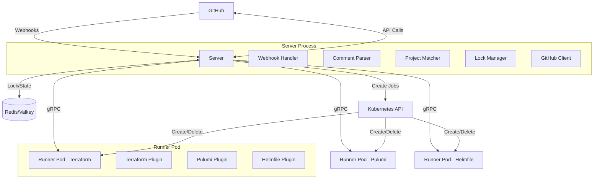

# turnip

turnip is a GitHub-integrated platform that automates infrastructure-as-code
operations (Terraform, Pulumi, Helmfile) across a repository's projects. A
Server receives GitHub webhooks, determines which `turnip.yaml` projects are
affected by a PR's changed files, and dispatches operations to ephemeral
Kubernetes Runner pods over gRPC. Locking (so a plan and its later apply
never drift), GitHub App auth, and multi-project PR comments/check-runs
round out the flow.

## Architecture

- **Server** (`cmd/server`): a stateless HTTP/gRPC service. Receives GitHub
  webhooks, parses `turnip.yaml`, matches modified files against each
  project's `whenModified` globs, acquires a Redis lock before planning,
  creates a Kubernetes Job per triggered Operation, and posts a
  consolidated PR comment and check run once every Job reports back. All
  state lives in Redis, not in-process — any number of Server replicas can
  run behind one Service with no coordination between them (see
  [`docs/deployment.md`](docs/deployment.md)'s "Scaling up" section).
- **Runner** (`cmd/runner`): one ephemeral Kubernetes Job per Operation.
  Clones the repository at the PR's commit, runs the matched tool
  (Terraform/Pulumi/Helmfile) via a shared Plugin interface, and streams
  logs and a final result back to the Server over gRPC.

turnip's own manifests live under [`deploy/`](deploy/) —
`deploy/overlays/kind/` is a complete, concrete worked example.

## Documentation

| Doc | Covers |
|---|---|
| [`docs/deployment.md`](docs/deployment.md) | installing turnip: prerequisites, the values an overlay must supply, verifying a deployment |
| [`docs/configuration.md`](docs/configuration.md) | `turnip.yaml`'s schema, the Server's own environment variables, setting up the GitHub App |
| [`docs/usage.md`](docs/usage.md) | day-to-day use: automatic plans, trigger comments, plan/apply/unlock, who can trigger what |
| [`docs/troubleshooting.md`](docs/troubleshooting.md) | what a given symptom (a stuck lock, a failed check run, a timeout) means and what to do about it |

## Development

See [`CLAUDE.md`](CLAUDE.md) for build/test/lint commands and the
spec-driven development workflow this repository follows
(`.kiro/specs/`).
